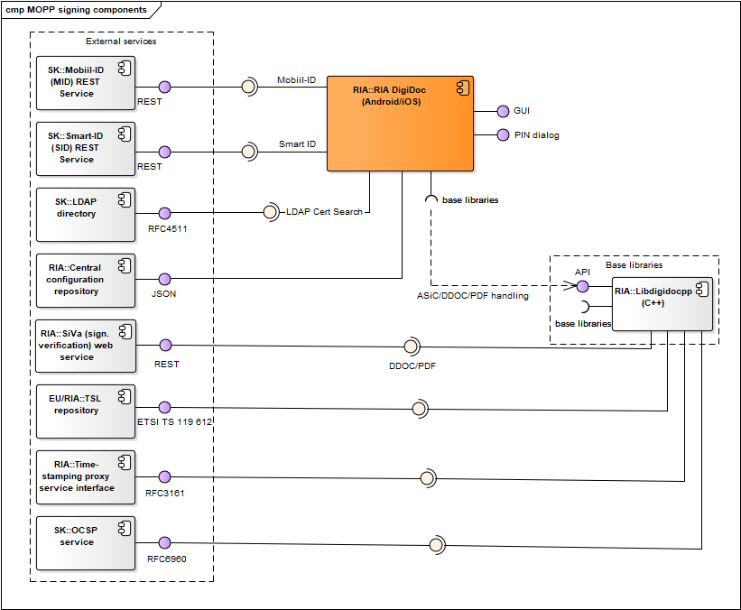
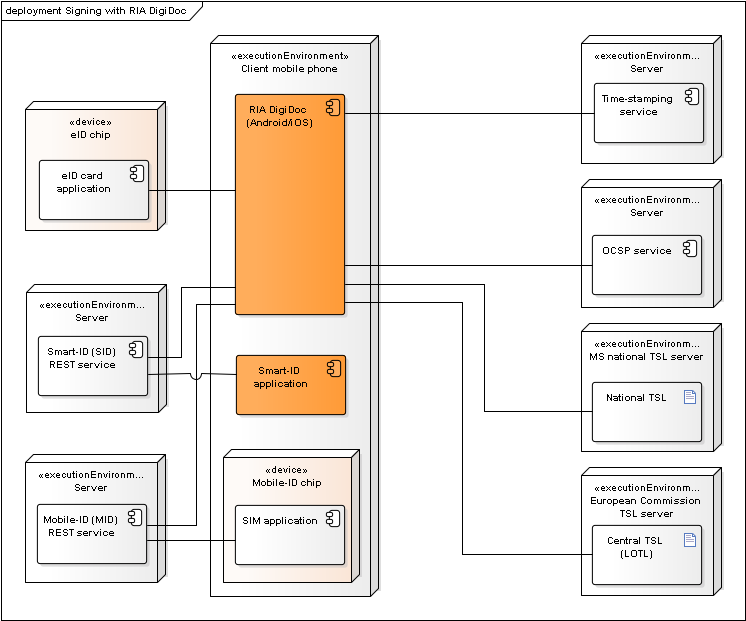

# ARCHITECTURE OF ID-SOFTWARE

Document version: 2.8  
Software version: 24.09  
Last updated: 23.9.2024  

# Introduction

The purpose of this document is to describe the architecture of ID-software.

**ID-software** is a collection of software components offering support for PKI-based functionality, i.e. operations with different cryptographic tokens (e.g. eID cards), handling digitally signed documents, file encryption/decryption and signing and authentication in web environment. The ID-software comprises end-user applications, software libraries, web components, drivers for communicating with the cryptographic tokens and other complementary components.

Main sources for information about ID-software are [www.id.ee](https://www.id.ee/en/), [Open-EID GitHub repository](https://github.com/open-eid) and [Web-eID GitHub repository](https://github.com/web-eid).

This document covers description of ID-software and its components, their deployment in different environments, provided and required interfaces. The document does not include components that have reached the end of their support nor the components that have not yet been released.

The document is based on the latest released state of the ID-software components. At the time of writing, the latest released version of ID-software is **version 24.09**. Latest version numbers of the various ID-software components are provided at [https://www.id.ee/en/article/information-on-the-latest-software-versions/](https://www.id.ee/en/article/information-on-the-latest-software-versions/).

The document is targeted for:

*   Owners/managers of the software;
*   Contractors;
*   Contributors interested in developing ad-hoc solutions;
*   Integrators/software developers interested in integrating the software with third-party information systems;
*   International audience – contributors/integrators from countries other than Estonia who wish to use the software internationally and/or contribute in its development.

# Background

**Estonian Information System Authority** (RIA, [https://www.ria.ee/en.html](https://www.ria.ee/en.html)) is the main owner/manager of the ID-software.  

The software is being developed and tested by:  

*   **RaulWalter** (RW, [https://www.raulwalter.com](https://www.raulwalter.com)) as the main contractor during 2019-2024;  
*   **Nortal** ([https://nortal.com](https://nortal.com)) during 2019-2024;  
*   **TTT** ([https://www.testijad.ee](https://www.testijad.ee)) during 2019-2024;  
*   SK ID Solutions (SK, [https://www.skidsolutions.eu/en](https://www.skidsolutions.eu/en));  
*   Aktors ([http://www.aktors.ee/wp/](http://www.aktors.ee/wp/));  
*   CGI Estonia ([https://www.cgi.ee/et](https://www.cgi.ee/et)).

Development of ID-software has been mainly done in Estonia, however, the ID-software is released for international usage.
The software is distributed open-source (mainly under LGPL/BSD/MIT licence) and is accessible from the following locations:

*   GitHub repository for the source code, wiki documentation, beta and (optionally) production versions of binary packages: [https://github.com/open-eid](https://github.com/open-eid) and [https://github.com/web-eid](https://github.com/web-eid).
*   Release repository for production versions of binaries: [https://www.id.ee/en/article/install-id-software/](https://www.id.ee/en/article/install-id-software/)

ID-software components can be logically divided in the following groups:

*   **Desktop applications** for end-users;
*   **Mobile applications** for end-users;
*   **Software libraries** for integrators/software developers to integrate the libraries’ functionality with third-party information systems/applications;
*   **Web components** for integrators/software developers to add the signature creation and authentication functionality in web environment to third-party web applications;
*   **Drivers** for communication with the cryptographic tokens that conduct the PKI operations;
*   **Other (supportive) components** for packaging, installation, updating and centrally managing changes of the configuration settings in software (with the central configuration service).

The following table maps the main ID-software components, their owner/developer (i.e. the main contractor) and the functionality they offer.

<table border="1" cellspacing="0" cellpadding="0">
<thead>
<tr>
<th rowspan="2" colspan="2">Component</td>
<th colspan="6">Function</td>
<th rowspan="2">Owner</td>
<th rowspan="2">Licence</td>
</tr>
<tr>
<th>Handling ASiC/BDOC/PADES documents</td>
<th>Handling DDOC documents</td>
<th>Handling CDOC documents</td>
<th>Calculating RSA/ECDSA signature</td>
<th>Card management operations</td>
<th>Authentication</td>
</tr>
</thead>
<tbody>
<tr>
<th><a href="#desktop-applications">Desktop applications</a></td>
<th>DigiDoc4</th>
<td>yes (1)</td>
<td>yes - validation only (1)</td>
<td>yes</td>
<td>yes (1)</td>
<td>yes</td>
<td>-</td>
<td>RIA</td>
<td>LGPL</td>
</tr>
<tr>
<th rowspan="2"><a href="#mobile-applications">Mobile applications</a></td>
<th>RIA DigiDoc (iOS)</th>
<td>yes (1)</td>
<td>yes - validation only (1)</td>
<td>yes (1)</td>
<td>yes</td>
<td>yes</td>
<td>-</td>
<td>RIA</td>
<td>LGPL</td>
</tr>
<tr>
<th>RIA DigiDoc (Android)</th>
<td>yes (1)</td>
<td>yes - validation only (1)</td>
<td>yes (1)</td>
<td>yes</td>
<td>yes</td>
<td>-</td>
<td>RIA</td>
<td>LGPL</td>
</tr>
<tr>
<th rowspan="3"><a href="#software-libraries">Software libraries</a></td>
<th>DigiDoc4j (Java)</th>
<td>yes (2)</td>
<td>yes (1)</td>
<td>-</td>
<td>yes (1)</td>
<td>-</td>
<td>-</td>
<td>RIA</td>
<td>LGPL</td>
</tr>
<tr>
<th>CDoc4j (java)</th>
<td>-</td>
<td>-</td>
<td>yes</td>
<td>-</td>
<td>-</td>
<td>-</td>
<td>RIA</td>
<td>LGPL</td>
</tr>
<tr>
<th>Libdigidocpp (C++, .NET)</th>
<td>yes (2)</td>
<td>yes - validation only (1)</td>
<td>-</td>
<td>yes (1)</td>
<td>-</td>
<td>-</td>
<td>RIA</td>
<td>LGPL</td>
</tr>
<tr>
<th rowspan="2"><a href="#web-components">Web components</a></td>
<th>Browser signing modules</th>
<td>-</td>
<td>-</td>
<td>-</td>
<td>yes</td>
<td>-</td>
<td>-</td>
<td>RIA</td>
<td>MIT</td>
</tr>
<tr>
<th>web-eid.js (JavaScript)</th>
<td>-</td>
<td>-</td>
<td>-</td>
<td>yes (1)</td>
<td>-</td>
<td>-</td>
<td>RIA</td>
<td>MIT</td>
</tr>
<tr>
<th rowspan="3"><a href="#drivers">Driver components</a></td>
<th>Minidriver</th>
<td>-</td>
<td>-</td>
<td>-</td>
<td>yes</td>
<td>-</td>
<td>yes</td>
<td>IDEMIA</td>
<td>IDEMIA</td>
</tr>
<tr>
<th>OpenSC-pkcs11</th>
<td>-</td>
<td>-</td>
<td>-</td>
<td>yes</td>
<td>-</td>
<td>yes</td>
<td>OpenSC</td>
<td>LGPL</td>
</tr>
<tr>
<th>EstEID-CTK-tokend</th>
<td>-</td>
<td>-</td>
<td>-</td>
<td>yes</td>
<td>-</td>
<td>yes</td>
<td>RIA</td>
<td>LGPL</td>
</tr>
</tbody>
</table>
**Table: Mapping of ID-software components and functions**

Remarks:

(1) - The functionality is provided via base components.  
(2) - PADES handling is not supported.  

The main functions offered by ID-software are described in the following table:

| Function | Description |
| - | - |
| Handling ASiC/BDOC/PADES documents | Handling documents in [BDOC 2.1](https://www.id.ee/wp-content/uploads/2020/06/bdoc-spec212-eng.pdf) digital signature format that is a profile of [ETSI XAdES](http://www.etsi.org/deliver/etsi_ts/101900_101999/101903/01.04.02_60/ts_101903v010402p.pdf) (XML Advanced Electronic Signature) and [ETSI ASiC](http://www.etsi.org/deliver/etsi_ts/102900_102999/102918/01.02.01_60/ts_102918v010201p.pdf) formats. Validating timestamp and signatures of enclosed DDOC document in the Time Stamp Token (TST) based [ETSI ASIC-S](http://www.etsi.org/deliver/etsi_ts/102900_102999/102918/01.02.01_60/ts_102918v010201p.pdf) containers. Validating the signatures of PDF documents in [PAdES](http://www.etsi.org/deliver/etsi_en/319100_319199/31914201/01.01.01_60/en_31914201v010101p.pdf) digital signature format that is a profile of [ETSI PAdES](http://www.etsi.org/deliver/etsi_en/319100_319199/31914201/01.01.01_60/en_31914201v010101p.pdf). More information on the formats’ life cycle can be found from [https://www.id.ee/en/article/digidoc-container-format-life-cycle-2/](https://www.id.ee/en/article/digidoc-container-format-life-cycle-2/). See [Libdigidocpp](http://open-eid.github.io/libdigidocpp/manual.html#format) and [Digidoc4j](https://github.com/open-eid/digidoc4j#features) documentation for supported formats. |
| Handling DDOC documents | Handling documents in [DIGIDOC-XML 1.3 (DDOC)](https://www.id.ee/wp-content/uploads/2020/08/digidoc_format_1.3.pdf) digital signature format that is a profile of [ETSI XAdES](http://www.etsi.org/deliver/etsi_ts/101900_101999/101903/01.04.02_60/ts_101903v010402p.pdf) (XML Advanced Electronic Signature) format. More information on the formats’ life cycle can be found from [https://www.id.ee/en/article/digidoc-container-format-life-cycle-2/](https://www.id.ee/en/article/digidoc-container-format-life-cycle-2/). |
| Handling CDOC documents | Encrypting and decrypting documents in [ENCDOC-XML 1.0 (CDOC)](https://www.id.ee/wp-content/uploads/2020/02/SK-CDOC-1.0-20120625_EN.pdf) also [CDOC 1.1](https://www.ria.ee/sites/default/files/content-editors/EID/cdoc.pdf) format. |
| Calculating RSA/ECDSA signature | Calculating the RSA or ECDSA signature value in browser or desktop/server environment. The operation involves connecting with the signature token’s driver, sending the data to be signed and receiving digital signature value calculated with the token owner’s RSA or ECDSA private key. The following cryptographic tokens are supported: hardware-based tokens (e.g. PKCS#11-based eID cards, USB cryptostick, Mobile-ID and Smart-ID); software-based tokens (e.g. PKCS#12 software token). |
| Card management operations | PIN/PUK management, reading personal data file. |
| Authentication | Authentication with ID-card. The operation is generally done via native operating system/browser components. In case of Estonian ID-cards and Firefox browser, a PKCS#11 module pkcs11-register is used for setting the proper parameters for authentication in Firefox browser on Linux. |

**Table: Functions offered by ID-software**

# Component model

The following chapter depicts ID-software component diagrams, including variations of the components used in different supported environments.  
In the context of the component diagrams in this document, the ID-software components have been divided to two different packages to show the component’s owner:

*   Components of ID-software that are owned and operated by RIA: <u>placed in "RIA" package</u>.
*   Components of ID-software that are owned and operated by SK: <u>placed in "SK" package</u>.

Other components are regarded as external to ID-software.  
Note that not all of the external base libraries are included in the component model to avoid duplicity with other documentation – the base libraries are listed and described in the documentation of the respective ID-software components and can be accessed via the references provided.

## Desktop applications

### DigiDoc4

  
**Figure: DigiDoc4 signing and crypto-components**

  
**Figure: DigiDoc4 ID-card management components**

| Component | Description | Owner |
| - | - | - |
| DigiDoc4 | DigiDoc4 enables handling digitally signed documents, encryption/decryption for managing ID-card’s PIN/PUK codes replacement and other services. Code repository: [https://github.com/open-eid/DigiDoc4-Client](https://github.com/open-eid/DigiDoc4-Client). | RIA |
| DigiDoc4 base libraries | Libdigidocpp (and its base libraries), etc. See [DigiDoc4 interfaces](#_DigiDoc4_interfaces). | - |
| Mobile-ID (MID) REST service | REST service that is used by DigiDoc4 for signature creation with Mobile-ID. See also [https://github.com/sk-eid/mid](https://github.com/sk-eid/mid). | SK |
| Smart-ID (SID) REST service | REST service that is used by DigiDoc4 for signature creation with Smart-ID. See also [https://github.com/SK-EID/smart-id-documentation](https://github.com/SK-EID/smart-id-documentation). | SK |
| LDAP directory | Directory of active certificates issued by SK (as the CA in Estonia). The directory is used by DigiDoc4 for finding authentication certificate (and the respective public key) of the recipient of the encrypted document. See also [https://www.skidsolutions.eu/en/repository/ldap/](https://www.skidsolutions.eu/en/repository/ldap/). | SK |
| Central configuration repository | Described in chap. [Central configuration service](#_comp_central_conf). | RIA |
| Central configuration client | Described in chap. [Central configuration service](#_comp_central_conf). | RIA |
| Libdigidocpp | Described in chap. [Software libraries](#_comp_libraries). | RIA |
| SiVa | Described in chap. [Software libraries](#_DigiDoc4). | RIA |
| TSL repository | Described in chap. [Software libraries](#_comp_libraries). | EU/RIA |
| Time-stamping proxy service interface | Described in chap. [Software libraries](#_comp_libraries). | RIA |
| OCSP service | Described in chap. [Software libraries](#_comp_libraries). | SK |
| Minidriver | Used via CNG interface in Windows environment only. Described in chap. [Drivers](#_comp_drivers). | IDEMIA |
| ID-Updater | Used in Windows and macOS only, described in chap. [Updating mechanisms](#_comp_update). In case of Windows platform, the ID-Updater can be executed from DigiDoc4 program. | RIA |

**Table: DigiDoc4**

#### DigiDoc4 interfaces

Provided:

*   Graphical user interface - interface for handling ASiC, BDOC, DDOC, CDOC documents, setting configuration parameters.
    *   User: end-user
    *   Accessible with: GUI elements
*   PIN dialog – for inserting PIN value during signature creation or decryption operations in all operating systems except of Windows.
    *   User: end-user
    *   Accessible with: GUI elements
*   Graphical user interface – interface for handling card management operations and using the external services (listed under “Required interfaces”).
    *   User: end-user
    *   Accessible with: GUI elements
*   PIN dialog – for inserting PIN/PUK value in all supported operating systems.
    *   User: end-user
    *   Accessible with: GUI elements

Required:

*   [ID-updater interface](#windows-updating-mechanism) (Windows only)
*   [Central configuration client interface](#_comp_central_conf_client_interfaces)
*   [Mobile-ID (MID) REST service](#_MID_REST_service)
*   [Smart-ID (MID) REST service](#_SID_REST_service)
*   [LDAP directory interface](#_LDAP_directory_interface)
*   Interfaces with base libraries:
    *   [Libdigidocpp library’s API](#_Libdigidocpp_library’s_interfaces) – for handling documents in supported digital signature formats (ASiC, BDOC, DDOC and PDF)
    *   External base libraries: Qt6, libldap, openssl
*   Interfaces with cryptographic token’s drivers (described in chap. [Drivers](#_comp_drivers))
    *   PKCS#11 interface
    *   CNG interface

## Mobile applications

### RIA DigiDoc

  
**Figure: RIA DigiDoc management, signing and crypto-components**

| Component | Description | Owner |
| - | - | - |
| RIA DigiDoc | RIA DigiDoc enables handling digitally signed documents, encryption/decryption for managing ID-card’s PIN/PUK codes replacement and other services. Code repository: [https://github.com/open-eid/MOPP-Android](https://github.com/open-eid/MOPP-Android) and [https://github.com/open-eid/MOPP-iOS](https://github.com/open-eid/MOPP-iOS). | RIA |
| RIA DigiDoc base libraries | Libdigidocpp (and its base libraries), etc. See [RIA DigiDoc interfaces](#_RIA_DigiDoc_interfaces). | - |
| Mobile-ID (MID) REST service | REST service that is used by RIA DigiDoc for signature creation with Mobile-ID. See also [https://github.com/sk-eid/mid](https://github.com/sk-eid/mid). | SK |
| Smart-ID (SID) REST service | REST service that is used by RIA DigiDoc for signature creation with Smart-ID. See also [https://github.com/SK-EID/smart-id-documentation](https://github.com/SK-EID/smart-id-documentation). | SK |
| LDAP directory | Described in chap. [DigiDoc4](#_DigiDoc4). | SK |
| Central configuration repository | Described in chap. [Central configuration service](#_comp_central_conf). | RIA |
| Libdigidocpp | Described in chap. [Software libraries](#_comp_libraries). | RIA |
| SiVa | Described in chap. [Software libraries](#_comp_libraries). | RIA |
| TSL repository | Described in chap. [Software libraries](#_comp_libraries). | EU/RIA |
| Time-stamping proxy service interface | Described in chap. [Software libraries](#_comp_libraries). | RIA |
| OCSP service | Described in chap. [Software libraries](#_comp_libraries). | SK |

**Table: RIA DigiDoc**

#### RIA DigiDoc interfaces

Provided:

*   Graphical user interface - interface for handling ASiC, BDOC, DDOC, CDOC documents, setting configuration parameters.
    *   User: end-user
    *   Accessible with: GUI elements
*   PIN dialog – for inserting PIN value during signature creation or decryption operations in all operating systems except of Windows.
    *   User: end-user
    *   Accessible with: GUI elements
*   Graphical user interface – interface for handling card management operations.
    *   User: end-user
    *   Accessible with: GUI elements
*   PIN dialog – for inserting PIN/PUK value in all supported operating systems.
    *   User: end-user
    *   Accessible with: GUI elements

Required:

*   [Central configuration server interface](#_comp_central_conf_server_interfaces)
*   [Mobile-ID (MID) REST service](#_MID_REST_service)
*   [Smart-ID (MID) REST service](#_SID_REST_service)
*   [LDAP directory interface](#_LDAP_directory_interface)
*   Interfaces with base libraries:
    *   [Libdigidocpp library’s API](#_Libdigidocpp_library’s_interfaces) – for handling documents in supported digital signature formats (ASiC, BDOC, DDOC and PDF)
    *   External base libraries: libldap, openssl

## Software libraries

")  
**Figure: Java software libraries and their components**

")  
**Figure: C++/.NET software libraries and their components**

| Component | Description | Owner |
| - | - | - |
| DigiDoc4j | Java software library that enables handling documents in BDOC 2.1 (XAdES/ASiC-E) and DIGIDOC-XML 1.3 formats. Documentation: [http://open-eid.github.io/digidoc4j](http://open-eid.github.io/digidoc4j) . Code repository: [https://github.com/open-eid/digidoc4j](https://github.com/open-eid/digidoc4j). | RIA |
| DigiDoc4j-util program | Small command line application that implements the main functionality of DigiDoc4j library. Used for testing purposes. Can also be used as a source for sample client code for using DigiDoc4j. See also [http://open-eid.github.io/digidoc4j](http://open-eid.github.io/digidoc4j). | RIA |
| CDoc4j | Java software library that enables handling documents in CDoc 1.1 format. Documentation: [https://github.com/open-eid/cdoc4j/wiki/Examples-of-how-to-use-it](https://github.com/open-eid/cdoc4j/wiki/Examples-of-how-to-use-it) . Code repository: [https://github.com/open-eid/cdoc4j](https://github.com/open-eid/cdoc4j). | RIA |
| CDoc4j-util program | Small command line application that implements the main functionality of CDoc4j library. Used for testing purposes. Can also be used as a source for sample client code for using CDoc4j. See also [https://github.com/open-eid/cdoc4j/tree/master/util](https://github.com/open-eid/cdoc4j/tree/master/util). | RIA |
| Libdigidocpp | C++ software library that enables handling documents in BDOC 2.1, ASiC and DIGIDOC-XML 1.3 formats (via SiVa service). Wiki: [https://github.com/open-eid/libdigidocpp/wiki](https://github.com/open-eid/libdigidocpp/wiki) Code repository: [https://github.com/open-eid/libdigidocpp](https://github.com/open-eid/libdigidocpp) Documentation: [http://open-eid.github.io/libdigidocpp](http://open-eid.github.io/libdigidocpp). | RIA |
| digidoc-tool program | Small command line application (digidoc-tool.exe) that implements the main functionality of Libdigidocpp library. Used for testing purposes. Can also be used as a source for sample client code for using Libdigidocpp. See also [http://open-eid.github.io/libdigidocpp](http://open-eid.github.io/libdigidocpp). | RIA |
| DigiDocCSharp | .NET C# wrapper classes for using Libidigidocpp library’s functionality in .NET environment. Created with Swig tool. See also [https://github.com/open-eid/libdigidocpp/blob/master/examples/DigiDocCSharp/README.md](https://github.com/open-eid/libdigidocpp/blob/master/examples/DigiDocCSharp/README.md). | RIA |
| SiVa | *Si*gnature *Ve*rification Service is an online web service for validating digitally signed documents. SiVa is used by the DigiDoc4 and RIA DigiDoc (by libdigidocpp base library) to validate documents in formats that are not natively supported; currently the service is used to validate ASiC (CAdES), PDF (ETSI PAdES) and DDOC documents. See also [Signature Verification Service interface](#_SiVa_verification_service). | RIA |
| TSL repository | Repository for accessing the TSL ([Trust Service status List](http://www.etsi.org/deliver/etsi_ts/119600_119699/119612/02.02.01_60/ts_119612v020201p.pdf)) lists that can be used as a central source of trust anchor information during digital signature creation and validation processes. The European Commission’s TSL list ([https://ec.europa.eu/tools/lotl/eu-lotl.xml](https://ec.europa.eu/tools/lotl/eu-lotl.xml)) is used as the central TSL list (with references to national lists). | EU/ RIA |
| Time-stamping proxy service interface | [RFC3161](https://tools.ietf.org/html/rfc3161) based time-stamping service. | RIA |
| OCSP service | [RFC6960](https://tools.ietf.org/html/rfc6960) based OCSP service. Also offered by SK for Estonian and a number of foreign certificates (see [www.skidsolutions.eu/en](http://www.skidsolutions.eu/en/)). | SK |

**Table: Software libraries and their components**

### DigiDoc4j library’s interfaces

Provided:

*   [DigiDoc4j API](http://open-eid.github.io/digidoc4j)
    *   User: DigiDoc4j utility program
    *   Accessible with: Java

Required:

*   [TSL repositories’ interfaces](#_TSL_repositories’_interfaces)
*   [Time-stamping proxy service interface](#_Time_stamping_proxy)
*   [OCSP service interface](#_OCSP_service_interface)
*   Interfaces with base libraries:
    *   Other base libraries: see [http://open-eid.github.io/digidoc4j](http://open-eid.github.io/digidoc4j)
*   Interfaces with cryptographic token’s drivers (described in chap. [Drivers](#_comp_drivers))
    *   PKCS#11 interface
    *   PKCS#12 interface

### DigiDoc4j utility program’s interfaces

Provided:

*   [DigiDoc4j utility program’s interface](http://open-eid.github.io/digidoc4j)
    *   User: server application, end-user application, end-user
    *   Accessible with: command line

Required:

*   DigiDoc4j API: see chap. [DigiDoc4j library’s interfaces](#_DigiDoc4j_library’s_interfaces)

### CDoc4j library’s interfaces

Provided:

*   [CDoc4j API](https://github.com/open-eid/cdoc4j/wiki/Examples-of-how-to-use-it)
    *   User: CDoc4j utility program
    *   Accessible with: Java

Required:

*   Interfaces with base libraries:
    *   Other base libraries: BouncyCastle
*   Interfaces with cryptographic token’s drivers (described in chap. [Drivers](#_comp_drivers))
    *   PKCS#11 interface
    *   PKCS#12 interface

### CDoc4j utility program’s interfaces

Provided:

*   [CDoc4j utility program’s interface](https://github.com/open-eid/cdoc4j/tree/master/util)
    *   User: server application, end-user application, end-user
    *   Accessible with: command line

Required:

*   CDoc4j API: see chap. [CDoc4j library’s interfaces](#_CDoc4j_library’s_interfaces)

### Libdigidocpp library’s interfaces

Provided:

*   [Libdigidocpp API](http://open-eid.github.io/libdigidocpp)
    *   User: DigiDoc4, RIA DigiDoc, Libdigidocpp utility program, DigiDocCSharp .NET wrapper classes
    *   Accessible with: C++

Required:

*   [TSL repositories’ interfaces](#_TSL_repositories’_interfaces)
*   [Time-stamping proxy service interface](#_Time_stamping_proxy)
*   [OCSP service interface](#_OCSP_service_interface)
*   [Signature Verification Service interface](#_SiVa_verification_service)
*   Interfaces with base libraries:
    *   OpenSSL, libxml2, xmlsec1. See also [http://open-eid.github.io/libdigidocpp](http://open-eid.github.io/libdigidocpp)
*   Interfaces with cryptographic token’s drivers (described in chap. [Drivers](#_comp_drivers))
    *   CNG interface
    *   CSP interface
    *   PKCS#11 interface
    *   PKCS#12 interface

### Libdigidocpp utility program’s interfaces

Provided:

*   [Libdigidocpp utility program’s interface](http://open-eid.github.io/libdigidocpp)
    *   User: server application, end-user application, end-user
    *   Accessible with: command line

Required:

*   Libdigidocpp API: see chap. [Libdigidocpp library’s interfaces](#_Libdigidocpp_library’s_interfaces)

## Web components

### Web signing components

The web signing component diagrams describe components that are needed for signature creation in web applications with eID cards.

  

**Figure: Components for signature creation in web environment**

| Component | Description | Owner |
| - | - | - |
| web-eid.js | JavaScript library that enables communication with the browser signing extension of the different web browsers. Code and documentation repository: [https://github.com/web-eid/web-eid.js](https://github.com/web-eid/web-eid.js). | RIA |
| Web application | A web application that implements signature creation with an eID-token in browser environment. | - |
| Web-eID | Used in Chrome, Edge and Firefox. Comprises two subcomponents: browser extension component and native macOS/Linux/Windows component that implements Native Messaging API (JSON). The browser extension enables data exchange with the native component that in turn interacts with the cryptographic token’s driver for authentication and signing. Code repository: [https://github.com/web-eid/web-eid-app](https://github.com/web-eid/web-eid-app). Documentation: [https://web-eid.eu](https://web-eid.eu). | RIA |
| Web-eID safari | Used in Safari. Comprises two subcomponents: browser extension component and native macOS component that implements Native Messaging API (JSON). The browser extension enables data exchange with the native component that in turn interacts with the cryptographic token’s driver for signing. Code repository: [https://github.com/web-eid/web-eid-app](https://github.com/web-eid/web-eid-app). | RIA |

**Table: Components for signing in web environment**

#### Web-eID.js library’s interfaces

Provided:

*   [Web-eID.js library’s API](https://github.com/web-eid/web-eid.js#quickstart)
    *   User: a web application in browser environment
    *   Accessible with: JavaScript

Required:

*   Interfaces with browser signing modules:
    *   [Web-eID extension’s interfaces](#_web-eid_extension’s_in)
    *   [Web-eID Safari extension’s interfaces](#_web-eid-safari_extension’s_in)

#### Web-eID interfaces

Provided:

*   [Web-eID extension’s API](https://github.com/web-eid/web-eid-webextension)
    *   User: a web application in browser environment, web-eid.js and hwcrypto.js library
    *   Accessible with: C++
*   PIN dialog – for inserting PIN1 or PIN2 value during authentication and signature creation
    *   User: end-user
    *   Accessible with: GUI elements
*   Certificate selection dialog
    *   User: end-user
    *   Accessible with: GUI elements

Required:

*   Interfaces with cryptographic token’s drivers (described in chap. [Drivers](#_comp_drivers))
    *   PKCS#11 interface

#### Web-eID Safari extension’s interfaces

Provided:

*   [Web-eID Safari extension’s API](https://github.com/web-eid/web-eid-webextension)
    *   User: a web application in browser environment, web-eid.js and hwcrypto.js library
    *   Accessible with: C++
*   PIN dialog – for inserting PIN1 or PIN2 value during authentication and signature creation
    *   User: end-user
    *   Accessible with: GUI elements
*   Certificate selection dialog
    *   User: end-user
    *   Accessible with: GUI elements

Required:

*   Interfaces with cryptographic token’s drivers (described in chap. [Drivers](#_comp_drivers))
    *   PKCS#11 interface

### Web authentication components

Authentication in web browsers is done with the browsers’ and operating systems’ native components. In case of authenticating in Firefox browser then pkcs11-register is used to load the OpenSC PKCS#11 driver by the browser on Linux.

  

**Figure: Web authentication components**

| Component | Description | Owner |
| - | - | - |
| CTK Tokend | Described in chap. [Drivers](#_comp_drivers). | RIA |
| Minidriver | Described in chap. [Drivers](#_comp_drivers). | IDEMIA |

**Table: Web authentication components**

## Drivers

  
**Figure: Cryptographic tokens’ drivers**

| Component | Description | Owner |
| - | - | - |
| OpenSC PKCS#11 driver | A driver for accessing eID-cards. Connects with the card via the operating system’s native PC/SC interface. Used as a default driver for signature creation in web browser environment and DigiDoc4 in case of Linux and macOS platform. Wiki: [https://github.com/OpenSC/OpenSC/wiki](https://github.com/OpenSC/OpenSC/wiki). | OpenSC |
| One-pin OpenSC PKCS#11 driver | Version of OpenSC PKCS#11 driver that only enables authentication functionality. Used as a default driver for authentication with eID card in Firefox browser environment in case of Linux platform. Wiki: [https://github.com/OpenSC/OpenSC/wiki](https://github.com/OpenSC/OpenSC/wiki). | OpenSC |
| Minidriver | Used as a default driver for accessing Estonian eID-cards via CNG interface for signature creation in web browser environment in case of Windows platform. Used as a default driver for authentication with eID card in browser environment in case of Windows platform. | IDEMIA |
| EstEID CTK Tokend | A driver for accessing eID-cards. Connects with the card via the operating system’s native PC/SC interface. Used as a default driver for authentication with eID card in browser environment in case macOS platform. Code repository: [https://github.com/open-eid/esteid-ctk-tokend](https://github.com/open-eid/esteid-ctk-tokend). | RIA |
| PKCS#12 implementation via base library | An implementation of PKCS#12 interface by the component’s base libraries. | - |

**Table: Cryptographic token driver components**

### PKCS#11 driver interfaces

Components:

*   OpenSC PKCS#11 driver
*   One-pin OpenSC PKCS#11 driver

Provided:

*   PKCS#11 API
    *   User: a browser signing module, software library
    *   Accessible with: C/C++
    *   Documentation: 
        *   PKCS#11 API: [http://docs.oasis-open.org/pkcs11/pkcs11-base/v2.40/os/pkcs11-base-v2.40-os.html](http://docs.oasis-open.org/pkcs11/pkcs11-base/v2.40/os/pkcs11-base-v2.40-os.html)
        *   source code for the list of implemented functions

Required:

*   PC/SC: see chap. [PC/SC driver](#_PC/SC_driver)

### Minidriver interfaces

Provided:

*   CNG/Minidriver API
    *   User: a browser signing module, software library
    *   Accessible with: C/C++
    *   Documentation:
        *   CNG: [http://msdn.microsoft.com/en-us/library/windows/desktop/aa376210(v=vs.85).aspx](http://msdn.microsoft.com/en-us/library/windows/desktop/aa376210(v=vs.85).aspx)
        *   Minidriver API: [http://msdn.microsoft.com/en-us/library/windows/hardware/dn631754(v=vs.85).aspx](http://msdn.microsoft.com/en-us/library/windows/hardware/dn631754(v=vs.85).aspx)
        *   source code for the list of implemented functions

*   CAPI/Minidriver API
    *   User: a browser signing module, software library
    *   Accessible with: C/C++
    *   Documentation:
        *   CAPI: [http://msdn.microsoft.com/en-us/library/aa380256.aspx](http://msdn.microsoft.com/en-us/library/aa380256.aspx)
        *   Minidriver API: [http://msdn.microsoft.com/en-us/library/windows/hardware/dn631754(v=vs.85).aspx](http://msdn.microsoft.com/en-us/library/windows/hardware/dn631754(v=vs.85).aspx)
        *   source code for the list of implemented functions

Required:

*   PC/SC: see chap. [PC/SC driver](#_PC/SC_driver)

### PKCS#12 implementation via base library

Provided:

*   PKCS#12 interface
    *   User: a software library
    *   Accessible with: PKCS#12 API
    *   Documentation: see documentation of the respective component’s appropriate base library

### Tokend driver interfaces

Components implementing the interface:

*   EstEID CTK Tokend driver

Provided:

*   CryptoTokenKit
    *   User: software library
    *   Accessible with: C/C++
    *   Documentation: see [https://developer.apple.com/documentation/cryptotokenkit?language=objc](https://developer.apple.com/documentation/cryptotokenkit?language=objc)

Required:

*   PC/SC: see chap. [PC/SC driver](#_PC/SC_driver)

### PC/SC driver interfaces

Provided:

*   PC/SC interface
    *   User: eID-card’s driver
    *   Accessible with: PC/SC API
    *   Documentation: see [http://www.pcscworkgroup.com/specifications/overview.php](http://www.pcscworkgroup.com/specifications/overview.php)

Required: not in the scope of this document.

## Updating mechanisms

The following chapter describes automatic updating mechanisms of different ID-software desktop applications. Several combinations of central software update checking and distribution environments are used depending on the end-user’s operating system.

### Windows updating mechanism

")  
**Figure: Updating mechanisms in Windows**

| Component | Description | Owner |
| - | - | - |
| ID-updater | Service that is periodically checks if newer versions of related ID-software components are available for download, initiates the download and installation if necessary. Uses [Central configuration service](#_comp_central_conf) for determining the latest available software versions. | RIA |
| MS Update | Microsoft Update – see Microsoft’s documentation for more information. | Microsoft |
| Windows Store | See [https://microsoftedge.microsoft.com/addons/detail/gnmckgbandlkacikdndelhfghdejfido](https://microsoftedge.microsoft.com/addons/detail/gnmckgbandlkacikdndelhfghdejfido). | Microsoft |
| Chrome Web Store | See [https://chrome.google.com/webstore/detail/web-eid/ncibgoaomkmdpilpocfeponihegamlic](https://chrome.google.com/webstore/detail/web-eid/ncibgoaomkmdpilpocfeponihegamlic). | Google |
| Firefox Web Store | See [https://addons.mozilla.org/en-US/firefox/addon/web-eid-webextension/](https://addons.mozilla.org/en-US/firefox/addon/web-eid-webextension/). | Firefox |

**Table: Updating mechanisms in Windows**

### macOS updating mechanism

")  
**Figure: Updating mechanisms in macOS**

| Component | Description | Owner |
| - | - | - |
| ID-updater | Described in chap. [Windows updating mechanism](#_Windows_updating_mechanism). | RIA |
| Apple App Store | See Apple App Store documentation. | Apple |
| Chrome Web Store** | See [https://chrome.google.com/webstore/detail/web-eid/ncibgoaomkmdpilpocfeponihegamlic](https://chrome.google.com/webstore/detail/web-eid/ncibgoaomkmdpilpocfeponihegamlic). | Google |
| Firefox Web Store | See [https://addons.mozilla.org/en-US/firefox/addon/web-eid-webextension/](https://addons.mozilla.org/en-US/firefox/addon/web-eid-webextension/). | Firefox |

**Table: Updating mechanisms in macOS**

### Linux updating mechanism

")  
**Figure: Updating mechanism in Linux**

| Component | Description | Owner |
| - | - | - |
| Ubuntu package updates | Managed and maintained by RIA. The binary packages are released for installation and updating to [https://installer.id.ee/media/ubuntu/](https://installer.id.ee/media/ubuntu/) repository. | RIA |
| Packages updates for other distros | Managed by the open-source community. Packages are built, added and updated in Estobuntu and Fedora distributions by the package maintainers. | - |
| Chrome Web Store | See [https://chrome.google.com/webstore/detail/web-eid/ncibgoaomkmdpilpocfeponihegamlic](https://chrome.google.com/webstore/detail/web-eid/ncibgoaomkmdpilpocfeponihegamlic). | Google |
| Firefox Web Store | See [https://addons.mozilla.org/en-US/firefox/addon/web-eid-webextension/](https://addons.mozilla.org/en-US/firefox/addon/web-eid-webextension/). | Firefox |

**Table: Updating mechanisms in Linux**

### Mobile updating mechanism

")  
**Figure: Updating mechanism in Mobile**

| Component | Description | Owner |
| - | - | - |
| Google Play | See Google Play documentation. | Google |
| Apple App Store | See Apple App Store documentation. | Apple |

**Table: Updating mechanisms in Mobile**

## Central configuration service

The central configuration service's purpose is to enable on-line and central management of ID-software components configuration settings.

 

**Figure: Central configuration service's client and server components**

| Component | Description | Owner |
| - | - | - |
| ID-Updater | ID-Updater component (only in Windows and macOS) requests data from the central configuration client component, the latest available ID-software versions are read from the configuration file. See also [Updating mechanisms](#_comp_update). | RIA |
| DigiDoc4 | DigiDoc4 requests configuration data from the central configuration client component. Described in chap. [DigiDoc4](#_DigiDoc4). | RIA |
| Central configuration client | Central Configuration Client component manages the configuration file validation and updating processes, returns the validated configuration data to the Requesting Application (DigiDoc4) and if necessary, updates the data from Central Configuration Server. | RIA |
| Central configuration service | Central Configuration Server component provides configuration data on-line to the Central Configuration Client component. | RIA |
| config.json | The central configuration file is named config.json, the file is in JSON format. The configuration file is signed. | RIA |
| config.rsa | Stores the central configuration file's signature value. | RIA |
| config.pub | Public key used for validating the central configuration file's signature value. | RIA |
| Libdigidocpp | DigiDoc4's base library, also uses the central configuration file's settings. Described in chap. [Software libraries](#_comp_libraries). | RIA |

**Table: Central configuration service's components**

### Central configuration client's interfaces
Provided:

*   Central Configuration Client API
    *   User: DigiDoc4, ID-Updater
    *   Accessible with: C++

Required:

*   Central configuration file config.json from the [central configuration repository](#_comp_central_conf_server_interfaces)
*   Central configuration file config.json from the local file system (or the local installation package)
*   Central configuration file's signature config.rsa from the [central configuration repository](#_comp_central_conf_server_interfaces)
*   Central configuration file's signature config.rsa from the local file system (or the local installation package)
*   Client operating system's registry/environment variables
    *   LastCheck entry
*   Base libraries:
    *   QT framework
    *   OpenSSL

### Central configuration repository's interfaces
See [Central configuration repository's interfaces](#_comp_central_conf_server_interfaces).

## Interfaces with external services
The following chapter describes interfaces that different ID-software components may have with external services. Relatsionships with the external services are depicted in different ID-software component models above.

#### Central configuration repository's interfaces

*   Central configuration file config.json
    *   User: central configuration client component
    *   Accessible from: <a href="https://id.eesti.ee/config.json">https://id.eesti.ee/config.json</a>
    *   Accessible with: HTTPS protocol
*   Central configuration file's signature file config.rsa
    *   User: central configuration client component
    *   Accessible from: <a href="https://id.eesti.ee/config.rsa">https://id.eesti.ee/config.rsa</a>
    *   Accessible with: HTTPS protocol
*   Central configuration file's public key file config.pub
    *   User: central configuration client component
    *   Accessible from: <a hreef="https://id.eesti.ee/config.pub">https://id.eesti.ee/config.pub</a> 
    *   Accessible with: HTTPS protocol

#### Mobile-ID REST service

*   User: DigiDoc4, RIA DigiDoc
*   Accessible with: REST over HTTPS
*   Accessible from: [https://eid-dd.ria.ee/mid](https://eid-dd.ria.ee/mid), [https://mid.sk.ee/mid-api](https://mid.sk.ee/mid-api)
*   Documentation: [https://github.com/sk-eid/mid](https://github.com/sk-eid/mid)

#### Smart-ID REST service

*   User: DigiDoc4, RIA DigiDoc
*   Accessible with: REST over HTTPS
*   Accessible from: [https://eid-dd.ria.ee/sid/v2](https://eid-dd.ria.ee/sid/v2), [https://rp-api.smart-id.com/v2](https://rp-api.smart-id.com/v2)
*   Documentation: [https://github.com/SK-EID/smart-id-documentation](https://github.com/SK-EID/smart-id-documentation)

#### LDAP directory interface

*   User: DigiDoc4, RIA DigiDoc
*   Accessible with: LDAP protocol
*   Accessible from: ldaps://esteid.ldap.sk.ee, ldaps://k3.ldap.sk.ee
*   Documentation: [https://www.skidsolutions.eu/en/repository/ldap/](https://www.skidsolutions.eu/en/repository/ldap/)

#### TSL repositories’ interfaces

*   User: Libdigidocpp, DigiDoc4j
*   Accessible with: HTTPS protocol
*   Accessible from:
    *   European Commission’s master list: [https://ec.europa.eu/tools/lotl/eu-lotl.xml](https://ec.europa.eu/tools/lotl/eu-lotl.xml)
    *   National TSL URLs in the European Commission’s TSL, e,g, Estonian TSL: [http://sr.riik.ee/tsl/estonian-tsl.xml](http://sr.riik.ee/tsl/estonian-tsl.xml)
*   Documentation: [http://www.etsi.org/deliver/etsi_ts/119600_119699/119612/02.02.01_60/ts_119612v020201p.pdf](http://www.etsi.org/deliver/etsi_ts/119600_119699/119612/02.02.01_60/ts_119612v020201p.pdf)

#### Time-stamping proxy service interface

*   User: DigiDoc4j, Libdigidocpp (DigiDoc4, RIA DigiDoc)
*   Accessible with: HTTPS protocol
*   Accessible from: [https://eid-dd.ria.ee/ts](https://eid-dd.ria.ee/ts)
*   Documentation: [RFC3161](https://tools.ietf.org/html/rfc3161)

#### OCSP service interface

*   User: DigiDoc4j or Libdigidocpp software libraries
*   Accessible with: HTTP protocol
*   Accessible from:
    *   OCSP URL from signer certificate Authority Information Access extension.
    *   SK’s OCSP service for SK issued certificates: [http://ocsp.sk.ee/](http://ocsp.sk.ee/)
    *   SK’s test OCSP service: [http://demo.sk.ee/ocsp](http://demo.sk.ee/ocsp)
*   Documentation: [RFC6960](https://tools.ietf.org/html/rfc6960)

#### Signature Verification Service interface

*   User: Libdigidocpp (DigiDoc4, RIA DigiDoc)
*   Accessible with: HTTPS protocol
*   Accessible from: [https://siva.eesti.ee/V3/validate](https://siva.eesti.ee/V3/validate)
*   Documentation: [http://open-eid.github.io/SiVa/](http://open-eid.github.io/SiVa/)

# Deployment model

The following subchapters describe physical deployment of ID-software components in collaboration with external components that were depicted in chap. [Component model](#component-model) in case of the most common use cases.

## Signing in web browser

 
 
**Figure: Signing in web browser via a web application**

Additional notes:

*   A digital signing software library (i.e. DigiDoc4j or Libdigidocpp) can be used for creating a ASiC container and adding the created signature value to the container.
*   Long term validation data is added to the ASiC signature by obtaining OCSP confirmation and a time-stamp.
*   Mobile-ID REST services is required in order to sign with Mobile-ID.
*   Smart-ID REST services is required in order to sign with Smart-ID.
*   Signature value is calculated either in the Mobile-ID SIM card, Smart-ID mobile application or eID-card’s chip.
*   When signing with eID smartcard then the browser signing module is necessary for enabling communication with the smart card connected to the user’s system. Hwcrypto.js library offers a single API for supporting signing modules of all the supported browsers.
*   Optionally, trust anchor data is retrieved from TSL lists – the European Commission’s central TSL and national TSL’s of the EU member states.

## Signing with DigiDoc4

  
**Figure: Deployment of components during signature creation with DigiDoc4**

Additional notes:

*   DigiDoc4 is used for creating the ASiC container and adding the signature value to the container.
*   Long term validation data is added to the ASiC signature by obtaining OCSP confirmation and a time-stamp.
*   Mobile-ID REST services is required in order to sign with Mobile-ID.
*   Smart-ID REST services is required in order to sign with Smart-ID.
*   Signature value is calculated either in the Mobile-ID SIM card, Smart-ID mobile application or ID-card’s chip.
*   Trust anchor data is retrieved from TSL lists – the European Commission’s central TSL and national TSL’s of the EU member states.

## Signing with RIA DigiDoc

  
**Figure: Deployment of components during signature creation with RIA DigiDoc**

Additional notes:

*   RIA DigiDoc is used for creating the ASiC container and adding the signature value to the container.
*   Long term validation data is added to the ASiC signature by obtaining OCSP confirmation and a time-stamp.
*   Mobile-ID REST services is required in order to sign with Mobile-ID.
*   Smart-ID REST services is required in order to sign with Smart-ID.
*   Signature value is calculated either in the Mobile-ID SIM card or ID-card’s chip.
*   Trust anchor data is retrieved from TSL lists – the European Commission’s central TSL and national TSL’s of the EU member states.
