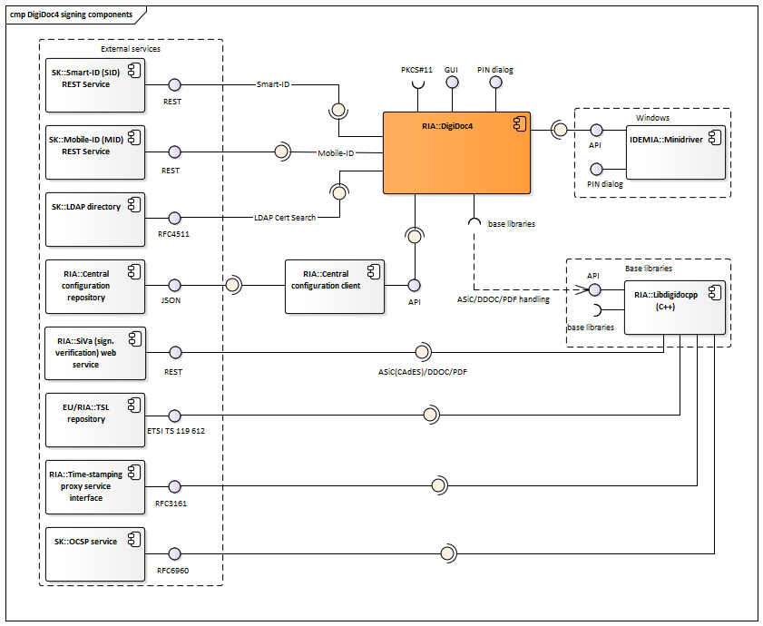
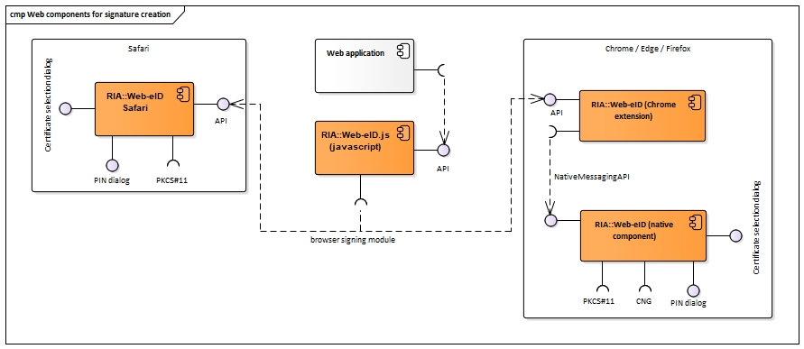
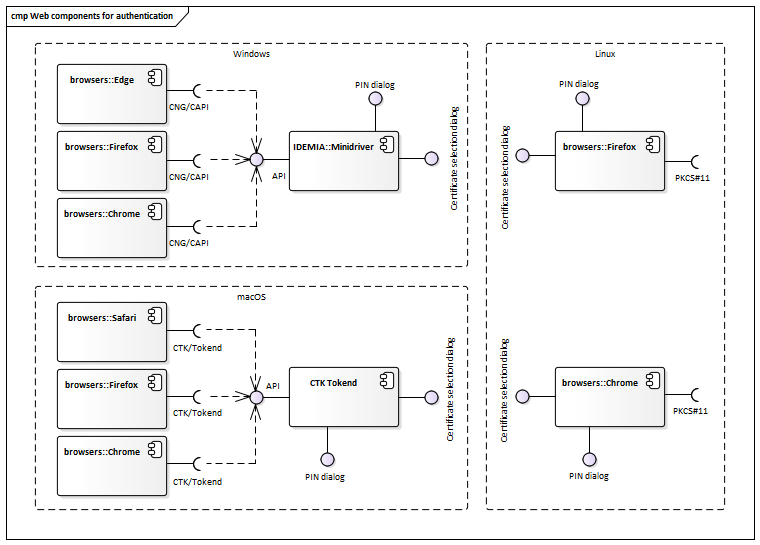
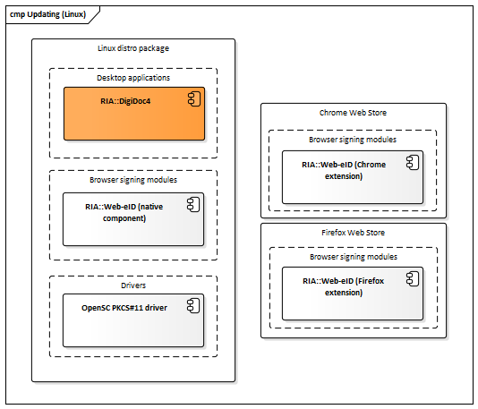
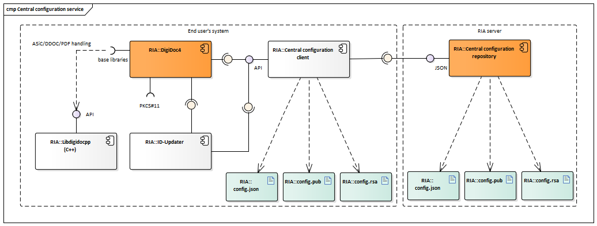

# <a name="home">ARCHITECTURE OF ID-SOFTWARE</a>

Document version: 0.6  
Software version: 3.12  
Last updated: 19.02.2016

# <a name="_intro">Introduction</a>

The purpose of this document is to describe the architecture of ID-software. 
 
**ID-software** is a collection of software components offering support for PKI-based functionality, i.e. operations with different cryptographic tokens (e.g. eID cards), handling digitally signed documents, file encryption/decryption and signing and authentication in web environment. The ID-software comprises end-user applications, software libraries, web components, drivers for communicating with the cryptographic tokens and other complementary components.  

Main sources for information about ID-software are [www.id.ee](http://id.ee/?lang=en&id=) and [Open-EID GitHub repository](https://github.com/open-eid). 

This document covers description of ID-software and its components, their deployment in different environments, provided and required interfaces. The document does not include components that have reached the end of their support nor the components that have not yet been released.  

The document is based on the latest released state of the ID-software components. At the time of writing, the latest released version of ID-software is **version 3.12**. Latest version numbers of the various ID-software components are provided at [http://www.id.ee/?lang=en&id=36798](http://www.id.ee/?lang=en&id=36798).

The document is targeted for:

*   Owners/managers of the software;
*   Contractors;
*   Contributors interested in developing ad-hoc solutions;
*   Integrators/software developers interested in integrating the software with third-party information systems;
*   International audience – contributors/integrators from countries other than Estonia who wish to use the software internationally and/or contribute in its development.

# <a name="_background">Background</a>

The main owner/manager of the ID-software is Estonian Information System Authority (RIA, [https://www.ria.ee/en.html](https://www.ria.ee/en.html)).  
Main contractor for developing the software is AS Sertifitseerimiskeskus (SK, [https://sk.ee/en](https://sk.ee/en)). In case of a few of the components, SK is also the owner.  

Development of ID-software has been mainly done in Estonia, however, the ID-software is released for international usage.  
The software is distributed open-source (mainly under LGPL/BSD licence) and is accessible from the following locations:

*   GitHub repository for the source code, wiki documentation, beta and (optionally) production versions of binary packages: [https://github.com/open-eid](https://github.com/open-eid).
*   Release repository for production versions of binaries: [https://installer.id.ee/](https://installer.id.ee/)

ID-software components can be logically divided in the following groups:

*   **Desktop applications** for end-users;
*   **Software libraries** for integrators/software developers to integrate the libraries’ functionality with third-party information systems/applications;
*   **Web components** for integrators/software developers to add the signature creation and authentication functionality in web environment to third-party web applications;
*   **Drivers** for communication with the cryptographic tokens that conduct the PKI operations;
*   **Other (supportive) components** for packaging, installation, updating and centrally managing changes of the configuration settings in software (with the central configuration service).

The following table maps the main ID-software components, their owner/developer (i.e. the main contractor) and the functionality they offer.

**Table: Mapping of ID-software components and functions**

<table border="1" cellspacing="0" cellpadding="0" width="101%">

<tbody>

<tr>

<td width="14%" colspan="2" rowspan="2">

Component

</td>

<td width="60%" colspan="6" valign="top">

Function

</td>

<td width="10%" rowspan="2">

Owner/  
Developer

</td>

<td width="8%" rowspan="2">

Licence

</td>

</tr>

<tr>

<td width="10%">

Handling BDOC documents

</td>

<td width="10%" >Handling DDOC documents</td>

<td width="12%">

Handling CDOC documents

</td>

<td width="12%">

Calculating RSA signature

</td>

<td width="12%">

Card management operations

</td>

<td width="14%">

Authentication

</td>

</tr>

<tr>

<td width="5%" rowspan="4">

Desktop applications

</td>

<td width="14%">

DigiDoc3 Client (incl. DigiDoc3 Crypto)

</td>

<td width="10%">

yes (1)

</td>

<td width="10%" >yes - validation only (1)</td>

<td width="12%">

yes (5)

</td>

<td width="12%">

-

</td>

<td width="12%">

-

</td>

<td width="14%">

-

</td>

<td width="10%">

RIA/SK

</td>

<td width="8%">

LGPL

</td>

</tr>

<tr>

<td width="14%">

ID-card utility

</td>

<td width="10%">

-

</td>

<td width="10%" >-</td>

<td width="12%">

-

</td>

<td width="12%">

-

</td>

<td width="12%">

yes (1)

</td>

<td width="14%">

-

</td>

<td width="10%">

RIA/SK

</td>

<td width="8%">

LGPL

</td>

</tr>

<tr>

<td width="14%">

DigiDoc4 Client

</td>

<td width="10%">

yes (1)

</td>

<td width="10%" >yes - validation only (1)</td>

<td width="12%">

yes (5)

</td>

<td width="12%">

-

</td>

<td width="12%">

yes (1)

</td>

<td width="14%">

-

</td>

<td width="10%">

RIA

</td>

<td width="8%">

LGPL

</td>

</tr>

<tr>

<td width="14%">

TeRa timestamping utility

</td>

<td width="10%" >yes - timestamping BDOC 1.0 (4)</td>

<td width="10%" >yes - timestamping only (4)</td>

<td width="12%">

-

</td>

<td width="12%">

-

</td>

<td width="12%">

-

</td>

<td width="14%">

-

</td>

<td width="10%">

RIA

</td>

<td width="8%">

LGPL

</td>

</tr>

<tr>

<td width="5%" rowspan="5">

Software libraries

</td>

<td width="14%">

JDigiDoc (Java)

</td>

<td width="10%">

yes (2)

</td>

<td width="10%" >yes</td>

<td width="12%">

yes

</td>

<td width="12%">

yes (1)

</td>

<td width="12%">

-

</td>

<td width="14%">

-

</td>

<td width="10%">

RIA/SK

</td>

<td width="8%">

LGPL

</td>

</tr>

<tr>

<td width="14%">

DigiDoc4j (Java)

</td>

<td width="10%">

yes

</td>

<td width="10%" >yes (1)</td>

<td width="12%">

-

</td>

<td width="12%">

yes (1)

</td>

<td width="12%">

-

</td>

<td width="14%">

-

</td>

<td width="10%">

RIA/SK

</td>

<td width="8%">

LGPL

</td>

</tr>

<tr>

<td width="14%">

Libdigidocpp (C++)

</td>

<td width="10%">

yes

</td>

<td width="10%" >yes (1)</td>

<td width="12%">

-

</td>

<td width="12%">

yes (1)

</td>

<td width="12%">

-

</td>

<td width="14%">

-

</td>

<td width="10%">

RIA/SK

</td>

<td width="8%">

LGPL

</td>

</tr>

<tr>

<td width="14%">

CDigiDoc (C)

</td>

<td width="10%">

-

</td>

<td width="10%" >yes</td>

<td width="12%">

yes

</td>

<td width="12%">

yes (1)

</td>

<td width="12%">

-

</td>

<td width="14%">

-

</td>

<td width="10%">

RIA/SK

</td>

<td width="8%">

LGPL

</td>

</tr>

<tr>

<td width="14%">

NDigiDoc (.NET)

</td>

<td width="10%">

-

</td>

<td width="10%" >-</td>

<td width="12%">

yes

</td>

<td width="12%">

-

</td>

<td width="12%">

-

</td>

<td width="14%">

-

</td>

<td width="10%">

SK/SK

</td>

<td width="8%">

BSD3

</td>

</tr>

<tr>

<td width="5%" rowspan="3">

Web components

</td>

<td width="14%">

Browser signing modules

</td>

<td width="10%">

-

</td>

<td width="10%" >-</td>

<td width="12%">

-

</td>

<td width="12%">

yes (1)

</td>

<td width="12%">

-

</td>

<td width="14%">
-
</td>
<td width="10%">
RIA/SK
</td>
<td width="8%">
LGPL
</td>
</tr>
<tr>
<td width="14%">
hwcrypto.js (JavaScript)
</td>
<td width="10%">
-
</td>
<td width="10%" >-</td>
<td width="12%">
-
</td>
<td width="12%">
yes (1)
</td>
<td width="12%">
-
</td>
<td width="14%">
-
</td>
<td width="10%">
RIA/SK
</td>
<td width="8%">
MIT
</td>
</tr>
<tr>
<td width="14%">
pkcs11-module-loader
</td>
<td width="10%">
-
</td>
<td width="10%" >-</td>
<td width="12%">
-
</td>
<td width="12%">
-
</td>
<td width="12%">
-
</td>
<td width="14%">
yes (3)
</td>
<td width="10%">
RIA/SK
</td>
<td width="8%">
LGPL
</td>
</tr>
<tr>
<td width="5%" rowspan="4">
Driver components
</td>
<td width="14%">
Minidriver
</td>
<td width="10%">
-
</td>
<td width="10%" >-</td>
<td width="12%">
-
</td>
<td width="12%">
yes (1)
</td>
<td width="12%">
-
</td>
<td width="14%">
yes (1)
</td>
<td width="10%">
RIA/SK
</td>
<td width="8%">
LGPL/BSD3
</td>
</tr>
<tr>
<td width="14%">
EstEID-pkcs11
</td>
<td width="10%">
-
</td>
<td width="10%" >-</td>
<td width="12%">
-
</td>
<td width="12%">
yes (1)
</td>
<td width="12%">
-
</td>
<td width="14%">
yes (1)
</td>
<td width="10%">
RIA/SK
</td>
<td width="8%">
-
</td>
</tr>
<tr>
<td width="14%">
EstEID-tokend
</td>
<td width="10%">
-
</td>
<td width="10%" >-</td>
<td width="12%">
-
</td>
<td width="12%">
yes (1)
</td>
<td width="12%">
-
</td>
<td width="14%">
yes (1)
</td>
<td width="10%">
RIA/SK
</td>
<td width="8%">
APSL / LGPL
</td>
</tr>
<tr>
<td width="14%">
Smartcardpp
</td>
<td width="10%">
-
</td>
<td width="10%" >-</td>
<td width="12%">
-
</td>
<td width="12%">
yes (1)
</td>
<td width="12%">
yes (1)
</td>
<td width="14%">
yes (1)
</td>
<td width="10%">
RIA/SK
</td>
<td width="8%">
LGPL/BSD3
</td>
</tr>
</tbody>
</table>
Remarks:

(1) - The functionality is provided via base components.  
(2) - Only BDOC with time-marks is supported (TM profile). Additional information is provided in the component's documentation.  
(3) - The component is used only once for setting the proper parameters for authentication in Firefox browser.  
(4) - The utility is used to timestamp BDOC 1.0 or DDOC documents - it creates a ASiC-S container with RFC 3161 timestamp token applied to the original BDOC or DDOC document.  
(5) - Supports also CDOC 1.1 format - encryption and decryption with ECDH (Elliptic-curve Diffie–Hellman).  

  
The main functions offered by ID-software are described in the following table.

**Table: Functions offered by ID-software**

| Function | Description |
| - | - |
| Handling BDOC documents | Handling documents in [BDOC 2.1](http://id.ee/public/bdoc-spec212-eng.pdf) (XAdES/ASiC-E) digital signature format that is a profile of [ETSI XAdES](http://www.etsi.org/deliver/etsi_ts/101900_101999/101903/01.04.02_60/ts_101903v010402p.pdf) (XML Advanced Electronic Signature) and [ETSI ASiC](http://www.etsi.org/deliver/etsi_ts/102900_102999/102918/01.02.01_60/ts_102918v010201p.pdf) formats. More information on the formats’ life cycle can be found from [http://www.id.ee/?lang=en&id=34336](http://www.id.ee/?lang=en&id=34336) . |
| Handling DDOC documents | Handling documents in [DIGIDOC-XML 1.3 (DDOC)](http://id.ee/public/DigiDoc_format_1.3.pdf) digital signature format that is a profile of [ETSI XAdES](http://www.etsi.org/deliver/etsi_ts/101900_101999/101903/01.04.02_60/ts_101903v010402p.pdf) (XML Advanced Electronic Signature) format. More information on the formats’ life cycle can be found from [http://www.id.ee/?lang=en&id=34336](http://www.id.ee/?lang=en&id=34336) |
| Verification of PAdES documents | Validating the signatures of PDF documents in [PAdES](http://www.etsi.org/deliver/etsi_en/319100_319199/31914201/01.01.01_60/en_31914201v010101p.pdf) digital signature format that is a profile of [ETSI PAdES](http://www.etsi.org/deliver/etsi_en/319100_319199/31914201/01.01.01_60/en_31914201v010101p.pdf). |
| Verification of ASiC-S documents | Validating timestamp and signatures of enclosed DDOC document in the Time Stamp Token (TST) based [ETSI ASIC-S](http://www.etsi.org/deliver/etsi_ts/102900_102999/102918/01.02.01_60/ts_102918v010201p.pdf) containers. |
| Calculating RSA signature | Calculating the RSA signature value in browser or desktop/server environment. The operation involves connecting with the signature token’s driver, sending the data to be signed and receiving digital signature value calculated with the token owner’s RSA private key. The following cryptographic tokens are supported: hardware-based tokens (e.g. PKCS#11-based eID cards, USB cryptostick and Mobile-ID); software-based tokens (e.g. PKCS#12 software token) |
| Handling CDOC documents | Encrypting and decrypting documents in [ENCDOC-XML 1.0 (CDOC)](http://id.ee/public/SK-CDOC-1.0-20120625_EN.pdf) format. |
| Card management operations | Renewal of the certificates on the card, PIN/PUK management, reading personal data file. |
| Authentication | Authentication with ID-card. The operation is generally done via native operating system/browser components. In case of Estonian ID-cards and Firefox browser, a PKCS#11 module loader script is used for setting the proper parameters for authentication in Firefox browser. |

# <a name="_tmp">Component model</a>

The following chapter depicts ID-software component diagrams, including variations of the components used in different supported environments.  
In the context of the component diagrams in this document, the ID-software components have been divided to three different packages to show the component’s owner/developer:

*   Components of ID-software that are owned by RIA and developed by SK: <u>placed in “RIA/SK” package</u>;
*   Components of ID-software that are owned and operated by RIA: <u>placed in “RIA” package;</u>
*   Components of ID-software that are owned and developed by SK: <u>placed in “SK” package.</u>

Other components are regarded as external to ID-software.  
Note that not all of the external base libraries are included in the component model to avoid duplicity with other documentation – the base libraries are listed and described in the documentation of the respective ID-software components and can be accessed via the references provided.

## Desktop applications

### DigiDoc3 Client

    
**Figure: Components of DigiDoc3 Client**

**Table: Components of DigiDoc3 Client**

| Component | Description | Owner/ Developer |
| - | - | - |
| DigiDoc3 Client |  End-user desktop applications that own a common GUI. DigiDoc3 Client enables handling digitally signed documents. DigiDoc3 Crypto subcomponent enables file encryption/decryption. Wiki: [https://github.com/open-eid/qdigidoc/wiki](https://github.com/open-eid/qdigidoc/wiki) Code repository: [https://github.com/open-eid/qdigidoc](https://github.com/open-eid/qdigidoc) | RIA/SK |
| DigiDoc3 Client base libraries |  Libdigidocpp (and its base libraries, including CDigiDoc), etc. See [ID-card utility's interfaces](#_ID-card_utility_interfaces) |  - |
| Kill switch (v3.9-v3.11) |  Service for centrally managing DigiDoc3 Client application’s life cycle. The application periodically connects with the service to check if the application’s version is still supported. If not, then the application cannot be used any longer and a newer version must be installed. | RIA |
| Error reports repository |  Repository where the DigiDoc3 Client application’s and ID-card utility program’s error reports (generated with BreakPad base library) are sent. | RIA |
| DigiDocService web service |  SOAP-based web service that is used by DigiDoc3 Client for signature creation with Mobile-ID. See also [http://www.sk.ee/upload/files/DigiDocService_spec_eng.pdf](http://www.sk.ee/upload/files/DigiDocService_spec_eng.pdf). | SK/SK |
| LDAP directory |  Directory of active certificates issued by SK (as the CA in Estonia). The directory is used by DigiDoc3 Crypto subcomponent for finding authentication certificate (and the respective public key) of the recipient of the encrypted document. See also [https://sk.ee/en/repository/ldap/ldap-kataloogi-kasutamine/](https://sk.ee/en/repository/ldap/ldap-kataloogi-kasutamine/) | SK/SK |
| Central configuration repository |  Described in chap. [Central configuration service](#_comp_central_conf) | RIA |
| Central configuration client |  Described in chap. [Central configuration service](#_comp_central_conf) | RIA/SK |
| TSL repository | Repository for accessing the TSL ([Trust Service status List](http://www.etsi.org/deliver/etsi_ts/119600_119699/119612/01.02.01_60/ts_119612v010201p.pdf)) lists that can be used as a central source of trust anchor information during digital signature creation and validation processes. The European Commission’s TSL list ([https://ec.europa.eu/information_society/policy/esignature/trusted-list/tl-mp.xml](https://ec.europa.eu/information_society/policy/esignature/trusted-list/tl-mp.xml)) is used as the central TSL list (with references to national lists). | - |
| Time-stamping service | [RFC3161](https://tools.ietf.org/html/rfc3161) based time-stamping service. | - |
| OCSP service | [RFC6960](https://tools.ietf.org/html/rfc6960) based OCSP service. Also offered by SK for Estonian and a number of foreign certificates (see [www.sk.ee](http://www.sk.ee/)). | - |
| Libdigidocpp |  Described in chap. [Software libraries](#_comp_libraries) | RIA/SK |
| CDigiDoc |  Described in chap. [Software libraries](#_comp_libraries) | RIA/SK |
| Minidriver |  Used via CNG interface in Windows environment only. Described in chap. [Drivers](#_comp_drivers) | RIA/SK |

#### DigiDoc3 Client interfaces

Provided:

*   [Graphical user interface](http://id.ee/index.php?id=30591) - interface for handling ASiC-E/XAdES (i.e. BDOC), DDOC, CDOC documents, setting configuration parameters.
    *   User: end-user
    *   Accessible with: GUI elements
*   PIN dialog – for inserting PIN value during signature creation or decryption operations in all operating systems except of Windows
    *   User: end-user
    *   Accessible with: GUI elements

Required:

*   [Central configuration client interface](#central-configuration-client-components-interfaces)
*   [Kill switch service interface](#_Kill_switch_service) (v3.9-v3.11)
*   [DigiDocService web service interface](#_DigiDocService_web_service)
*   [Error reports repository interface](#_Error_reports_repository)
*   [LDAP directory interface](#_LDAP_directory_interface)
*   Interfaces with base libraries:
    *   [Libdigidocpp library’s API](#_Libdigidocpp_library’s_interfaces_1) – for handling documents in supported digital signature formats (BDOC and DDOC).
    *   External base libraries: Qt5, libldap, openssl
*   Interfaces with cryptographic token’s drivers (described in chap. [Drivers](#_comp_drivers))
    *   PKCS#11 interface
    *   CNG interface

### ID-card utility

     
**Figure: Components of ID-card utility**

**Table: Components of ID-card utility**

| Component | Description | Owner/ Developer |
| - | - | - |
| ID-card utility | End-user desktop application for managing ID-card’s PIN/PUK codes replacement, certificates’ renewal and other services. Code repository: [https://github.com/open-eid/qesteidutil](https://github.com/open-eid/qesteidutil) . Wiki: [https://github.com/open-eid/qesteidutil/wiki](https://github.com/open-eid/qesteidutil/wiki) | RIA/SK |
| ID-card utility’s base libraries |  See [ID-card utility's interfaces](#_ID-card_utility_interfaces) |  - |
| ID-Updater |  Used in Windows and OSX only, described in chap. [Updating mechanisms](#_comp_update). In case of Windows platform, the ID-Updater can be executed from ID-card utility program. | RIA/SK |
| ID-Updater service |  Used until v3.11 of ID-software. Since v3.12, replaced with the [Central configuration service](#_comp_central_conf) | RIA/SK |
| Central configuration client |  Described in chap. [Central configuration service](#_comp_central_conf) | RIA/SK |
| Central configuration repository |  Described in chap. [Central configuration service](#_comp_central_conf) | RIA |
| ID-card owner’s photo repository |  Repository where the Estonian national ID-cards photos’ are kept. ID-card’s owner can download the photo after the user has been authenticated with PIN1 code. |  RIA |
| Error reports repository |  Described in chap. [DigiDoc3 Client](#_DigiDoc3_Client) |  RIA |
| @eesti.ee e-mail checking service |  Service that enables to set the properties of e-mail address (@eesti.ee) that is provided for Estonian national ID-card owners by the state. The user must be authenticated with PIN1 code. |  RIA |
| Certificate's renewal service |  Service for renewing certificates on the Estonian national ID-card and Digi-ID card. |  RIA |
| M-ID checking service |  Service for checking the status of Estonian national ID-card owner’s Mobile-ID certificates. The user must be authenticated with PIN1 code. |  SK |

#### ID-card utility's interfaces

Provided:

*   [Graphical user interface](http://www.id.ee/index.php?id=30590) – interface for handling card management operations and using the external services (listed under “Required interfaces”).
    *   User: end-user
    *   Accessible with: GUI elements
*   PIN dialog – for inserting PIN/PUK value in all supported operating systems.
    *   User: end-user
    *   Accessible with: GUI elements

Required:

*   [ID-updater interface](#windows-updating-mechanism) (Windows only)
*   [Central configuration client interface](#central-configuration-client-components-interfaces)
*   [ID-card owners’ photo repository interface](#_ID-card_owners’_photo)
*   [Error reports repository interface](#_Error_reports_repository)
*   [Eesti.ee e-mail checking service interface](#_Eesti.ee_e-mail_checking)
*   [Certificate's renewal service interface](#_Certificate_renewal_service)
*   [Mobile-ID validity checking service interface](#_Mobile-ID_validity_checking)
*   Interfaces with base libraries: Qt5

### DigiDoc4 Client

    
**Figure: DigiDoc4 Client signing and crypto-components**

    
**Figure: DigiDoc4 Client ID-card management components**

**Table: DigiDoc4 Client**

| Component | Description | Owner/ Developer |
| - | - | - |
| DigiDoc4 Client | DigiDoc4 Client is an update of both [DigiDoc3 Client](#_DigiDoc3_Client) and [ID-card utility](#_ID-card_utility) - it combines the functionality of both applications. Major changes provided by the new client are refreshed UI and the improvements in the workflow/UX of the application. Architectural components and interfaces of the application mirror the existing applications. Code repository: [https://github.com/open-eid/DigiDoc4-Client](https://github.com/open-eid/DigiDoc4-Client) . | RIA |
| SiVa | *Si*gnature *Ve*rification Service is an online web service for validating digitally signed documents. SiVa is used by the DigiDoc4 Client (by libdigidocpp base library) to validate documents in formats that are not natively supported; currently the service is used to validate PDF (ETSI PAdES) documents. See also [Signature Verification Service interface](#_SiVa_verification_service). | RIA |
| - | See the list of components of [DigiDoc3 Client](#_DigiDoc3_Client) and [ID-card utility](#_ID-card_utility) | - |

#### DigiDoc4 interfaces 

DigiDoc4 interfaces are the combination of [DigiDoc3 Client-](#_DigiDoc3_Client_interfaces) and [ID-card utility interfaces](#_ID-card_utility_interfaces).

### TeRa timestamping application

    
**Figure: Components of TeRa timestamping application**

**Table: Components of TeRa timestamping application**

| Component | Description | Owner/ Developer |
| - | - | - |
| TeRa | TeRa (*Te*mbeldamis*Ra*kendus) is a timestamping utility that searches the local filesystem for DDOC and BDOC v1 files and timestamps them creating new ASiC-S containers in Time stamp token format. Timestamping is necessary in order to ensure the long term verification of the documents in case if the format becomes attackable, e.g. in case of weak hashes used in the signed documents. Code repository: [https://github.com/open-eid/TeRa](https://github.com/open-eid/TeRa). | RIA |
| Central configuration client | Described in chap. [Central configuration service](#_comp_central_conf) | RIA/SK |
| Timestamping proxy | Proxy service used by RIA. The proxy is used to provide well-known interface for the timestamping service; it allows flexible change of service providers and possibility to support multiple providers at the same time. See also [Time-stamping proxy interface](#_Time_stamping_proxy). | RIA |
| Time-stamping service | Trusted timestamping service based on RFC 3161 protocol | Service provider |

#### TeRa interfaces

Provided:

*   Graphical user interface – interface for searching and timestamping of DDOC/BDOC v1.0 signature containers on user's machines.
    *   User: end-user
    *   Accessible with: GUI elements
*   Command line (CLI) interface – interface for searching and timestamping of DDOC/BDOC v1.0 signature containers via CLI.
    *   User: end-user
    *   Accessible with: command line / terminal
*   PIN dialog – for inserting PIN value in all supported operating systems.
    *   User: end-user
    *   Accessible with: GUI elements

Required:

*   [Central configuration client interface](#central-configuration-client-components-interfaces)
*   [Time-stamping proxy interface](#_Time_stamping_proxy)
*   Interfaces with base libraries: Qt5

## Software libraries

    
**Figure: Java software libraries and their components**

  
**Figure: C/C++ software libraries and their components**

  

**Figure: .NET software libraries and components**

**Table: Software libraries and their components**

| Component | Description | Owner/ Developer |
| - | - | - |
| DigiDoc4j | Java software library that enables handling documents in BDOC 2.1(XAdES/ASiC-E) and DIGIDOC-XML 1.3 formats. Documentation: [http://open-eid.github.io/digidoc4j/](http://open-eid.github.io/digidoc4j/) . Code repository: [https://github.com/open-eid/digidoc4j](https://github.com/open-eid/digidoc4j) | RIA/SK |
| DigiDoc4j utility program | Small command line application that implements the main functionality of DigiDoc4j library. Used for testing purposes. Can also be used as a source for sample client code for using DigiDoc4j. See also [http://open-eid.github.io/digidoc4j/](http://open-eid.github.io/digidoc4j/) | RIA/SK |
| JDigiDoc | Java software library that enables handling documents in BDOC 2.1 (XAdES/ASiC-E) and DIGIDOC-XML 1.3 formats and encryption/decryption in ENCDOC-XML 1.0 (CDOC). Documentation: [http://id.ee/public/SK-JDD-PRG-GUIDE.pdf](http://id.ee/public/SK-JDD-PRG-GUIDE.pdf) Code repository: [https://github.com/open-eid/jdigidoc](https://github.com/open-eid/jdigidoc) | RIA/SK |
| JDigiDoc utility program |  Small command line application that implements the main functionality of JDigiDoc library. Used for testing purposes. Can also be used as a source for sample client code for using JDigiDoc. See also [http://id.ee/public/SK-JDD-PRG-GUIDE.pdf](http://id.ee/public/SK-JDD-PRG-GUIDE.pdf). | RIA/SK |
| Libdigidocpp |  C++ software library that enables handling documents in BDOC 2.1  (XAdES/ASiC-E) and DIGIDOC-XML 1.3 formats (via CDigiDoc base library). Wiki: [https://github.com/open-eid/libdigidocpp/wiki](https://github.com/open-eid/libdigidocpp/wiki) Code repository: [https://github.com/open-eid/libdigidocpp](https://github.com/open-eid/libdigidocpp) Documentation: [http://open-eid.github.io/libdigidocpp/](http://open-eid.github.io/libdigidocpp/) | RIA/SK |
| Libdigidocpp utility program |  Small command line application (digidoc-tool.exe) that implements the main functionality of Libdigidocpp library. Used for testing purposes. Can also be used as a source for sample client code for using Libdigidocpp. See also [http://open-eid.github.io/libdigidocpp/](http://open-eid.github.io/libdigidocpp/) | RIA/SK |
| CDigiDoc | Software library in C that enables handling digitally signed documents in DIGIDOC-XML 1.3 format and encryption/decryption in ENCDOC-XML 1.0 (CDOC). Documentation: [http://id.ee/public/SK-CDD-PRG-GUIDE.pdf](http://id.ee/public/SK-CDD-PRG-GUIDE.pdf) Code repository: [https://github.com/open-eid/libdigidoc](https://github.com/open-eid/libdigidoc) Wiki: [https://github.com/open-eid/libdigidoc/wiki](https://github.com/open-eid/libdigidoc/wiki) | RIA/SK |
| CDigiDoc utility program |  Small command line application that implements the main functionality of CDigiDoc library. Used for testing purposes. Can also be used as a source for sample client code for using CDigiDoc. See also [http://id.ee/public/SK-CDD-PRG-GUIDE.pdf](http://id.ee/public/SK-CDD-PRG-GUIDE.pdf) | RIA/SK |
| NDigiDoc |  Software library in .NET enabling encryption/decryption in ENCDOC-XML 1.0 (CDOC). Documentation: [http://id.ee/public/NDigiDoc.pdf](http://id.ee/public/NDigiDoc.pdf) Code repository: [https://github.com/open-eid/ndigidoc](https://github.com/open-eid/ndigidoc) | SK/SK |
| NDigiDoc utility program |  Small command line application that implements the main functionality of NDigiDoc library. Used for testing purposes. Can also be used as a source for sample client code for using NDigiDoc. See also [http://id.ee/public/NDigiDoc.pdf](http://id.ee/public/NDigiDoc.pdf). | SK/SK |
| DigiDocCSharp | .NET C# wrapper classes for using Libidigidocpp library’s functionality in .NET environment. Created with Swig tool. See also [https://github.com/open-eid/libdigidocpp/blob/master/examples/DigiDocCSharp/README.md](https://github.com/open-eid/libdigidocpp/blob/master/examples/DigiDocCSharp/README.md) | RIA/SK |
| TSL repository | Described in chap. [DigiDoc3 Client](#_DigiDoc3_Client) | - |
| Time-stamping service | Described in chap. [DigiDoc3 Client](#_DigiDoc3_Client) | - |
| OCSP service | Described in chap. [DigiDoc3 Client](#_DigiDoc3_Client) | - |

### DigiDoc4j library’s interfaces

Provided:

*   [DigiDoc4j API](http://open-eid.github.io/digidoc4j/)
    *   User: DigiDoc4j utility program
    *   Accessible with: Java

Required:

*   [TSL repositories’ interfaces](#_TSL_repositories’_interfaces)
*   [Time-stamping service interface](#_Time-stamping_service_interface)
*   [OCSP service interface](#_OCSP_service_interface)
*   Interfaces with base libraries:
    *   [JDigiDoc library’s API](#_JDigiDoc_library’s_interfaces) – for handling documents in DDOC format.
    *   Other base libraries: see [http://open-eid.github.io/digidoc4j/](http://open-eid.github.io/digidoc4j/) .
*   Interfaces with cryptographic token’s drivers (described in chap. [Drivers](#_comp_drivers) )
    *   PKCS#12 interface

### DigiDoc4j utility program’s interfaces

Provided:

*   [DigiDoc4j utility program’s interface](http://open-eid.github.io/digidoc4j/)
    *   User: server application, end-user application, end-user
    *   Accessible with: command line

Required:

*   [DigiDoc4j API](http://open-eid.github.io/digidoc4j/)

### JDigiDoc library’s interfaces

Provided:

*   [JDigiDoc API](http://id.ee/public/SK-JDD-PRG-GUIDE.pdf)
    *   User: JDigiDoc utility program, DigiDoc4j library
    *   Accessible with: Java

Required:

*   [OCSP service interface](#_OCSP_service_interface)
*   Interfaces with base libraries: see [http://id.ee/public/SK-JDD-PRG-GUIDE.pdf](http://id.ee/public/SK-JDD-PRG-GUIDE.pdf) for more information.
*   Interfaces with cryptographic token’s drivers (described in chap. [Drivers](#_comp_drivers) ):
    *   PKCS#11 interface
    *   PKCS#12 interface

### JDigiDoc utility program’s interfaces

Provided:

*   [JDigiDoc utility program’s interface](http://id.ee/public/SK-JDD-PRG-GUIDE.pdf)
    *   User: server application, end-user application, end-user
    *   Accessible with: command line

Required:

*   JDigiDoc API: see chap. [JDigiDoc library’s interfaces](#_JDigiDoc_library’s_interfaces)

### Libdigidocpp library’s interfaces

Provided:

*   [Libdigidocpp API](http://open-eid.github.io/libdigidocpp/)
    *   User: DigiDoc3 Client, Libdigidocpp utility program, DigiDocCSharp .NET wrapper classes
    *   Accessible with: C++

Required:

*   [TSL repositories’ interfaces](#_TSL_repositories’_interfaces)
*   [Time-stamping service interface](#_Time-stamping_service_interface)
*   [OCSP service interface](#_OCSP_service_interface)
*   Interfaces with base libraries:
    *   CDigiDoc library’s API – for handling documents in DDOC format. See chap. [CDigiDoc library’s interfaces](#_CDigiDoc_library’s_interfaces)
    *   Other base libraries: OpenSSL, xerces-c, xalan-c, codesynthesis-xsd, libxml-security-c. See also [http://open-eid.github.io/libdigidocpp/](http://open-eid.github.io/libdigidocpp/)
*   Interfaces with cryptographic token’s drivers (described in chap. [Drivers](#_comp_drivers) )
    *   PKCS#11 interface
    *   CNG interface
    *   PKCS#12 interface

### Libdigidocpp utility program’s interfaces

Provided:

*   [Libdigidocpp utility program’s interface](http://open-eid.github.io/libdigidocpp/)
    *   User: server application, end-user application, end-user
    *   Accessible with: command line

Required:

*   Libdigidocpp API: see chap. [Libdigidocpp library’s interfaces](#_Libdigidocpp_library’s_interfaces)

### CDigiDoc library’s interfaces

Provided:

*   [CDigiDoc API](http://id.ee/index.php?id=35782)
    *   User: Libdigidocpp library, CDigiDoc utility program
    *   Accessible with: C

Required:

*   [OCSP service interface](#_OCSP_service_interface)
*   Interfaces with base libraries: OpenSSL, libxml2\. See also [http://id.ee/index.php?id=35782](http://id.ee/index.php?id=35782).
*   Interfaces with cryptographic token’s drivers (described in chap. [Drivers](#_comp_drivers) )
    *   PKCS#11 interface
    *   CNG interface
    *   PKCS#12 interface

### CDigiDoc utility program’s interfaces

Provided:

*   [CDigiDoc utility program’s interface](http://id.ee/index.php?id=35782)
    *   User: server application, end-user application, end-user
    *   Accessible with: command line/console

Required:

*   CDigiDoc API: see chap. [CDigiDoc library’s interfaces](#_CDigiDoc_library’s_interfaces)

### NDigiDoc library’s interfaces

Provided:

*   [NDigiDoc API](http://id.ee/public/NDigiDoc.pdf)
    *   User: server application, end-user application; NDigiDoc utility program
    *   Accessible with: .NET

Required:

*   Interfaces with base libraries: see [http://id.ee/public/NDigiDoc.pdf](http://id.ee/public/NDigiDoc.pdf) for more information.
*   Interfaces with cryptographic token’s drivers (described in chap. [Drivers](#_comp_drivers) )
    *   PKCS#12 interface

### NDigiDoc utility program’s interfaces

Provided:

*   [NDigiDoc utility program’s interface](http://id.ee/public/NDigiDoc.pdf)
    *   User: server application, end-user application, end-user
    *   Accessible with: command line/console   

Required:

*   NDigiDoc API: see chap. [NDigiDoc library’s interfaces](#_NDigiDoc_library’s_interfaces)

## Web components

### Web signing components

The web signing component diagrams describe components that are needed for signature creation in web applications with eID cards.

  

**Figure: Components for signature creation in web environment**

**Table: Components for signing in web environment**

| Component | Description | Owner/ Developer |
| - | - | - |
| hwcrypto.js |  JavaScript library that enables communication with the browser signing modules (plug-in or extension) of the different web browsers. Wiki: [https://github.com/open-eid/hwcrypto.js/wiki](https://github.com/open-eid/hwcrypto.js/wiki) . Code repository: [https://github.com/open-eid/hwcrypto.js](https://github.com/open-eid/hwcrypto.js) | RIA/SK |
| Web application |  A web application that implements signature creation with an eID-token in browser environment. |  - |
| EstEID Firefox plug-in |  Browser signing module (NPAPI-based plug-in) that is used in Firefox (supported in Windows and Linux) and Safari (supported in Mac OS) browsers. The plug-in enables data exchange with the cryptographic token’s driver that is used for signing. In Windows environment, the driver that is implementing CNG/CAPI interface is used, along with the operating system’s native PIN insertion and certificate selection dialogs. Otherwise, PKCS#11 driver is used. Code repository: [https://github.com/open-eid/browser-token-signing](https://github.com/open-eid/browser-token-signing) . Wiki: [https://github.com/open-eid/browser-token-signing/wiki](https://github.com/open-eid/browser-token-signing/wiki) | RIA/SK |
| EstEIDPluginBHO | Browser signing module (BHO-based plug-in) that is used in Internet explorer browser (supported in Windows operating system). The plug-in enables data exchange with the cryptographic token’s driver that is used for signing. By default, the CNG/CAPI and minidriver is used along with its certificate selection and PIN insertion dialogs. Alternatively, in case of using PKCS#11 driver, the operating system's native PIN insertion dialog is used, certificate is selected via CAPI interface. Code repository: [https://github.com/open-eid/browser-token-signing](https://github.com/open-eid/browser-token-signing) . Wiki: [https://github.com/open-eid/browser-token-signing/wiki](https://github.com/open-eid/browser-token-signing/wiki) | RIA/SK |
| chrome-token-signing | Comprises two subcomponents: browser extension component and native OSX/Linux/Windows component that implements Native Messaging API (JSON). The browser extension enables data exchange with the native component that in turn interacts with the cryptographic token’s driver for signing. Code repository: [https://github.com/open-eid/chrome-token-signing](https://github.com/open-eid/chrome-token-signing) . Wiki: [https://github.com/open-eid/chrome-token-signing/wiki](https://github.com/open-eid/chrome-token-signing/wiki) | RIA/SK |
| Minidriver | Used via CNG interface in Windows environment only. Described in chap. [Drivers](#_comp_drivers) | RIA/SK |

#### Hwcrypto.js library’s interfaces

Provided:

*   [hwcrypto.js library’s API](https://github.com/open-eid/hwcrypto.js/wiki/ModernAPI)
    *   User: a web application in browser environment
    *   Accessible with: JavaScript

Required:

*   Interfaces with browser signing modules:
    *   [EstEID Firefox plug-in’s interfaces](#_EstEID_Firefox_plug-in’s)
    *   [EstEIDPluginBHO plug-in’s interfaces](#_EstEIDPluginBHO_plug-in’s_interface)
    *   [Chrome-token-signing extension’s interfaces](#_Chrome-token-signing_extension’s_in)

#### EstEID Firefox plug-in’s interfaces

Provided:

*   [EstEID Firefox plug-in’s API](https://github.com/open-eid/hwcrypto.js/wiki/LegacyAPI)
    *   User: a web application in browser environment, hwcrypto.js library
    *   Accessible with: C
*   PIN dialog – for inserting PIN2 value during signature creation in all operating systems except of Windows
    *   User: end-user
    *   Accessible with: GUI elements
*   Certificate selection dialog
    *   User: end-user
    *   Accessible with: GUI elements

Required:

*   Interfaces with cryptographic token’s drivers (described in chap. [Drivers](#_comp_drivers))
    *   PKCS#11 interface
    *   CNG interface

#### EstEIDPluginBHO plug-in’s interfaces

Provided:

*   [EstEIDPluginBHO plug-in’s API](https://github.com/open-eid/hwcrypto.js/wiki/LegacyAPI)
    *   User: a web application in browser environment, hwcrypto.js library
    *   Accessible with: C++

Required:

*   Interfaces with cryptographic token’s drivers (described in chap. [Drivers](#_comp_drivers))
    *   CNG/CAPI interface

#### Chrome-token-signing interfaces

Provided:

*   [Chrome-token-signing extension’s API](https://github.com/open-eid/chrome-token-signing/wiki/Extension#api)
    *   User: a web application in browser environment, hwcrypto.js library
    *   Accessible with: C++
*   PIN dialog – for inserting PIN2 value during signature creation
    *   User: end-user
    *   Accessible with: GUI elements
*   Certificate selection dialog
    *   User: end-user
    *   Accessible with: GUI elements

Required:

*   Interfaces with cryptographic token’s drivers (described in chap. [Drivers](#_comp_drivers))  
    *   PKCS#11 interface

### Web authentication components

Authentication in web browsers is done with the browsers’ and operating systems’ native components. In case of authenticating in Firefox browser then Firefox pkcs11-module-loader JavaScript component is used to load the OpenSC PKCS#11 driver by the browser.

  

**Figure: Web authentication components**

**Table: Web authentication components**

| Component | Description | Owner/ Developer |
| - | - | - |
| pkcs11-loader.js | A JavaScript component that is used to load the OpenSC PKCS#11 driver to the Firefox browser’s cryptographic devices list during each initialization of the browser. Needed during authentication process with eID-card in Firefox browser in all supported operating systems. Code repository: [https://github.com/open-eid/firefox-pkcs11-loader](https://github.com/open-eid/firefox-pkcs11-loader) Wiki: [https://github.com/open-eid/firefox-pkcs11-loader/wiki](https://github.com/open-eid/firefox-pkcs11-loader/wiki) | RIA/SK |
| OSX native certificate selection and PIN dialog | PIN dialog and certificate selection windows provided by the operating system’s native components. | - |
| Minidriver | Described in chap. [Drivers](#_comp_drivers) | RIA/SK |

## Drivers

    
**Figure: Cryptographic tokens’ drivers**

**Table: Cryptographic token driver components**

| Component | Description | Owner/ Developer |
| - | - | - |
| EstEID PKCS#11 driver | A driver for accessing eID-cards. Connects with the card via the operating system’s native PC/SC interface. Used as a default driver for signature creation with eID card in browser environment in case of OSX platform. Used as a default driver for authentication with eID card in browser environment in case of Firefox browser in OSX platform. Code repository: [https://github.com/open-eid/esteid-pkcs11](https://github.com/open-eid/esteid-pkcs11) Wiki: [https://github.com/open-eid/esteid-pkcs11/wiki](https://github.com/open-eid/esteid-pkcs11/wiki) | RIA/SK |
| OpenSC PKCS#11 driver | A driver for accessing eID-cards. Connects with the card via the operating system’s native PC/SC interface. Used as a default driver for authentication with eID card and signature creation in web browser environment in case of Linux platform. Wiki: [https://github.com/OpenSC/OpenSC/wiki](https://github.com/OpenSC/OpenSC/wiki) |  - |
| One-pin OpenSC PKCS#11 driver | Version of OpenSC PKCS#11 driver that only enables authentication functionality. Used as a default driver for authentication with eID card in browser environment in case of Windows platform. Wiki: [https://github.com/OpenSC/OpenSC/wiki](https://github.com/OpenSC/OpenSC/wiki) |  - |
| Smartcardpp | eID card driver’s helper component. Inner component. Code repository: [https://github.com/open-eid/smartcardpp](https://github.com/open-eid/smartcardpp) Wiki: [https://github.com/open-eid/smartcardpp/wiki](https://github.com/open-eid/smartcardpp/wiki) | RIA/SK |
| Minidriver |  Used as a default driver for accessing Estonian eID-cards via CNG interface for signature creation in web browser environment in case of Windows platform. Used as a default driver for authentication with eID card in Chrome and Internet Explorer browsers in case of Windows platform. Code repository: [https://github.com/open-eid/minidriver](https://github.com/open-eid/minidriver) Wiki: [https://github.com/open-eid/minidriver/wiki](https://github.com/open-eid/minidriver/wiki) | RIA/SK |
| ATR Filter | Base component for Minidriver (see [http://support.microsoft.com/kb/981665](http://support.microsoft.com/kb/981665) for more information). |  - |
| Esteid Tokend | A driver for accessing eID-cards. Connects with the card via the operating system’s native PC/SC interface. Used as a default driver for authentication with eID card in browser environment in case OSX platform. Code repository: [https://github.com/open-eid/esteid-tokend](https://github.com/open-eid/esteid-tokend) Wiki: [https://github.com/open-eid/esteid-tokend/wiki](https://github.com/open-eid/esteid-tokend/wiki)   |  RIA/SK |
| PKCS#12 implementation via base library | An implementation of PKCS#12 interface by the component’s base libraries. |  - |

### PKCS#11 driver interfaces

Components:

*   EstEID PKCS#11 driver
*   OpenSC PKCS#11 driver
*   One-pin OpenSC PKCS#11 driver

Provided:

*   PKCS#11 API
    *   User: a browser signing module, software library
    *   Accessible with: C++
    *   Documentation: 
        *   PKCS#11 API: [http://www.emc.com/emc-plus/rsa-labs/standards-initiatives/pkcs-11-cryptographic-token-interface-standard.htm](http://www.emc.com/emc-plus/rsa-labs/standards-initiatives/pkcs-11-cryptographic-token-interface-standard.htm)
        *   source code for the list of implemented functions

Required:

*   PC/SC: see chap. [PC/SC driver](#_PC/SC_driver)

### Minidriver interfaces

Provided:

*   CNG/Minidriver API
    *   User: a browser signing module, software library
    *   Accessible with: C/C++
    *   Documentation:
        *   CNG: [http://msdn.microsoft.com/en-us/library/windows/desktop/aa376210(v=vs.85).aspx](http://msdn.microsoft.com/en-us/library/windows/desktop/aa376210(v=vs.85).aspx),
        *   Minidriver API: [http://msdn.microsoft.com/en-us/library/windows/hardware/dn631754(v=vs.85).aspx](http://msdn.microsoft.com/en-us/library/windows/hardware/dn631754(v=vs.85).aspx)
        *   source code for the list of implemented functions

*   CAPI/Minidriver API
    *   User: a browser signing module, software library
    *   Accessible with: C/C++
    *   Documentation:
        *   CAPI:  [http://msdn.microsoft.com/en-us/library/aa380256.aspx](http://msdn.microsoft.com/en-us/library/aa380256.aspx)
        *   Minidriver API: [http://msdn.microsoft.com/en-us/library/windows/hardware/dn631754(v=vs.85).aspx](http://msdn.microsoft.com/en-us/library/windows/hardware/dn631754(v=vs.85).aspx)
        *   source code for the list of implemented functions

Required:

*   PC/SC: see chap. [PC/SC driver](#_PC/SC_driver)

### PKCS#12 implementation via base library

Provided:

*   PKCS#12 interface
    *   User: a software library
    *   Accessible with: PKCS#12 API
    *   Documentation: see documentation of the respective component’s appropriate base library

### Tokend driver interfaces

Components implementing the interface:

*   EstEID Tokend driver

Provided:

*   CDSA
    *   User: software library
    *   Accessible with: C++
    *   Documentation: see [https://developer.apple.com/library/mac/documentation/security/conceptual/cryptoservices/CDSA/CDSA.html](https://developer.apple.com/library/mac/documentation/security/conceptual/cryptoservices/CDSA/CDSA.html)

Required:

*   PC/SC: see chap. [PC/SC driver](#_PC/SC_driver)

### PC/SC driver interfaces

Provided:

*   PC/SC interface
    *   User: eID-card’s driver
    *   Accessible with: PC/SC API
    *   Documentation: see [http://www.pcscworkgroup.com/specifications/overview.php](http://www.pcscworkgroup.com/specifications/overview.php)

Required: not in the scope of this document.

## Updating mechanisms

The following chapter describes automatic updating mechanisms of different ID-software desktop applications. Several combinations of central software update checking and distribution environments are used depending on the end-user’s operating system.

### Windows updating mechanism

  
**Figure: Updating mechanisms in Windows**

**Table: Updating mechanisms in Windows**

| Component | Description | Owner/ Developer |
| - | - | - |
| ID-updater |  Service that is periodically checks if newer versions of related ID-software components are available for download, initiates the download and installation if necessary. Uses [Central configuration service](#_comp_central_conf) for determining the latest available software versions. | RIA/SK |
| MS Update | Microsoft Update – see Microsoft’s documentation for more information. |  - |
| Chrome Web Store | See [https://chrome.google.com/webstore/detail/token-signing/ckjefchnfjhjfedoccjbhjpbncimppeg](https://chrome.google.com/webstore/detail/token-signing/ckjefchnfjhjfedoccjbhjpbncimppeg) |  - |

### OS X updating mechanism

  
**Figure: Updating mechanisms in OSX**

**Table: Updating mechanisms in OSX**

| Component | Description | Owner/ Developer |
| - | - | - |
| ID-updater |  Described in chap. [Windows updating mechanism](#_Windows_updating_mechanism) | RIA/SK |
| Apple App Store |  See Apple App Store documentation. |  - |
| Chrome Web Store** | See [https://chrome.google.com/webstore/detail/token-signing/ckjefchnfjhjfedoccjbhjpbncimppeg](https://chrome.google.com/webstore/detail/token-signing/ckjefchnfjhjfedoccjbhjpbncimppeg) |  - |

### Linux updating mechanism

  
**Figure: Updating mechanism in Linux**

**Table: Updating mechanisms in Linux**

| Component | Description | Owner/ Developer |
| - | - | - |
| Ubuntu package updates |  Managed and maintained by SK. The binary packages are released for installation and updating to [https://installer.id.ee/media/ubuntu/](https://installer.id.ee/media/ubuntu/) repository. | RIA/SK |
| Packages updates for other distros |  Managed by the open-source community. Packages are built, added and updated in Estobuntu and Fedora distributions by the package maintainers. |  - |
| Chrome Web Store | See [https://chrome.google.com/webstore/detail/token-signing/ckjefchnfjhjfedoccjbhjpbncimppeg](https://chrome.google.com/webstore/detail/token-signing/ckjefchnfjhjfedoccjbhjpbncimppeg) |  - |

## Central configuration service

The central configuration service's purpose is to enable on-line and central management of ID-software components configuration settings.

 

**Figure: Central configuration service's client and server components**

**Table: Central configuration service's components**

| Component | Description | Owner/ Developer |
| - | - | - |
| ID-Updater | ID-Updater component (only in Windows and OSX) requests data from the central configuration client component, the latest availabe ID-software versions are read from the configuration file. See also [Updating mechanisms](#_comp_update) | RIA/SK |
| ID-card Utility | ID-card Utility requests configuration data from the central configuration client component. Described in chap. [ID-card Utility](#_ID-card_utility) | RIA/SK |
| DigiDoc3 Client | DigiDoc3 Client requests configuration data from the central configuration client component. Described in chap. [DigiDoc3 Client](#_DigiDoc3_Client) | RIA/SK |
| Central configuration client | Central Configuration Client component manages the configuration file validation and updating processes, returns the validated configuration data to the Requesting Application (DigiDoc3 Client or Utility program) and if necessary, updates the data from Central Configuration Server | RIA/SK |
| Central configuration service | Central Configuration Server component provides configuration data on-line to the Central Configuration Client component | RIA |
| config.json | The central configuration file is named config.json, the file is in JSON format. The configuration file is signed | RIA/SK |
| config.rsa | Stores the central configuration file's signature value. | RIA/SK |
| config.pub | Public key used for validating the central configuration file's signature value. | RIA/SK |
| Libdigidocpp | DigiDoc3 Client's base library, also uses the central configuration file's settings. Described in chap. [Software libraries](#_comp_libraries) | RIA/SK |

### Central configuration client's interfaces
Provided:

*   Central Configuration Client API
    *   User: DigiDoc3 Client, ID-card Utility, ID-Updater
    *   Accessible with: C++

Required:

*   Central configuration file config.json from the [central configuration repository](#_comp_central_conf_server_interfaces)
*   Central configuration file config.json from the local file system (or the local installation package)
*   Central configuration file's signature config.rsa from the [central configuration repository](#_comp_central_conf_server_interfaces)
*   Central configuration file's signature config.rsa from the local file system (or the local installation package)
*   Client operating system's registry/environment variables
    *   LastCheck entry
*   Base libraries:
    *   QT framework
    *   OpenSSL
	

### Central configuration repository's interfaces
See [Central configuration repository's interfaces](#_comp_central_conf_server_interfaces).

## Interfaces with external services
The following chapter describes interfaces that different ID-software components may have with external services. Relatsionships with the external services are depicted in different ID-software component models above.

#### Central configuration repository's interfaces

*   Central configuration file config.json
    *   User: central configuration client component
    *   Accessible from: <a href="https://id.eesti.ee/config.json">https://id.eesti.ee/config.json</a>
	*   Accessible with: HTTPS protocol
*   Central configuration file's signature file config.rsa
    *   User: central configuration client component
    *   Accessible from: <a href="https://id.eesti.ee/config.rsa">https://id.eesti.ee/config.rsa</a>
	*   Accessible with: HTTPS protocol
*   Central configuration file's public key file config.pub
    *   User: central configuration client component
    *   Accessible from: <a hreef="https://id.eesti.ee/config.pub">https://id.eesti.ee/config.pub</a> 
	*   Accessible with: HTTPS protocol

#### ID-updater service interface (until v3.11)

*   User: DigiDoc3 Client
*   Accessible with: HTTPS protocol
*   Accessible from:
    *   Windows: [https://installer.id.ee/media/win/products.xml](https://installer.id.ee/media/win/products.xml),
    *   OSX: [https://installer.id.ee/media/osx/products.xml](https://installer.id.ee/media/osx/products.xml),
    *   Linux: [https://installer.id.ee/media/ubuntu/pool/main/](https://installer.id.ee/media/ubuntu/pool/main/) 

#### Kill switch service interface (v3.9-v3.11)

*   User: DigiDoc3 Client
*   Accessible with: XML file sent over HTTPS protocol
*   Accessible from: [https://installer.id.ee/media/killswitch/products.xml](https://installer.id.ee/media/killswitch/products.xml)

#### DigiDocService web service interface

*   User: DigiDoc3 Client
*   Accessible with: SOAP 1.0-encoded over HTTPS
*   Accessible from: [https://digidocservice.sk.ee](https://digidocservice.sk.ee/)
*   Documentation: [http://www.sk.ee/upload/files/DigiDocService_spec_eng.pdf](http://www.sk.ee/upload/files/DigiDocService_spec_eng.pdf)

#### Error reports repository interface

*   User: DigiDoc3 Client, ID-utility
*   Accessible with: HTTPS protocol
*   Accessible from: [https://cr.eesti.ee](https://cr.eesti.ee/)

#### LDAP directory interface

*   User: DigiDoc3 Client
*   Accessible with: LDAP protocol
*   Accessible from: ldap.sk.ee:389
*   Documentation: [https://sk.ee/en/repository/ldap/ldap-kataloogi-kasutamine/](https://sk.ee/en/repository/ldap/ldap-kataloogi-kasutamine/)

#### TSL repositories’ interfaces

*   User: Libdigidocpp, DigiDoc4j
*   Accessible with: HTTPS protocol
*   Accessible from:

    *   European Commission’s master list: [https://ec.europa.eu/information_society/policy/esignature/trusted-list/tl-mp.xml](https://ec.europa.eu/information_society/policy/esignature/trusted-list/tl-mp.xml)
    *   National TSL URLs in the European Commission’s TSL, e,g, Estonian TSL: [http://sr.riik.ee/tsl/estonian-tsl.xml](http://sr.riik.ee/tsl/estonian-tsl.xml)

*   Documentation: [http://www.etsi.org/deliver/etsi_ts/119600_119699/119612/01.02.01_60/ts_119612v010201p.pdf](http://www.etsi.org/deliver/etsi_ts/119600_119699/119612/01.02.01_60/ts_119612v010201p.pdf)

#### Time-stamping service interface

*   User: Libdigidocpp , DigiDoc4j
*   Accessible with: HTTPS protocol
*   Accessible from:
    *   SK’s time-stamping service [http://demo.sk.ee/tsa/](http://demo.sk.ee/tsa/)
    *   Documentation: [RFC3161](https://tools.ietf.org/html/rfc3161)

#### OCSP service interface

*   User: DigiDoc4j, JDigiDoc, Libdigidocpp, CDigiDoc software libraries; DigiDocService web service
*   Accessible with: HTTPS protocol
*   Accessible from:
    *   SK’s OCSP service for SK issued certificates: [http://ocsp.sk.ee/](http://ocsp.sk.ee/)
    *   SK’s Proxy OCSP service for international use: [http://ocsp.sk.ee/_proxy](http://ocsp.sk.ee/_proxy)
    *   SK’s test OCSP service: [http://demo.sk.ee/ocsp](http://demo.sk.ee/ocsp)

*   Documentation: [RFC6960](https://tools.ietf.org/html/rfc6960)

#### ID-card owners’ photo repository interface

*   User: ID-card utility program
*   Accessible with: HTTPS protocol
*   Accessible from: [https://sisene.www.eesti.ee/idportaal/portaal.idpilt](https://sisene.www.eesti.ee/idportaal/portaal.idpilt)

#### Eesti.ee e-mail checking service interface

*   User: ID-card utility program
*   Accessible with: HTTPS
*   Accessible from: [https://sisene.www.eesti.ee/idportaal/postisysteem.naita_suunamised](https://sisene.www.eesti.ee/idportaal/postisysteem.naita_suunamised)

#### Mobile-ID validity checking service interface

*   User: ID-card utility program
*   Accessible with: HTTPS
*   Accessible from: [https://id.sk.ee/MIDInfoWS/](https://id.sk.ee/MIDInfoWS/)

#### Certificate's renewal service interface (since v3.12.x)

*   User: ID-card utility program
*   Accessible with: HTTP
*   Accessible from: to be specified. 

#### Signature Verification Service interface (since v3.12.x)

*   User: Libdigidocpp (DigiDoc3 and DigiDoc4 clients)
*   Accessible with: HTTPS protocol
*   Accessible from: [https://siva.eesti.ee/validate](https://siva.eesti.ee/validate)
*   Documentation: [http://open-eid.github.io/SiVa/](http://open-eid.github.io/SiVa/)

#### Time-stamping proxy interface

*   User: TeRa utility
*   Accessible with: HTTPS protocol
*   Accessible from: [https://puhver.ria.ee/tsa](https://puhver.ria.ee/tsa)

# <a name="_tmp2">Deployment model</a>

The following subchapters describe physical deployment of ID-software components in collaboration with external components that were depicted in chap. [Component model](#_component_model) in case of the most common use cases.

## Signing in web browser

 
 
**Figure: Signing in web browser via a web application**

Additional notes:

*   A DigiDoc software library (i.e. DigiDoc4j, JDigiDoc, Libdigidocpp or CDigiDoc library) and DigiDocService web service are optional and can be used for creating a DDOC or BDOC container and adding the created signature value to the container.
*   Long term validation data is added to the DDOC/BDOC signature by obtaining OCSP confirmation and optionally a time-stamp
*   DigiDocService is required in order to sign with Mobile-ID.
*   Signature value is calculated either in the Mobile-ID SIM card or eID-card’s chip.s
*   When signing with eID smartcard then the browser signing module is necessary for enabling communication with the smart card connected to the user’s system. Hwcrypto.js library offers a single API for supporting signing modules of all the supported browsers. 
*   Optionally, trust anchor data is retrieved from TSL lists – the European Commission’s central TSL and national TSL’s of the EU member states.

## Signing with DigiDoc3 Client

  
**Figure: Deployment of components during signature creation with DigiDoc3 Client**

Additional notes:

*   DigiDoc3 Client is used for creating the DDOC or BDOC (XAdES/ASiC-E) container and adding the signature value to the container.
*   Long term validation data is added to the DDOC/BDOC signature by obtaining OCSP confirmation and optionally a time-stamp
*   DigiDocService is required in order to sign with Mobile-ID.
*   Signature value is calculated either in the Mobile-ID SIM card or ID-card’s chip.
*   Trust anchor data is retrieved from TSL lists – the European Commission’s central TSL and national TSL’s of the EU member states.
