# ID-tarkvara administraatori vaade

**[In English](index.md)**

**Versioon:** 26.07/1

**Väljaandja:** [RIA](https://www.ria.ee/)

**Versiooni info**

| Kuupäev    | Versioon | Muutused/märkused
|:-----------|:--------:|:-----------------------------------------------------------
| 21.01.2019 | 19.01/1  | Avalik versioon, tugineb 18.12 tarkvarale.
| 24.07.2019 | 19.7/1   | Lisatud `.exe` installatsiooni võti Chrome allkirjastamise toe automaatselt aktiveerimiseks, ning tarkvara kaasajastatud versioonile 19.7. — Muutja: Kristel Merilain
| 20.11.2019 | 19.10/1  | Muudetud AWP pakiga kaasatulevat `OTCertSynchronizer` vaikimisi paigaldust ning tarkvara kaasajastatud versioonile 19.10. — Muutja: Kristjan Vaikla
| 31.01.2020 | 20.01/1  | Lisatud DigiDoc4 kliendi kinnituslehe registrivõtme asukoht ning tarkvara kaasajastatud versioonile 20.01. — Muutja: Kristjan Vaikla
| 02.07.2020 | 20.05/1  | Lisatud AWP 5.3.4 SR1 komponendi parameeter registrivõtmele, mis sisaldab tõlkeid Windows serveri jaoks ning tarkvara kaasajastatud versioonile 20.05. — Muutja: Kristjan Vaikla
| 11.10.2020 | 20.10/1  | Eemaldatud TeRa tembeldamisrakendus, tarkvara kaasajastatud versioonile 20.10. — Muutja: Kristjan Vaikla
| 28.02.2022 | 22.02/1  | Lisatud Web eID uuendus, eemaldatud aegunud info, täiendatud installatsioonivõimalusi, kirjeldatud veebilehitsejate laienduste keskselt levitamine. Tarkvara kaasajastatud versioonile 22.02/1. — Muutja: Urmas Vanem
| 29.03.2022 | 22.03/1  | Laiendite keskse levitamise peatükis parandatud Chrome Web eID laienduse väärtus. — Muutja: Urmas Vanem
| 13.04.2022 | 22.04/1  | Lisatud Web eID laienduste paigaldamise vaikekoha muutmine. — Muutja: Tarmo Nurmela
| 21.04.2022 | 22.04/2  | Lisatud MSI pakiga Idemia minidraiveri automaatinstallatsiooni kirjeldus (ilma kaardita/lugejata, RDP juhtum). — Muutja: Urmas Vanem
| 13.06.2022 | 22.06/1  | Lisatud peatükk „Tarkvara uuenduste loogika“ ja Chrome „Configure native messaging blocklist/allowlist“ poliitikate kirjeldus. — Muutja: Urmas Vanem
| 29.07.2022 | 22.07/1  | Dokumendis kirjeldatava tarkvara baasversioon on uuendatud versioonile 22.06.0.1930, kirjeldatud on uue versiooniga seotud muudatused, eemaldatud aegunud info, lisatud Firefox kesksete poliitikate kirjeldus. — Muutjad: Kristel Merilain, Urmas Vanem
| 11.08.2022 | 22.08/1  | Lisatud ID-tarkvara uuenduste protsessi kirjeldus. — Muutja: Urmas Vanem
| 31.08.2022 | 22.08/2  | Parandatud „Veebilehitsejate käitumisest laiendite vaates installatsiooni ajal“ peatükis olevate tabelite informatsioon. — Muutja: Kristel Merilain
| 14.12.2022 | 22.12/1  | Muudetud laiendite käitumise kirjeldust Edge ja Chrome veebilehitsejates installatsiooni ajal ning tarkvara on kaasajastatud versioonile 22.11. — Muutja: Kristjan Vaikla
| 29.12.2022 | 22.12/1  | Uuendatud transform failide info `AWP`, `Digidoc_ShellExt` ja Web eID peatükkides. — Muutja: Märt Hirtentreu
| 24.10.2024 | 24.10/1  | Eemaldatud Gemalto minidraiver, uuendatud installatsiooniloogikat, muudetud veebilehitsejatesse suhtumist installatsiooni ajal jpm. — Muutja: Urmas Vanem
| 16.06.2025 | 25.06/1  | AWP asendatud IDPlug-iga. — Muutja: Raul Metsma
| 31.10.2025 | 25.10/1  | Lisatud SmartCard Client. — Muutja: Raul Kaidro
| 19.05.2026 | 26.04/1  | Avaldatud veebidokumentatsioonina. Lisatud Edge NativeMessagingAllowlist konfiguratsioon. — Muutja: Raul Metsma
| 11.06.2026 | 26.06/1  | Uuendatud GPO-MSI levitamise juhiseid ja kuvatõmmiseid. — Muutja: Raul Metsma
| 29.07.2026 | 26.07/1  | Lisatud Microsoft Intune paigaldusjuhised ID-tarkvarale ning laienduste keskseks haldamiseks. — Muutja: Raul Metsma

---

- TOC
{:toc}

## Sissejuhatus

See dokument käsitleb ID-tarkvara paigaldamist ja haldamist IT-administraatori vaates. Pildid on illustratiivsed ja tehtud versiooni 26.4.20.8412 baasil.

ID-tarkvaras toetatud operatsioonisüsteemid ja veebilehitsejad:

- Operatsioonisüsteemid: Windows 10, Windows 11, Windows Server 2019, Windows Server 2022 ja Windows Server 2025.
- Veebilehitsejad: eelnimetatud operatsioonisüsteemide poolt toetatud Mozilla Firefox, Google Chrome ja Microsoft Edge Chromium versioonid.

Täpsem info viimase ID-tarkvara versiooni muudatuste kohta on leitav aadressilt <https://www.id.ee/artikkel/id-tarkvara-versioonide-info-release-notes/>.

## Ülevaade ID-tarkvarast

ID-tarkvara installer on üks offline EXE fail, `Open-EID-26.4.20.8412.exe`, mis ei toeta enam `/layout` käsku MSI pakettide eraldamiseks. MSI failid on eraldi allalaetavad aadressilt <https://installer.id.ee/media/win/Open-EID.zip>.

Lihtne viis ID-tarkvara interaktiivseks paigaldamiseks on käivitada EXE fail, millega tarkvara paigaldatakse vaikimisi konfiguratsioonis. Soovi korral on võimalik paigaldada vaid teatud komponente, selleks tuleb paigaldamise alguses avanenud tervitusaknast valida *Customize*:

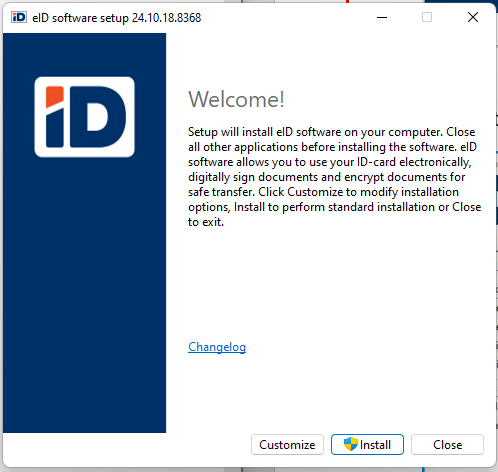

Valikud on:

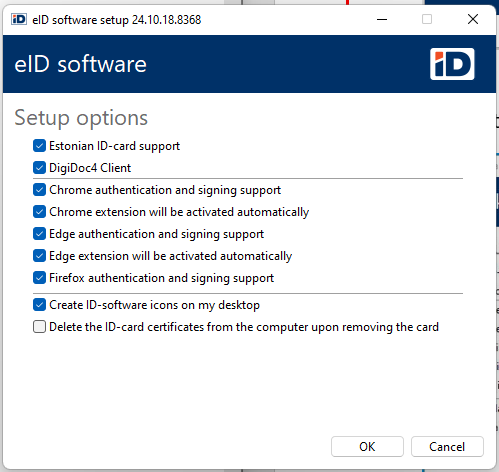

### Lühidalt erinevatest ID-tarkvara komponentidest

Komponendid on eraldi kättesaadavad MSI pakkidena aadressilt <https://installer.id.ee/media/win/Open-EID.zip>.

#### IDPlug

IDPlug on Idemia kaardi tarkvara, mis muuhulgas paigaldab ka minidraiveri Idemia kaartidele.

IDPlug sees sisaldub ka komponent IDPlug Services. Selle paigaldamisel kustutakse kaardi lugejast eemaldamisel Windowsi kasutaja sertifikaadihoidlast ID-kaardi sertifikaadid. Vaikimisi EXE installatsiooniga IDPlug Services ei paigaldata ning sertifikaadihoidlast ID-kaardi sertifikaate ei eemaldata. Komponendi paigaldamiseks tuleb EXE installatsioon käivitada käsurea parameetriga `InstallCertSynchronizer=1`.

#### SmartCard Client

SmartCard Client on Thales kaardi tarkvara, mis muuhulgas paigaldab ka minidraiveri Thales kaartidele.

#### CertDelApp

Selle paigaldamisel kustutakse kaardi lugejast eemaldamisel Windowsi kasutaja sertifikaadihoidlast ID-kaardi sertifikaadid. Vaikimisi EXE installatsiooniga `CertDelApp` ei paigaldata ning sertifikaadihoidlast ID-kaardi sertifikaate ei eemaldata. Komponendi paigaldamiseks tuleb EXE installatsioon käivitada käsurea parameetriga `InstallCertSynchronizer=1`.

#### Digidoc_ShellExt

See komponent paigaldab klassikalise (*legacy*) Windows Exploreri kontekstimenüü laienduse, mis võimaldab alustada faili paremklõpsuga dokumendi allkirjastamist või krüpteerimist DigiDoc4 rakenduses. Windows 11-s kuvatakse selle laienduse käsud menüü *Show more options* all. Kui laiendus on Windows Explorerisse juba laaditud, võib selle paigaldamine või uuendamine nõuda Exploreri või arvuti taaskäivitamist.

#### DigiDoc4

DigiDoc4 on rakendus, mis võimaldab dokumente allkirjastada ja digiallkirjastatud dokumente valideerida, dokumente krüpteerida ja dekrüpteerida, saada ülevaadet ID-kaardi sertifikaatidest ning ID-kaardi PIN- ja PUK-koode hallata. Nii DigiDoc4 MSI kui ka Microsoft Store'i rakendus paigaldavad Windows Exploreri moodsa kontekstimenüü laienduse; MSI teeb seda AppX-põhise lahenduse kaudu.

#### ID-updater

ID-tarkvara EXE-paigaldus paigaldab alati komponendi ID-updater, mis sisaldab teiste ID-tarkvara komponentide jaoks vajalikke kolmanda osapoole teeke (Qt, OpenSSL jms). Vaikimisi loob EXE-paigaldus ka *Task Scheduleri* käsu `id updater task`, mis kontrollib kord nädalas uue tarkvara saadavust ja pakub leitud uuenduse kasutajale. Automaatkorralduse loomise saab keelata parameetriga `AutoUpdate=0`, kuid ID-updater paigaldatakse ka sel juhul. Kui ID-tarkvara komponendid paigaldatakse eraldi MSI-pakkidena, ei ole ID-updater vajalik.

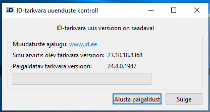

#### Web eID

Web eID võimaldab Eesti ID-kaarte kasutada veebis autentimiseks ja allkirjastamiseks. Web eID komponent koosneb omarakendusest (*native app*) ja tuntumate veebilehitsejate Google Chrome, Mozilla Firefox ja Microsoft Edge laiendustest.

### Ettevõttes

Keskmistes ja suurtes organisatsioonides paigaldatakse ja hallatakse ID-tarkvara tavaliselt keskselt. Levinud lahendused on Microsoft Intune, Microsoft Configuration Manager (SCCM) ja Active Directory rühmapoliitikad (AD/GPO).

#### SCCM

Lisaks interaktiivse installatsiooni puhul saadaolevatele konfiguratsioonivõimalustele on automaatsete installatsioonide puhul võimalik kasutada EXE-installatsioonidel järgmiseid võtmeid:

1. `ChromeSupport=0` — ei paigaldata Chrome laiendust, registri kirjeid ega native messaging manifesti, vaikimisi 1.
2. `EdgeSupport=0` — ei paigaldata Edge laiendust, registri kirjeid ega native messaging manifesti, vaikimisi 1.
3. `ForceChromeExtensionActivation2=1` — Chrome laiendus aktiveeritakse automaatselt, vaikimisi 1.
4. `ForceEdgeExtensionActivation2=1` — Edge laiendus aktiveeritakse automaatselt, vaikimisi 1.
5. `FirefoxSupport=0` — ei paigaldata Firefox laiendust, registri kirjeid ega native messaging manifesti, vaikimisi 1.
6. `InstallCertSynchronizer=1` — installeeritakse vaikimisi `OTCertSynchronizer`, vaikimisi 0[^1].
7. `MinidriverInstall=0` — ei installeerita minidraiverit, vaikimisi 1.
8. `Qdigidoc4Install=0` — ei installeerita DigiDoc tarkvara, vaikimisi 1.
9. `IconsDesktop=0` — ei paigutata DigiDoc ikooni desktopile, vaikimisi 1.
10. `AutoUpdate=0` — ei lisata *Task Scheduleri* käsku `id updater task`, vaikimisi 1.

> **Märkus:** Ülaltoodud installivõtmed on tõusutundlikud.

> **Märkus:** Kui `ChromeSupport`, `EdgeSupport` ja `FirefoxSupport` on kõik seatud väärtusele 0, ei paigaldata ka native messaging rakendust.

Näiteks käsurida `Open-EID-<version>.exe /q AutoUpdate=0 IconsDesktop=0` installeerib ID-tarkvara vaikimisi režiimil, ei aktiveeri automaatset uuenduste otsimist ega paigalda ID-tarkvara ikoone töölauale.

Vaikimisi piisab tarkvara installeerimiseks EXE käivitamisest, mis paigaldab tarkvara vaikimisi seadetega.

SCCM vahenditega installeerides on kõige lihtsam luua tavaline installatsioonipakk ja installeerida see arvutile näiteks vaikimisi käsureaga `Open-EID-<version>.exe /q AutoUpdate=0`.

Selle tavapärase installatsiooni tulemusena on ID-tarkvara tavapäraselt näha tarkvara loendis:

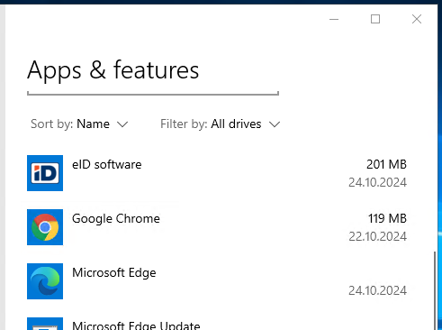

#### AD/GPO

Juhul, kui keskne süsteemihaldusvahend on ettevõttes puudu, küll aga on võimalik kasutada rühmapoliitikate (GPO) võimalusi, on võimalik kasutada ka MSI tüüpi installatsioone. Soovitatav on GPO installatsioonid teha arvutipõhised.

> **Märkus:** MSI-pakke saab kasutada nii esmaseks paigalduseks kui ka keskselt hallatud uuendusteks. Need ei eemalda ega vii olemasolevat EXE-põhist paigaldust automaatselt MSI-põhisele haldusele. EXE-lt MSI-põhisele haldusele üleminekul eemalda EXE-põhine paigaldus eraldi. Järgnevate MSI-uuenduste puhul levita uuemaid komponendipakke keskhalduslahenduse kaudu ja testi enne juurutamist konkreetse versiooni uuenduskäitumist.

Milleks erinevad komponendid on vajalikud, leiad peatükist „[Lühidalt erinevatest komponentidest](#lühidalt-erinevatest-id-tarkvara-komponentidest)“, allpool tuleb ülevaade GPO-MSI installatsioonide konfigureerimise kohta.

MSI pakid on EXE-sse sisse pakitud, kuid neid ei saa sealt lahti pakkida. Küll aga on need eraldi allalaetavad aadressilt <https://installer.id.ee/media/win/Open-EID.zip>.

MSI pakkidena on olemas järgmised failid:

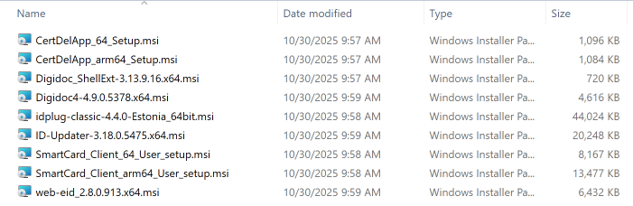

Juhendis järgnevalt kirjeldatavad MST failid on allalaetavad asukohast <https://www.id.ee/artikkel/open-eid-administreerimise-ja-paigaldamise-juhised-administraatoritele/>.

Palun märgake ka seda, et uute MSI versioonidega on ka mitmeid MST faile uuendatud ja kindlasti kasutage uusi — vanad ei toimi.

> **Märkus:** Võrreldes juhendi varasemate versioonidega ei ole GPO-MSI paigalduste puhul enam vaja paigaldada komponenti `ID-updater` ning komponendid ei vaja enam transformfaile, mis sunnivad tarkvara paigaldamist samasse kausta `PROGRAMMIFAILID\Open-EID`.

##### IDPlug

Idemia kaardi minidraiver ja baastarkvara.

Erinevalt EXE installatsioonist (vt. [IDPlug](#idplug) komponendi tutvustust) paigaldab MSI install vaikimisi komponendi IDPlug Services. Kui seda ei soovita, tuleb MSI installile lisada kohandus.

Kohandused:

- Komponendi IDPlug Services installatsiooni keelamiseks tuleb installatsioonile lisada transformfail:
  - `DisableIDPlugServices.mst`

##### SmartCard Client

Thales kaardi minidraiver ja baastarkvara.

##### CertDelApp

Selle paigaldamisel kustutakse kaardi lugejast eemaldamisel Windowsi kasutaja sertifikaadihoidlast ID-kaardi sertifikaadid.

##### DigiDoc4

Vajalik, kui soovitakse paksu kliendiga sertifikaate hallata, allkirjastada ja krüpteerida.

Kohandused:

- Vaikimisi MSI installatsioon töölauale vajalikke ikoone ei paigalda. Kui on soov seda teha, tuleb installatsioonile lisada ka transformfail `2410-DD-Shortcut`.

DigiDoc4 MSI paigaldab Windows Exploreri moodsa kontekstimenüü laienduse AppX-põhise lahenduse kaudu.

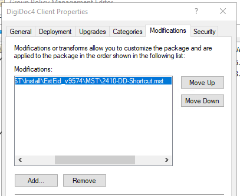

##### Windowsile klassikalise paremkliki-laienduse lisamine

`Digidoc_ShellExt` MSI paigaldab Windows Exploreri klassikalise kontekstimenüü laienduse. Windows 11-s kuvatakse selle laienduse käsud menüü *Show more options* all. Kasuta seda ainult siis, kui moodsa, DigiDoc4 MSI-ga kaasneva laienduse asemel on vaja klassikalist laiendust. Kui klassikaline laiendus on Explorerisse juba laaditud, võib selle paigaldamine või uuendamine nõuda Exploreri või arvuti taaskäivitamist.

##### Web eID

Brauserite laiendused ja omarakendus (*native app*).

MSI kohandatud pakkide loend näeb GPMC halduskonsoolis välja nii:

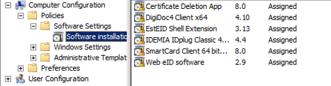

GPO-MSI installatsioonide puhul ilmuvad kõik installeeritud programmid ka programmide loendisse:

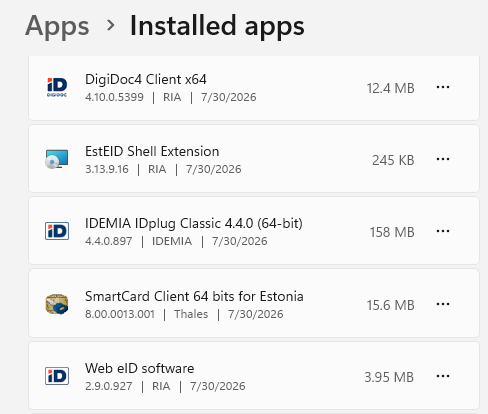

> **Märkus:** MSI-de installatsioonide järjestus ei ole oluline, kuid vajalik minidraiver peab olema paigaldatud, sest teised komponendid sõltuvad sellest.

> **Märkus:** MST failid on allalaetavad asukohast <https://www.id.ee/artikkel/open-eid-administreerimise-ja-paigaldamise-juhised-administraatoritele/>.

> **Märkus:** Skoobis olevad juur- ja kesktaseme sertifikaadid on soovitatav domeenis publitseerida rühmapoliitikate abil kõikidele serveritele ja tööjaamadele.

#### Microsoft Intune'i rakenduste levitamine

Kui seadmeid hallatakse Microsoft Intune'iga, levita eespool kirjeldatud eraldi MSI pakke Win32 rakendustena. MSI paigalduste puhul ei ole `ID-updater` vajalik.

MSI komponendi Intune'i jaoks pakkimiseks:

1. Laadi alla *Microsoft Win32 Content Prep Tool* (`IntuneWinAppUtil.exe`) aadressilt <https://github.com/microsoft/Microsoft-Win32-Content-Prep-Tool>.
2. Pane komponendi MSI ja kõik vajalikud MST failid eraldi lähtekausta.
3. Pakenda MSI tööriista abil `.intunewin` failiks.
4. Ava Intune halduskeskuses *Apps > All apps > Create*, vali rakenduse tüübiks *Windows app (Win32)* ja laadi üles tekkinud `.intunewin` fail.

Ilma käsureaparameetriteta käivitamisel küsib `IntuneWinAppUtil.exe` lähtekausta, installifaili ja väljundkausta. Tööriist toetab ka käsureaparameetreid, mis on kasulikud pakkimise sammu skriptimiseks:

```
IntuneWinAppUtil.exe -c Source -s "<tegelik komponendi MSI failinimi>" -o Out -q
```

- `-c` — lähtekaust (kõik installatsiooniks vajalikud failid)
- `-s` — paigaldatava komponendi MSI fail
- `-o` — väljundkaust, kuhu tekib `.intunewin` fail
- `-q` — vaikne režiim, mis jätab ära interaktiivsed küsimused (nt kinnituse küsimise olemasoleva väljundfaili ülekirjutamiseks)

Installatsiooni käsk, eemaldamise käsk ja tuvastusreegel (*detection rule*) sisestatakse Intune halduskeskuse rakenduse loomise juhendatud protsessis. Alltoodud failinimed on kohatäitjad; asenda need allalaaditud `Open-EID.zip` failis olevate tegelike versioonipõhiste failinimedega:

- *Program* vahekaart:
  - Installatsiooni käsk, näiteks: `msiexec /i "<tegelik Web eID MSI failinimi>" /quiet`
  - Eemaldamise käsk: `msiexec /x "{PRODUCT-CODE}" /quiet`
  - Installatsiooni käituskontekst (*Install behavior*): *System*
- *Detection rules* vahekaart — vali *Manually configure detection rules*, lisa *MSI* reegel, sisesta vastava versiooni MSI tootekood ja luba MSI tooteversiooni kontroll.
- *Assignments* vahekaart — rakenduse automaatseks paigaldamiseks määra see soovitud seadme- või kasutajagruppidele profiiliga *Required*.

> **Märkus:** `{PRODUCT-CODE}` on kohatäitja. Kui Content Prep Tooli installifailiks (`-s`) valida MSI, loeb tööriist selle metaandmed ning Intune saab tootekoodi MSI tuvastusreeglis kasutada. Kontrolli Intune'is kuvatud väärtust ning kasuta sama GUID-i eemaldamiskäsus. Enne pakkimist saab väärtust vaadata ka [Orcaga](https://learn.microsoft.com/en-us/windows/win32/msi/orca-exe): ava MSI, vali tabel `Property` ning loe rea `ProductCode` veerust `Value` vajalik GUID. Tootekood võib versiooni, arhitektuuri ja keelepaketi lõikes erineda, seetõttu ei ole selles juhendis konkreetseid GUID-e loetletud.

Transformfailid antakse MSI käsureal kaasa `TRANSFORMS` parameetriga, näiteks:

```
msiexec /i "<tegelik IDPlug MSI failinimi>" TRANSFORMS=DisableIDPlugServices.mst /quiet
```

Kui MSI komponendid levitatakse eraldi Win32 rakendustena, määra vajalik minidraiver seda vajavate komponentide sõltuvuseks.

> **Märkus:** MSI komponendid ja transformfailid on samad, mis eespool kirjeldatud peatükis [AD/GPO](#adgpo).

##### DigiDoc4 levitusviisi valimine

DigiDoc4 saab levitada kas Microsoft Store'ist või MSI-põhise Win32 rakendusena. Kasuta ühe seadmegrupi jaoks ainult ühte neist meetoditest.

###### Valik 1: Microsoft Store

DigiDoc4 on saadaval [Microsoft Store'is](https://apps.microsoft.com/detail/9pfpfk4dj1s6). Selle Intune'i kaudu levitamiseks ava *Apps > All apps > Create*, vali *Microsoft Store app (new)* ning otsi rakendust nimega `DigiDoc4` või Store'i tootetunnusega `9PFPFK4DJ1S6`. Rakenduse saab seejärel määrata profiiliga *Required* või *Available for enrolled devices*.

Store'i rakendus sisaldab DigiDoc4 rakendust koos failiseoste ja Windows Exploreri moodsa kontekstimenüü laiendusega. See ei asenda ID-kaardi minidraiverit ega Web eID omarakendust ja brauserilaiendusi. Levita need vajalikud komponendid eraldi eespool kirjeldatud MSI pakkidega.

Intune'i kaudu Microsoft Store'ist levitatud rakendusi uuendatakse automaatselt. Kasuta seda võimalust, kui DigiDoc4 uusima versiooni automaatne vastuvõtmine on sobiv; kui iga DigiDoc4 versioon peab enne levitamist olema testitud ja heaks kiidetud, kasuta eespool kirjeldatud MSI-põhist Win32 paigaldust.

###### Valik 2: MSI-põhine Win32 rakendus

Pakenda DigiDoc4 MSI eespool kirjeldatud viisil. MSI paigaldab Windows Exploreri moodsa kontekstimenüü laienduse AppX-põhise lahenduse kaudu. Töölaua otseteede lisamiseks pane `2410-DD-Shortcut.mst` lähtekausta ja kasuta käsku:

```
msiexec /i "<tegelik DigiDoc4 MSI failinimi>" TRANSFORMS=2410-DD-Shortcut.mst /quiet
```

`Digidoc_ShellExt` MSI-d ei ole moodsa kontekstimenüü laienduse jaoks vaja. Levita see eraldi ainult siis, kui vaja on Windows Exploreri klassikalist kontekstimenüü laiendust. Windows 11-s kuvatakse selle laienduse käsud menüü *Show more options* all. Kui klassikaline laiendus on Explorerisse juba laaditud, võib selle paigaldamine või uuendamine nõuda Exploreri või arvuti taaskäivitamist. MSI-põhine valik võimaldab organisatsioonil iga DigiDoc4 versiooni enne levitamist testida ja heaks kiita, kuid uuendusi tuleb hallata Intune'is.

##### Intune'i paigalduse uuendamine

Store'i valiku puhul uuendab Microsoft Store DigiDoc4 rakendust automaatselt. MSI-põhiste Win32 rakenduste puhul levita iga heakskiidetud komponendiuuendus Intune'i kaudu:

1. Loo uue komponendi MSI-st uus `.intunewin` pakk.
2. Uuenda installatsiooni- ja eemaldamiskäske, MSI tootekoodi ning tooteversiooni tuvastust.
3. Loo uus Win32 rakendus või uuenda olemasoleva rakenduse sisu. Uue rakenduse loomisel määra see eelmise versiooni asendajaks (*supersedence*). Kui testimine kinnitab, et uus MSI uuendab olemasoleva paigalduse, määra *Uninstall previous version* väärtuseks *No*. Kasuta väärtust *Yes* ainult siis, kui eelmine pakk tuleb enne uue paigaldamist eemaldada.
4. Testi paigaldust ja määra uus versioon seejärel vajalikele gruppidele.

Kõigi MSI-põhiste ID-tarkvara komponentide järgnevate versioonide levitamise eest vastutab Intune.

### Laienduste levitamine keskselt

Veebilehitsejate laiendusi saab keskselt levitada rühmapoliitika või Microsoft Intune'i kaudu.

Alltoodud konfiguratsioonid tuleb kindlasti enne reaalset rakendamist kohalikes oludes testida.

#### Brauserilaienduste poliitikad AD/GPO kaudu

##### Chromium Edge

Edge puhul tuleb alla laadida värskeim Edge poliitikate raamistik aadressilt <https://www.microsoft.com/en-us/edge/business/download> ja siduda see enda domeeni lahendusega.

Pärast poliitikate keskkonnale tutvustamist saab teha uue poliitika, millega muudetakse Web eID laienduse kasutamine domeenis automaatseks. Selleks tuleb määrata välja `Computer Configuration/Policies/Administrative Templates/Microsoft Edge/Extensions — Control which extensions are installed silently` väärtuseks `gnmckgbandlkacikdndelhfghdejfido`.

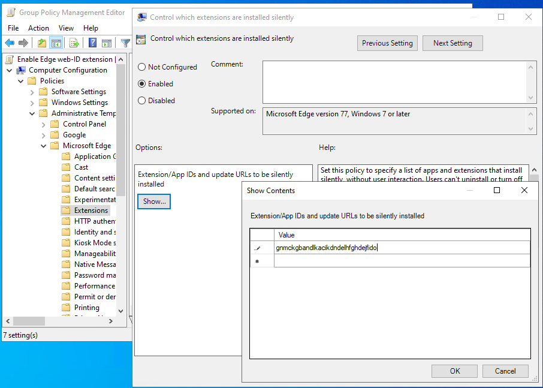

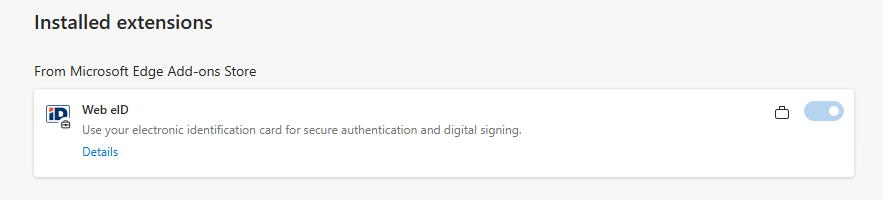

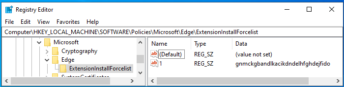

###### Vajalik lisakonfiguratsioon `native messaging` jaoks

Vaikimisi on kõik native messaging hostid Edge'is lubatud. Kui aga `NativeMessagingBlocklist` poliitika väärtuseks on määratud `*`, siis Web eID allkirjastamine ei toimi. Lahenduseks tuleb `eu.webeid` lisada `NativeMessagingAllowlist` poliitikasse. Lisainfo: Edge poliitika dokumentatsioon [NativeMessagingAllowlist](https://learn.microsoft.com/en-us/deployedge/microsoft-edge-browser-policies/nativemessagingallowlist).

##### Google Chrome

Chrome poliitika pannakse paika juba ID-tarkvara installeerimise käigus. Registrisse kirjutatakse info, millega lubatakse Web eID laiendus Chrome's automaatselt:

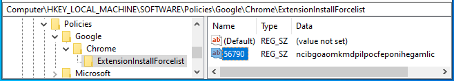

Kui on soov Chrome poliitikaid ettevõttes keskselt hallata, võib abi olla alljärgnevast juhisest.

Chrome puhul tuleb kesksete poliitikate kasutamiseks alla laadida värskeimad Chrome haldusmallid aadressilt <https://chromeenterprise.google/browser/download/#windows-tab> ja siduda need domeeni lahendusega.

Pärast poliitikate keskkonnale tutvustamist saab teha uue poliitika, millega muudetakse Web eID laienduse kasutamine domeenis automaatseks. Selleks tuleb määrata loendi `Computer Configuration/Policies/Administrative Templates/Google/Google Chrome/Extensions — Configure the list of force-installed apps and extensions` üheks väärtuseks `ncibgoaomkmdpilpocfeponihegamlic`.

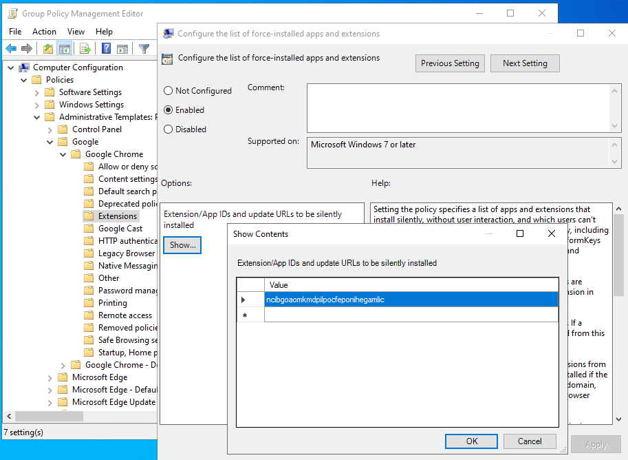

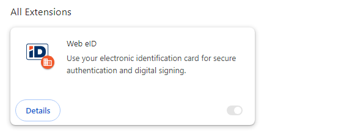

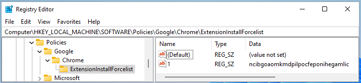

###### Vajalik lisakonfiguratsioon `native messaging` jaoks

Juhul, kui Chrome poliitikatega on konfigureeritud omadus `Configure native messaging blocklist` ja määratud seal väärtuseks `*`, siis kasutades ülalkirjeldatud Chrome veebilehitseja laiendust allkirjastamine ei toimi. Näiteks testlehel <https://hwcrypto.github.io/hwcrypto.js/sign.html> allkirjastamisel kuvatakse:

```
Debug: hwcrypto.js 0.0.13 with failing backend Chrome native messaging extension
getCertificate() failed: Error: technical_error
```

Lubamaks sellises situatsioonis veebis siiski allkirjastamist, tuleb lubada host `eu.webeid` poliitikas `Configure native messaging allowlist`:

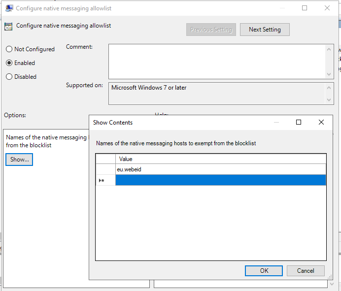

Pärast poliitika rakendamist allkirjastamine õnnestub.

```
Debug: hwcrypto.js 0.0.13 with Chrome native messaging extension 2.0.1/2.0.0.552
Using certificate:
-----BEGIN CERTIFICATE-----
...
```

##### Mozilla Firefox

Firefox poliitika määratakse juba ID-tarkvara installeerimise käigus, registrisse kirjutatakse järgneval pildil kajastatud info. Eelnimetatud poliitika abil installeeritakse Web eID laiendus Firefoxile automaatselt:

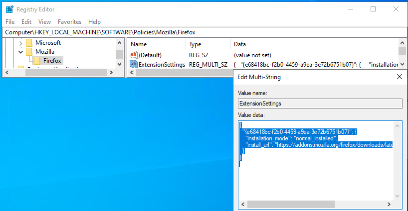

Kui on soov Firefox poliitikaid ettevõttes keskselt hallata, võib abi olla alljärgnevast juhisest.

Firefox puhul tuleb kesksete poliitikate kasutamiseks alla laadida Firefox värskeimad haldusmallid aadressilt <https://github.com/mozilla/policy-templates/releases> ja siduda need domeeni lahendusega.

Pärast poliitikate keskkonnale tutvustamist saab teha uue poliitika, millega muudetakse Web eID laienduse kasutamine domeenis automaatseks. Selleks on mitmeid võimalusi, ent soovitav on üle kirjutada juba installatsiooni käigus kirjeldatud poliitika. Selleks määratakse välja `Computer Configuration/Policies/Administrative Templates/Mozilla/Firefox/Extensions — Extension Management` väärtuseks järgnev tekst:

```json
{
  "{e68418bc-f2b0-4459-a9ea-3e72b6751b07}": {
    "installation_mode": "normal_installed",
    "install_url": "https://addons.mozilla.org/firefox/downloads/latest/web-eid-webextension/latest.xpi"
  }
}
```

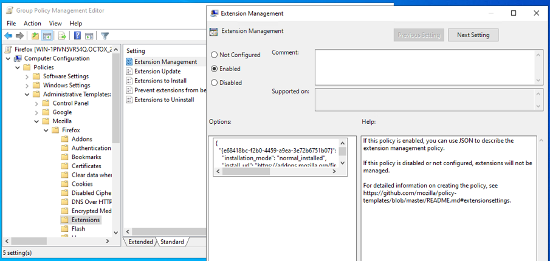

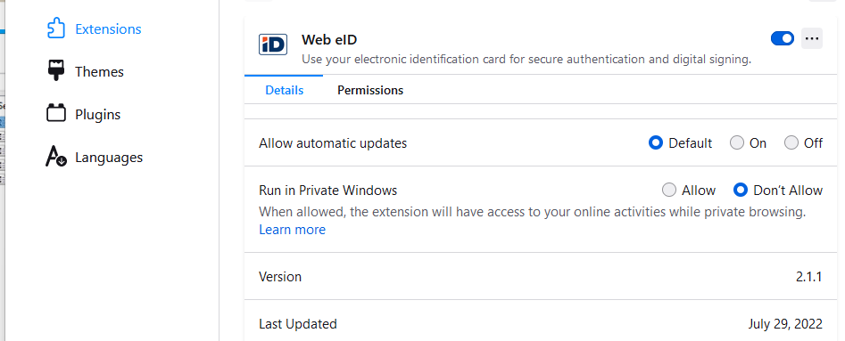

Registris paigaldatakse vastav info samasse kohta, kuhu ka installatsiooni ajal.

Kui on soov, et kasutaja ei saaks iseseisvalt Web eID laiendust välja lülitada, tuleb:

1. Asendada ülaltoodud välja väärtuses tekst `normal_installed` tekstiga `force_installed`;
2. Lisada rida `{e68418bc-f2b0-4459-a9ea-3e72b6751b07}` loendisse `Computer Configuration/Policies/Administrative Templates/Mozilla/Firefox/Extensions — Prevent extensions from being disabled or removed`.

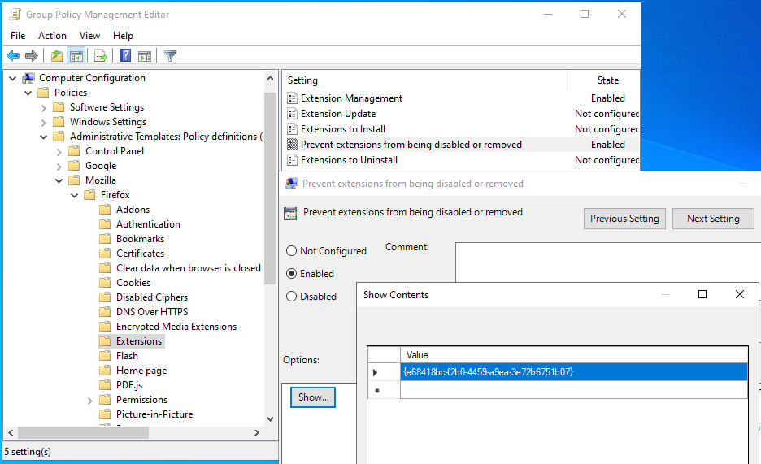

Pärast kummagi poliitika rakendamist ei saa kasutaja enda Firefoxis Web eID laiendust keelata:

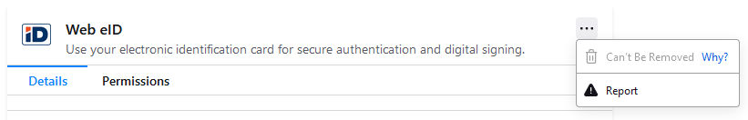

Lisaks on võimalik laiendus installida ka loendi `Computer Configuration/Policies/Administrative Templates/Mozilla/Firefox/Extensions — Extensions to install` abil, ent praeguse konfiguratsiooni puhul on pigem soovitav olemasoleva väärtuse ülekirjutamine.

#### Brauserilaienduste poliitikad Microsoft Intune'i kaudu

Veebilehitsejate laienduste poliitikaid saab levitada ka Microsoft Intune seadme konfiguratsiooniprofiilide abil, mitte ainult GPO kaudu.

##### Google Chrome ja Microsoft Edge

Chrome ja Edge poliitikad põhinevad samadel ADMX mallidel, millele viidati eespool ([Chromium Edge](#chromium-edge), [Google Chrome](#google-chrome)):

1. Ava Intune halduskeskuses *Devices > Manage devices > Configuration > Create > New policy*. Vali platvormiks *Windows 10 and later* ja profiili tüübiks *Settings catalog*. Chrome'i ja Edge'i sätted on kataloogis olemas ning nende ADMX malle ei ole vaja importida.
2. Seadista laienduse sundinstalli lubav säte (Chrome puhul `Configure the list of force-installed apps and extensions`, Edge puhul `Control which extensions are installed silently`) Web eID laienduse ID-ga: Chrome'i puhul `ncibgoaomkmdpilpocfeponihegamlic`, Edge'i puhul `gnmckgbandlkacikdndelhfghdejfido`.
3. Kui native messaging on piiratud blocklist-poliitikaga, lisa ka `eu.webeid` vastavasse allowlist-sättesse, samamoodi nagu eespool kirjeldatud peatükkides [Chromium Edge](#chromium-edge) ja [Google Chrome](#google-chrome).
4. Määra profiil vajalikele seadme- või kasutajagruppidele.

##### Mozilla Firefox

Firefoxi poliitikad ei ole Intune'i sisseehitatud *settings catalog*'i osa:

1. Laadi alla Firefoxi ADMX mallid (vt [Mozilla Firefox](#mozilla-firefox) eespool). Impordi asukohas *Devices > Manage devices > Configuration > Import ADMX* esmalt `mozilla.admx` koos vastava `mozilla.adml` failiga. Kui nende olek on *Available*, impordi `firefox.admx` koos vastava `firefox.adml` failiga.
2. Loo uus profiil, valides platvormiks *Windows 10 and later* ja profiili tüübiks *Templates > Imported Administrative templates (Preview)*. Seadista `Extension Management` sama JSON väärtusega, mis on kirjeldatud eespool peatükis [Mozilla Firefox](#mozilla-firefox).

   > **Hoiatus:** Kui asutuses on laienduste poliitikad grupeeritud kokku, kasuta varianti `Extension Management (JSON on one line)`. Vastasel juhul võib Intune lisada poliitikasse võõrsümboleid, mis jõuavad avatekstina Windowsi registrisse ja põhjustavad JSON-is süntaksivea. Intune ja Firefox ei võimalda praegu mõlemat varianti samal ajal kasutada. Näide registrisse jõudnud vigasest väärtusest: `�"*": {"installation_mode": "…`.

3. Määra profiil vajalikele seadme- või kasutajagruppidele.

> **Märkus:** Nagu GPO puhulgi, testi eespool kirjeldatud konfiguratsioone kindlasti enda keskkonna(s) enne rakendamist.

## Tarkvara uuendamine

ID-tarkvara uuenduste kontrollimisel on kasutusel keskne konfiguratsioon, mille abil võrreldakse kasutusel olevat tarkvara versiooni viimase saada oleva (ja DigiDoc4 puhul ka viimase toetatud tarkvara) versiooniga. Keskne konfiguratsioon on leitav aadressilt <https://id.eesti.ee/config.json>. Tarkvara uuenduste otsimist saab käivitada kolmel erineval viisil:

1. Automaatkorralduse `id updater task` abil;
2. DigiDoc4 programmi startimisel;
3. Käsitsi tarkvarauuenduste otsimine DigiDoc4 rakenduse käivitamisel.

### Automaatkorraldus `id updater task`

> **Märkus:** See meetod töötab vaid EXE-installatsioonidega — allkirjeldatud registriväärtuseid MSI installatsiooniga ei teki.

Vaikimisi luuakse installatsiooni käigus automaatkorraldus `id updater task`, millega kontrollitakse uuema tarkvaraversiooni saadavust. Juhul, kui on saadaval uuem versioon tarkvarast, pakutakse see kasutajale välja.

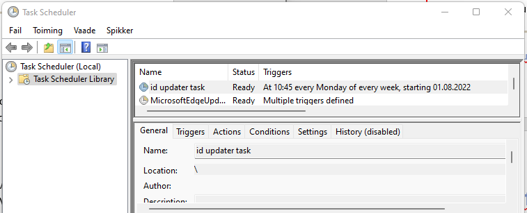

ID-tarkvara versiooni 26.4.20.8412 puhul on arvutis olev versioon kirjas registris võtme `HKEY_LOCAL_MACHINE\SOFTWARE\WOW6432Node\Microsoft\Windows\CurrentVersion\Uninstall\{5FBF3885-332F-4E02-B7C8-589775D00818}` all asuval väljal *DisplayVersion*.

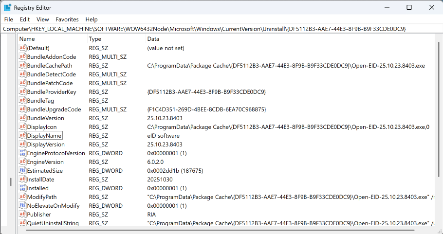

Genereeritud unikaalne võti (siin: `{5FBF3885-332F-4E02-B7C8-589775D00818}`) on iga ID-tarkvara versiooni puhul erinev. Automaatkorralduse `id updater task` käivitamisel laaditakse keskne konfiguratsioon arvuti mällu, loetakse sealt parameeter `WIN-LATEST` ja võrreldakse seda registris oleva parameetriga *DisplayVersion*. Juhul, kui `WIN-LATEST` on suurem kui registris asuva *DisplayVersion* välja väärtus, pakutakse kasutajale tarkvara uuendust.

### DigiDoc4 käivitamine

Ka programmi DigiDoc4 käivitamisel kontrollitakse tarkvara versiooni ajakohasust. Esimesel DigiDoc4 programmi käivitamisel laaditakse konfiguratsioonifail `config.json` alla kausta `%APPDATA%\RIA\qdigidoc4`. Esimesel käivitamisel kirjutatakse kasutaja registriosasse väljale *LastCheck* väärtus, mis kirjeldabki ootuspäraselt aja, mil viimane uue versiooni päring kesksest konfiguratsioonifailist õnnestus.

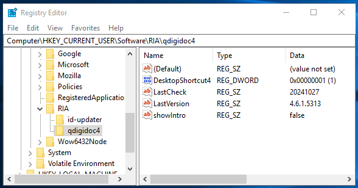

Igal järgneval DigiDoc4 rakenduse käivitusel võrreldakse aktuaalset kuupäeva ülalmainitud *LastCheck* väärtusega ja kui see vahe on suurem kui 4 päeva, kontrollitakse automaatselt uue tarkvara saadavust. Õnnestunud kontrolli puhul uuendatakse ka välja *LastCheck*.

#### Aegunud tarkvara

Juhul, kui DigiDoc4 versioon kasutaja registriosas väljal *LastVersion* on väiksem kui keskses konfiguratsioonifailis real `QDIGIDOC4-SUPPORTED` kirjeldatud, teavitatakse sellest kasutajat igal DigiDoc4 programmi käivitamisel: *Sinu kasutatav ID-tarkvara on aegunud. Tarkvara viimase versiooni saad alla laadida veebilehelt ...*.

#### Uuem versioon tarkvarast

Juhul, kui DigiDoc4 versioon kasutaja registriosas väljal *LastVersion* on väiksem konfiguratsioonifailis real `QDIGIDOC4-LATEST` kirjeldatud, teavitatakse sellest kasutajat DigiDoc4 programmi käivitamisel: *Saadaval on ID-tarkvara uuendus, mille saad paigaldada veebilehelt id.ee ...*. Kasutajat teavitatakse uuendusest esimesel korral pärast versioonide erinevuse leidmist ja järgnevad teavitused tulevad alles siis, kui keskses konfiguratsioonifailis on tehtud mõni muudatus[^2].

### Käsitsi uuenduste otsing

Käsitsi ID-tarkvara uuenduste otsinguks tuleb DigiDoc4 programmis avada seaded ja klikkida all ääres oleval tekstil „Kontrolli värskendusi“. Selle tulemusena kontrollitakse alati uue konfiguratsioonifaili olemasolu, vajadusel laaditakse see alla ja seejärel võrreldakse seal olevat versiooni arvutis oleva tarkvara versiooniga. Arvuti versioon loetakse analoogselt automaatkorraldusele `id updater task` registri väljast *DisplayVersion* võtme `HKEY_LOCAL_MACHINE\SOFTWARE\WOW6432Node\Microsoft\Windows\CurrentVersion\Uninstall\{5FBF3885-332F-4E02-B7C8-589775D00818}` alt.

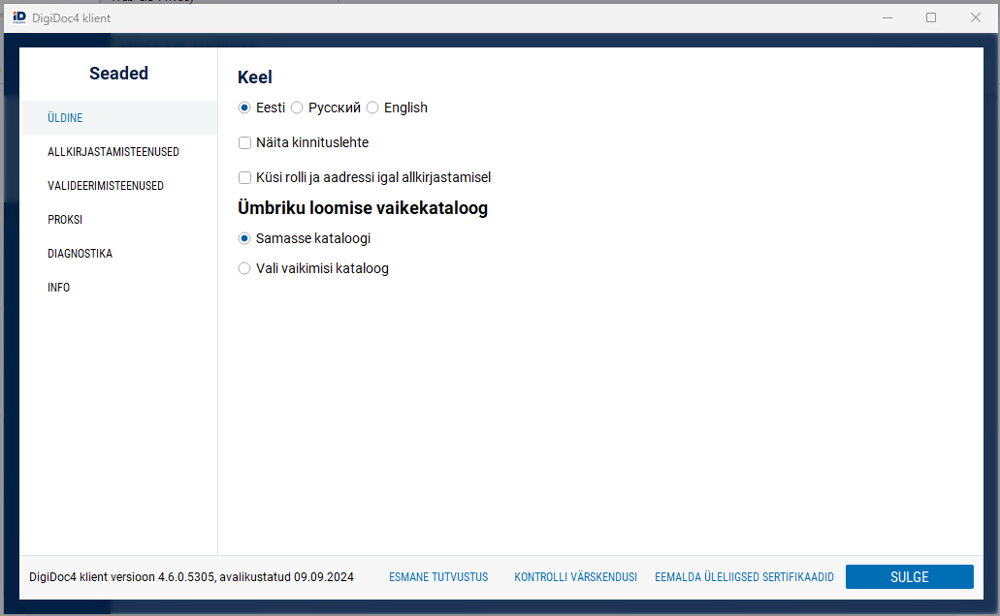

Kui tarkvara uuendus on olemas, pakutakse see kasutajale välja. Kasutajat teavitatakse ka sellest, kui ID-tarkvara uuendusi ei ole saadaval:

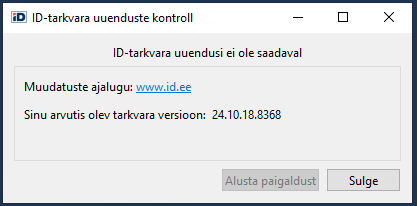

> **Märkus:** Ka see meetod töötab korrektselt vaid EXE installide puhul.

[^1]: Selle määrangu lubamisel eemaldatakse kasutaja sertifikaadid EID kaardi eemaldamisel Windows sertifikaadihoidlast.
[^2]: Reeglina tehakse keskses konfiguratsioonifailis muudatus kord kuus.
