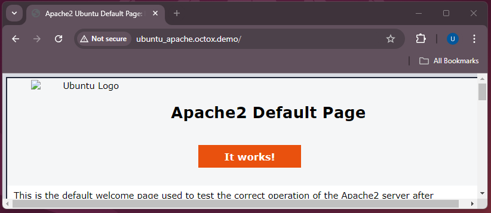
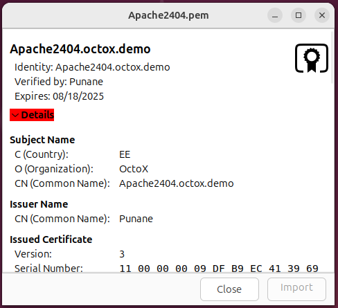
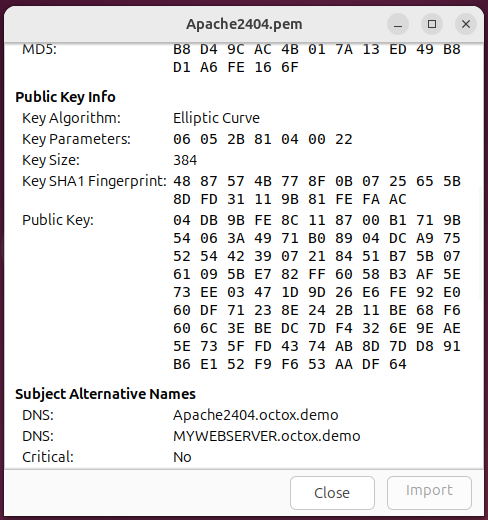
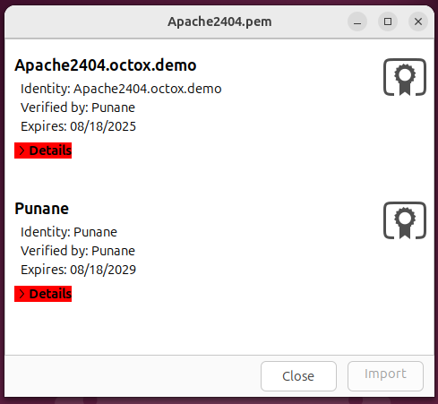
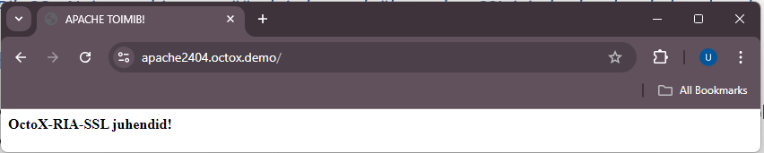
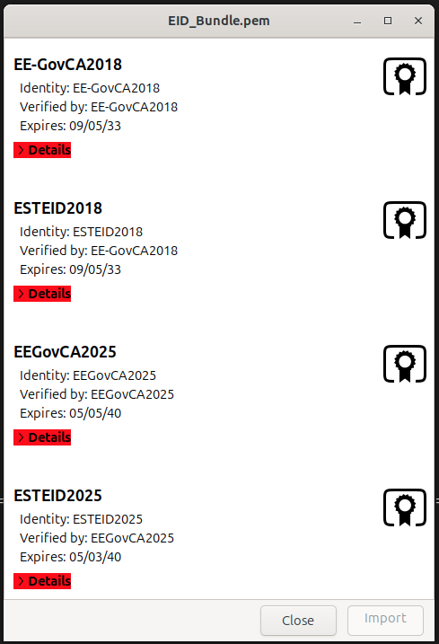
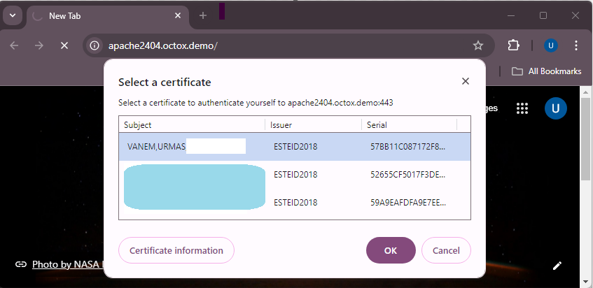
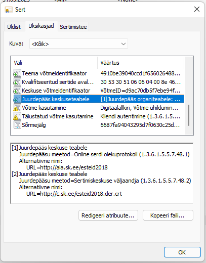

# Configuring two-way SSL using Estonian ID-cards in the Ubuntu Apache2 web server

**[Eesti keeles (In Estonian)](index.et.md)**

**Version:** 26.08/1

**Published by:** [RIA](https://www.ria.ee/)

**Version information**

| Date       | Version | Changes/Notes
|:-----------|:-------:|:-----------------------------------------------------------
| 06/02/2019 | 19.02/1 | Public version.
| 20/02/2019 | 19.02/1 | Added the chapter of additional configuration options: firewall and OCSP configuration, default website removal. — Changed by: Urmas Vanem
| 12/12/2019 | 19.12/1 | Added recommendations for securing Apache. — Changed by: Urmas Vanem
| 16/12/2020 | 20.12/1 | Added a requirement for the user certificate to have the correct `extendedKeyUsage` field and the right certificate issuer. See the chapter 'Additional filtering of user certificates'. — Changed by: Urmas Vanem
| 17/12/2020 | 20.12/2 | Added the directive `SSLCADNRequestPath`, see the chapter 'Filtering certificates displayed to the user'. — Changed by: Urmas Vanem
| 13/01/2021 | 21.01/1 | Added the demonstrative configuration file as a link. Added HSTS configuration. — Changed by: Urmas Vanem
| 21/01/2021 | 21.01/2 | `SSLOCSPEnable` directive replaced from `on` to `leaf`. Updated TLS 1.2 cipher recommendations and TLS protocol usage recommendations. Variable names in Democonf and document have been synchronised. — Changed by: Urmas Vanem
| 27/01/2021 | 21.01/3 | Added the mobile-ID filter. — Changed by: Urmas Vanem
| 26/02/2021 | 21.02/1 | Added the alternative possibility to filter intermediate certificate authorities using the `SSLCADNRequestFile` directive. — Changed by: Urmas Vanem
| 27/04/2021 | 21.04/1 | Support for outdated `ESTEID-SK 2011` certificates removed. — Changed by: Urmas Vanem
| 25/11/2021 | 21.11/1 | Ubuntu version updated to Ubuntu Server 21.10. Apache version updated to 2.4.48. Added guidance for ECC certificates. Updated TLS and cipher recommendations.
| 21/02/2023 | 23.02/1 | Ubuntu version updated to Ubuntu Server 22.04. Apache version updated to 2.4.55. Updates in the virtual host configuration. — Changed by: Urmas Vanem
| 27/12/2023 | 23.12/1 | Removed the `ESTEID-SK 2015` chain. — Changed by: Urmas Vanem
| 27/12/2023 | 23.12/2 | Removed the outdated OCSP responder certificate. — Changed by: Urmas Vanem
| 22/08/2024 | 24.08/1 | Ubuntu version updated to Ubuntu Server 24.04. Apache version updated to 2.4.62. Updates in the virtual host configuration. — Changed by: Urmas Vanem
| 31/10/2025 | 25.10/1 | Added Zetes certificates. — Changed by: Raul Kaidro
| 22/04/2026 | 26.04/1 | Converted to Markdown format. — Changed by: Raul Metsma
| 21/08/2026 | 26.08/1 | Updated certificate-key, TLS protocol, cipher-suite, certificate-policy, and OCSP guidance based on the 2026 cryptographic algorithms life-cycle report. — Changed by: Raul Metsma

---

- TOC
{:toc}

## Introduction

This guide describes:

- How to install and configure the Apache2 (v. 2.4.66) web server on
  Ubuntu Server 24.04.
- How to configure HTTPS (one-way SSL) in the web server.
- How to configure ID-card authentication (two-way SSL) using [SK ID Solutions](https://www.skidsolutions.eu/resources/certificates/) (`EE-GovCA2018`) and [Zetes](https://repository.eidpki.ee/) (`EEGovCA2025`) ID-cards.
- Other options for server configuration and recommendations for
  ensuring security.

## Apache2 installation and configuration

### Installation

1.  Renew the Ubuntu package data -- in the terminal, run

    ```bash
    $ apt update
    Hit:1 http://ee.archive.ubuntu.com/ubuntu noble InRelease
    Hit:2 http://ee.archive.ubuntu.com/ubuntu noble-updates InRelease
    Hit:3 http://ee.archive.ubuntu.com/ubuntu noble-backports InRelease
    Get:4 http://ee.archive.ubuntu.com/ubuntu noble/main Icons (48x48) [106 kB]
    Hit:5 http://security.ubuntu.com/ubuntu noble-security InRelease
    Get:6 http://ee.archive.ubuntu.com/ubuntu noble/main Icons (64x64) [156 kB]
    Get:7 http://ee.archive.ubuntu.com/ubuntu noble/main Icons (64x64@2) [21.8 kB]
    Get:8 http://ee.archive.ubuntu.com/ubuntu noble/universe Icons (48x48) [3,717 kB]
    ```

2.  Install Apache2 with the command

    ```bash
    $ apt install apache2
    Reading package lists... Done
    Building dependency tree... Done
    Reading state information... Done
    The following additional packages will be installed:
      apache2-bin apache2-data apache2-utils libapr1t64 libaprutil1-dbd-sqlite3
      libaprutil1-ldap libaprutil1t64
    Suggested packages:
      apache2-doc apache2-suexec-pristine | apache2-suexec-custom
    ```

As result of the previous steps, the Apache server is now installed[^1].

```bash
$ apache2 -v
Server version: Apache/2.4.58 (Ubuntu)
Server built:   2025-08-11T11:10:09
```

Update Apache to version 2.4.66 using the following commands:

```bash
add-apt-repository ppa:ondrej/apache2
apt update
apt upgrade
```

Apache has now been successfully updated to version 2.4.66 as expected:

```bash
$ apache2 -v
Server version: Apache/2.4.66 (Ubuntu)
Server built:   2025-07-26T17:41:22
```

With version 2.4.66, the Apache2 web server runs in the insecure HTTP
mode:



### Configuration

#### Enabling one-way SSL

Enable SSL for Apache2 with the command `a2enmod ssl` and restart the Apache2 service with `systemctl restart apache2`

```bash
$ a2enmod ssl
Considering dependency mime for ssl:
Module mime already enabled
Considering dependency socache_shmcb for ssl:
Enabling module socache_shmcb.
Enabling module ssl.
See /usr/share/doc/apache2/README.Debian.gz on how to configure SSL and create self-signed certificates.
To activate the new configuration, you need to run:
  systemctl restart apache2
$ systemctl restart apache2
```

##### Creating the private key and the Certification Signing Request (CSR) file

###### Elliptic Curve Cryptography (ECC)

First, generate an ECC private key, then generate an ECC CSR[^2]:

```bash
$ openssl ecparam -name secp384r1 -genkey -noout -out Apache2404.key
$ openssl req -new -key Apache2404.key -out Apache2404.csr -subj /C=EE/O=OctoX/CN=Apache2404.octox.demo -reqexts SAN -config <(cat /etc/ssl/openssl.cnf <(printf "[SAN]\nsubjectAltName=DNS:Apache2404.octox.demo,DNS:MYWEBSERVER.octox.demo"))
```

1.  `Apache2404.key` is the private key of the certificate;
2.  `Apache2404.csr` is the CSR for the certificate authority (CA);
3.  `CN=Apache2404.octox.demo` is the common name for the certificate;
4.  `DNS:Apache2404.octox.demo` and `DNS:MYWEBSERVER.octox.demo` are the
    SAN DNS names for the certificate. These names must correspond to
    the actual address of the website[^3]. The names must also be
    resolvable in name services.

Generate a separate private key for every independent TLS server. Do not copy
one key between servers merely because a wildcard or multi-SAN certificate
could cover all their names. Keeping keys separate limits the impact of a
server or key compromise.

For production deployments, use a hardware security module (HSM) or an
equivalent non-exportable hardware-backed key store where supported. Generate
the key inside the device and keep it non-exportable. Confirm that the HSM,
OpenSSL integration, and certificate issuer support the selected ECDSA P-384
key before deployment. The file-based key in this example is not an HSM setup.

The contents of the CSR can be viewed by running

```bash
$ openssl req -in Apache2404.csr -noout -text
Certificate Request:
    Data:
        Version: 1 (0x0)
        Subject: C = EE, O = OctoX, CN = Apache2404.octox.demo
        Subject Public Key Info:
            Public Key Algorithm: id-ecPublicKey
                Public-Key: (384 bit)
                pub:
                    04:db:9b:fe:8c:11:87:00:b1:71:9b:54:06:3a:49:
                    71:b0:89:04:dc:a9:75:52:54:42:39:07:21:84:51:
                    b7:5b:07:61:09:5b:e7:82:ff:60:58:b3:af:5e:73:
                    ee:03:47:1d:9d:26:e6:fe:92:e0:60:df:71:23:8e:
                    24:2b:11:be:68:f6:08:6c:3e:be:dc:7d:f4:32:6e:
                    9e:ae:5e:73:5f:fd:43:74:ab:8d:7d:d8:91:b6:e1:
                    52:f9:f6:53:aa:df:64
                ASN1 OID: secp384r1
                NIST CURVE: P-384
        Attributes:
            Requested Extensions:
                X509v3 Subject Alternative Name:
                    DNS:Apache2404.octox.demo, DNS:MYWEBSERVER.octox.demo
        Signature Algorithm: ecdsa-with-SHA256
        Signature Value:
```

##### Ordering and installing an SSL certificate

The CSR `Apache2404.csr` should be sent to trustworthy CA. In the demo
environment, the certificate issuer is the test CA. Signed certificate
is issued in PEM format.

```
-----BEGIN CERTIFICATE-----
MIICGDCCAZGAwIBAgITEQAAAAnfuexBOWmmSg...
...
o6DunYynxvZsuwE5
-----END CERTIFICATE-----
```

In Ubuntu, the certificate looks like the following picture:



The certificate also includes the algorithm and alternative SAN DNS
names of the subject:



As you can see, the certificate issuer is a CA named `Punane`. Now, you
need to create a certificate file in which both the TLS certificate of
the future web server and its chain of issuers are located. To do this,
add the issuer's certificate in PEM format to the certificate file of
the web server and save the file as `Apache2404.pem`.



Place the generated file in the `/etc/ssl/certs` folder. In addition,
you need to place the certificate private key in the
`/etc/ssl/private` folder.

```bash
$ cp Apache2404.pem /etc/ssl/certs
$ cp Apache2404.key /etc/ssl/private
```

Now, the certificates and private key needed by Apache2 for one-way SSL
have been correctly installed.

#### Creating a virtual website

Create a separate virtual website for your configuration. First, create
a home folder named `/var/www/Apache2404` for the content of the
website.

```bash
$ mkdir /var/www/Apache2404
```

Place a simple and recognisable webpage in the folder. In this example,
the file `/var/www/html/index.html` is copied to the new folder for
testing. Minor modifications are made in the heading or title of the
copied webpage to ensure it is taken from the right place.

Next, prepare the virtual site configuration file. Create a new file named `/etc/apache2/sites-available/Apache2404.conf` (e.g. with the command `nano /etc/apache2/sites-available/Apache2404.conf`)

```bash
$ nano /etc/apache2/sites-available/Apache2404.conf
```

Now, change the new configuration file as you wish. Paste the following
configuration in it:

```apache
# <VirtualHost Apache2404.octox.demo:80>
#   By contacting the HTTP site, automatic HTTP -> HTTPS redirection takes place with the next two lines.
    ServerName Apache2404.octox.demo
    Redirect / https://Apache2404.octox.demo
# </VirtualHost>

<VirtualHost Apache2404.octox.demo:443>
    # General info
    ServerName Apache2404.octox.demo:443
    DocumentRoot /var/www/Apache2404

    # SSL configuration
    SSLEngine on
    SSLCertificateFile /etc/ssl/certs/Apache2404.pem
    SSLCertificateKeyFile /etc/ssl/private/Apache2404.key

    # Error collection configuration
    ErrorLog ${APACHE_LOG_DIR}/error.log
    CustomLog ${APACHE_LOG_DIR}/access.log combined
</VirtualHost>
```

Activate the new configuration with `a2ensite Apache2404.conf` and restart the Apache2 service.

```bash
$ a2ensite Apache2404.conf

Enabling site Apache2404.
To activate the new configuration, you need to run:
  systemctl reload apache2
$ systemctl reload apache2
```

Now, the new website can be accessed by one-way SSL. In addition, all
HTTP requests to the site <http://Apache2404.octox.demo> are
automatically redirected to the HTTPS site
<https://Apache2404.octox.demo>.

#### Result



> **Note:** There can be many similar virtual websites with different names in the same Apache2 server with a single IP address.

#### Requiring two-way SSL

If you wish to allow website access by authenticating with an Estonian
ID-card, you need to supplement the existing configuration slightly.

Add the following lines to the SSL section of the file `Apache2404.conf`:

```apache
SSLVerifyClient require
SSLVerifyDepth 2
SSLCACertificateFile /etc/ssl/certs/EID_Bundle.pem
```

Now, create a new text file named [`EID_Bundle.pem`](#eid_bundle.pem), which includes
the eID root and intermediate certificates (`EE-GovCA2018`, `ESTEID2018`,
`EEGovCA2025`, `ESTEID2025`) in PEM format. With this file, you
can filter out all CA's whose certificates are supported by the new
website. The user will only see the certificates from those chains. When
opened in Ubuntu, the file looks like this:



Save the file as [`EID_Bundle.pem`](#eid_bundle.pem) and copy it to the folder
`/etc/ssl/certs`. Restart Apache2 web server with the command
`systemctl reload apache2` to activate the change in the web server.

After accessing the website <https://Apache2404.octox.demo> now, a user
certificate is required.



The server suggests certificates to the user, the issuers of which are
described in the file [`EID_Bundle.pem`](#eid_bundle.pem). After confirming the
certificate and entering the PIN, the user can access the website --
two-way SSL works.

A complete demonstrative Apache2 configuration file combining all settings in this document is available in the [Appendix](#apache2404_eid_demo.conf).

## Additional configuration options

The purpose of this document is not to give exact guidance on how to
optimise or protect websites, but to show how to configure two-way SSL
for Estonian ID-cards. However, you should take into account the
following.

### Firewall rules (if necessary)

For creating a firewall rule, run the command on the terminal:

```bash
$ ufw allow 'DESIRABLE RULE'
```

For example, to allow HTTPS traffic only, run

```bash
$ ufw enable
Firewall is active and enabled on system startup
$ ufw allow 443/tcp
Rule added
Rule added (v6)
```

If the firewall is active (`ufw enable`), running the command `ufw status` in the terminal shows the active rules.

```bash
$ ufw status
Status: active

To                         Action      From
--                         ------      ----
443/tcp                    ALLOW       Anywhere
443/tcp (v6)               ALLOW       Anywhere (v6)
```

### Checking client-certificate revocation with OCSP[^4]

OCSP (Online Certificate Status Protocol) lets Apache check the revocation
status of a client certificate during authentication.

Certificates issued under the `ESTEID2018` and `ESTEID2025` CAs contain
their AIA OCSP service address (<http://aia.sk.ee/esteid2018> and
<http://ocsp.eidpki.ee>).



To enable the user certificate validity check against the AIA OCSP
service, you need to add the following lines to the SSL configuration of
Apache2:

```apache
SSLOCSPEnable leaf
SSLOCSPUseRequestNonce off
```

The `leaf` value checks the end-user certificate. The responder address is
taken from that certificate. This strict configuration does not use
`no_ocsp_for_cert_ok`: a missing responder URL or an unsuccessful OCSP check
prevents client-certificate authentication. Allow outbound HTTP access to
both responders and monitor Apache errors. Reload Apache with
`systemctl reload apache2` after applying the change.

### Stapling the server-certificate OCSP response

Client-certificate validation above and server-certificate OCSP stapling are
separate functions. Stapling lets Apache obtain a signed status response for
its own server certificate and send it during the TLS handshake. This avoids
each browser querying the issuing CA and improves client privacy.[^5]

First check whether the server certificate contains an OCSP responder URI:

```bash
$ openssl x509 -in /etc/ssl/certs/Apache2404.pem -noout -ocsp_uri
```

If the command returns a supported URI, enable the shared-memory cache and
production error handling in `/etc/apache2/mods-available/ssl.conf`:

```apache
SSLStaplingCache "shmcb:${APACHE_RUN_DIR}/ssl_stapling(32768)"
SSLStaplingReturnResponderErrors off
SSLStaplingResponderTimeout 4
SSLStaplingErrorCacheTimeout 60
```

Ensure `socache_shmcb` is enabled, then add `SSLUseStapling On` to the HTTPS
virtual host. Do not enable stapling when the issuing CA does not provide an
OCSP service.

```bash
$ a2enmod socache_shmcb
$ systemctl restart apache2
$ openssl s_client -connect Apache2404.octox.demo:443 \
    -servername Apache2404.octox.demo -status </dev/null
```

The output must contain a successful OCSP response and a `good` certificate
status. Monitor refresh errors and ensure the server can reach the responder.

### Default webpage removal

The default webpage is also installed with the Apache2 installation. To
remove the default website from the solution, run `a2dissite 000-default.conf` and activate the change with `systemctl reload apache2`.

```bash
$ a2dissite 000-default.conf
Site 000-default disabled.
To activate the new configuration, you need to run:
  systemctl reload apache2
$ systemctl reload apache2
```

### Recommended security settings for Apache

#### SSL/TLS

Do not rely on the Apache or operating-system defaults to select TLS
protocol versions. Check the effective configuration with:

```bash
$ grep -i -r "SSLProtocol" /etc/apache2/mods-available/
/etc/apache2/mods-available/ssl.conf:SSLProtocol all -SSLv3
```

Disable TLS 1.0 and TLS 1.1. New and updated deployments should enable
only TLS 1.3 by default. Add TLS 1.2 only as a documented exception when
the service must support clients from 2020 or earlier, or when a client
certificate must be requested after the initial TLS connection has been
established. When TLS 1.2 is enabled, configure an explicit secure
cipher-suite allowlist.

TLS 1.3 configuration:

```apache
SSLProtocol -all +TLSv1.3
```

For a documented compatibility exception, enable TLS 1.2 and TLS 1.3:

```apache
SSLProtocol -all +TLSv1.2 +TLSv1.3
```

The report recommends disabling renegotiation when TLS 1.2 is enabled. If a
deployment depends on requesting a client certificate after the initial
handshake, disabling renegotiation prevents that flow. Prefer a separate
virtual host that requests the certificate during the initial handshake; do
not retain renegotiation merely for a location-specific authentication flow.

When the TLS implementation and deployed clients provide production support,
prioritize the hybrid `X25519MLKEM768` group. This guide does not hard-code a
group setting because support and the standardized identifier depend on the
installed OpenSSL version. Confirm the effective group with a current TLS
scanner before relying on it.

If you want to make the change at the server level, modify the parameter
`SSLProtocol` in the file `/etc/apache2/mods-available/ssl.conf`.

More information about the recommendations for the use of the cipher
suites can be found in the cryptographic algorithms life cycle report
ordered by RIA at
<https://www.id.ee/en/article/cryptographic-algorithms-life-cycle-reports-2/>.

##### Cipher suites

Configure an explicit allowlist instead of relying on OpenSSL aliases
such as `HIGH`. For TLS 1.3, enable the following suites in this order:

```apache
SSLCipherSuite TLSv1.3 "TLS_AES_256_GCM_SHA384:TLS_CHACHA20_POLY1305_SHA256:TLS_AES_128_GCM_SHA256"
```

`TLS_AES_128_CCM_SHA256` may be used only as a fallback when AES-GCM and
ChaCha20-Poly1305 are unavailable. Do not enable CCM_8 suites.

When the documented TLS 1.2 compatibility exception applies, enable only the
three ECDHE-ECDSA and AEAD suites below. This matches the ECDSA-only
certificate profile used in this guide:

```apache
SSLCipherSuite SSL "ECDHE-ECDSA-AES128-GCM-SHA256:ECDHE-ECDSA-AES256-GCM-SHA384:ECDHE-ECDSA-CHACHA20-POLY1305"
```

The `SSL` protocol qualifier applies to cipher suites through TLS 1.2;
the separate `TLSv1.3` directive controls TLS 1.3. Because this guide
disables older protocol versions, the `SSL` list is available only to
TLS 1.2. The TLS 1.2 list excludes RSA authentication and key exchange,
static DH/ECDH, CBC, CCM_8, and non-AEAD suites.

You can also configure cipher suites at the server level by modifying
the parameter `SSLCipherSuite` in the file
`/etc/apache2/mods-available/ssl.conf`.

Check the effective list with `openssl ciphers -v` and verify the
negotiated protocol and suite with a current TLS scanner after every
configuration change.

##### Compression

Keep TLS compression disabled explicitly:

```apache
SSLCompression off
```

HTTP response compression is separate from TLS compression and can disclose
secrets when a response contains both attacker-controlled input and sensitive
data. Disable `mod_deflate` and `mod_brotli` for sensitive dynamic responses.
If response compression must remain enabled, the application must prevent
cross-site request forgery and mitigate response-length leakage.

More information about the recommendations for the use of the cipher
suites can be found in the cryptographic algorithms life cycle report
ordered by RIA at
<https://www.id.ee/en/article/cryptographic-algorithms-life-cycle-reports-2/>.

##### SSLHonorCipherOrder

Another important parameter related to ciphers is `SSLHonorCipherOrder`,
the value of which should be set to `ON` in the configuration file. This
way, the server's list of cipher suites is always preferred over the
user's. By default, this parameter is undefined and its default value is
`off`.

#### Additional filtering of user certificates

Trusting a CA chain does not prove that the leaf certificate is an ID-card
authentication certificate. Different certificate products can share a root
or intermediate CA. Before accepting the authenticated identity, require all
of the following:

1.  Apache successfully validates the complete certificate chain;
2.  the issuer is an explicitly allowed intermediate CA;
3.  `extendedKeyUsage` permits TLS web-client authentication;
4.  the leaf certificate's `X509v3 CertificatePolicies` extension
    (`2.5.29.32`) contains both the NCP+ authentication-policy OID and an
    allowed document-policy OID for the certificate's CA generation.[^6]

For production certificates covered by this guide, use this allowlist:

```text
# Required in every accepted authentication certificate
0.4.0.2042.1.2

# ESTEID2018 - require one of these document-policy OIDs
1.3.6.1.4.1.51361.1.1.1
1.3.6.1.4.1.51361.1.1.2
1.3.6.1.4.1.51361.1.1.3
1.3.6.1.4.1.51361.1.1.4
1.3.6.1.4.1.51361.1.1.5
1.3.6.1.4.1.51361.1.1.6
1.3.6.1.4.1.51361.1.1.7
1.3.6.1.4.1.51455.1.1.1

# ESTEID2025 - require one of these document-policy OIDs
1.3.6.1.4.1.51361.2.1.1
1.3.6.1.4.1.51361.2.1.2
1.3.6.1.4.1.51361.2.1.3
1.3.6.1.4.1.51361.2.1.4
1.3.6.1.4.1.51361.2.1.5
1.3.6.1.4.1.51361.2.1.6
1.3.6.1.4.1.51455.2.1.1
```

Correlate the document-policy OID with the validated issuer: an `ESTEID2018`
certificate must not be accepted using an `ESTEID2025` policy OID, or vice
versa. The common NCP+ OID is not product-specific and is insufficient on its
own. Do not add test OIDs, such as Zetes OIDs prefixed with `2.999`, to a
production allowlist.

The issuer and EKU checks below are useful defence in depth, but they do not
replace the certificate-policy check:

```apache
<Location "/">
Require expr (
  (
    %{SSL_CLIENT_I_DN_CN} == "ESTEID2018"
    || %{SSL_CLIENT_I_DN_CN} == "ESTEID2025"
  )
  and (
    "TLS Web Client Authentication, E-mail Protection"
    in PeerExtList('extendedKeyUsage')
  )
)
</Location>
```

The configuration can be added to the virtual host or Apache's main
configuration. The application or an authentication gateway must then parse
the verified leaf certificate and reject authentication unless both the NCP+
OID and a matching document-policy OID are present. Do not infer the
certificate product from its subject, issuer, or EKU alone, and do not treat
the `anyPolicy` OID (`2.5.29.32.0`) as proof of an ID-card policy.

When the application is integrated through CGI or another interface that
uses Apache environment variables, `SSLOptions +ExportCertData` makes the
PEM-encoded leaf certificate available as `SSL_CLIENT_CERT`. Other
application interfaces should use their native TLS client-certificate API.
Only accept certificate data supplied through the trusted Apache-to-
application connection; never trust a client-provided certificate header.

To inspect the extension while testing an exported certificate:

```bash
$ openssl x509 -in client.pem -noout -text
```

Check the `X509v3 Certificate Policies` section against the current policy
and certificate-profile sources cited above. Test at least one
accepted ID-card certificate and certificates for other products issued in
related hierarchies, including Mobile-ID where applicable.

> **Note:** If you are using another feature to filter network traffic, the secure
> configuration should be implemented there, too. SK has published
> information about the F5 configuration in the chapter 'Only accept
> certificates with trusted key usage' in the following article:
> <https://github.com/SK-EID/smart-id-documentation/wiki/Secure-Implementation-Guide>

> **Note:** SK's recommendations for secure ID-card authentication are published
> here in the chapter 'Defence: implement ID-card authentication
> securely':
> <https://github.com/SK-EID/smart-id-documentation/wiki/Secure-Implementation-Guide>

#### Filtering certificates displayed to the user

By default, the selection of certificates displayed to the user is not
limited, which means that all user authentication certificates are
listed during authentication in the web server. However, you should only
display the certificates issued from the `ESTEID2018` or `ESTEID2025` chain
to the user. To do so:

1.  Create a file for accepted chains
    [`/etc/ssl/certs/DN_Bundle.pem`](#dn_bundle.pem)
2.  Put the `ESTEID2018` and `ESTEID2025` certificates in PEM format into
    the created file
3.  add the directive `SSLCADNRequestFile /etc/ssl/certs/DN_Bundle.pem`
    into the SSL section of the Apache configuration file and save the
    new configuration;
4.  restart the Apache server with `systemctl reload apache2`

Now, Apache will send information to the user that only certificates
issued from the `ESTEID2018` or `ESTEID2025` chains are supported and only
certificates issued from those chains are displayed to the user.

##### Enabling HTTP Strict Transport Security (HSTS)

1.  Enable mod-headers in the terminal with `a2enmod headers`

    ```bash
    $ a2enmod headers
    Enabling module headers.
    To activate the new configuration, you need to run:
      systemctl restart apache2
    ```

2.  Add the following line to the Apache configuration:

    ```apache
    # Enable HSTS.
    Header always set Strict-Transport-Security "max-age=31536000; includeSubDomains"
    ```

3.  Restart the Apache service to apply both changes:

    ```bash
    $ systemctl restart apache2
    ```

##### Additional possibilities

In addition to TLS and cipher suite configuration, you should pay
attention to the security of the Apache server from the following
aspects:

- Keep the operating system up to date.
- Keep Apache up to date.
- Run Apache under non-root user rights.
- Disable presenting server information.
- Remove unnecessary modules.
- Add and configure *Mod Security*.
- Add and configure *Mod Evasive*.
- Disable default directory listing.
- Enable logging.
- ...

The above is a sample list of ways to improve Apache security. Detailed
recommendations are available online:
<https://www.google.com/search?q=how+to+secure+apache+server>.

## Appendix

### EID_Bundle.pem

```
# EE-GovCA2018
-----BEGIN CERTIFICATE-----
MIIE+DCCBFmgAwIBAgIQMLOwlXoR0oFbj52nmRsnezAKBggqhkjOPQQDBDBaMQsw
CQYDVQQGEwJFRTEbMBkGA1UECgwSU0sgSUQgU29sdXRpb25zIEFTMRcwFQYDVQRh
DA5OVFJFRS0xMDc0NzAxMzEVMBMGA1UEAwwMRUUtR292Q0EyMDE4MB4XDTE4MDkw
NTA5MTEwM1oXDTMzMDkwNTA5MTEwM1owWjELMAkGA1UEBhMCRUUxGzAZBgNVBAoM
ElNLIElEIFNvbHV0aW9ucyBBUzEXMBUGA1UEYQwOTlRSRUUtMTA3NDcwMTMxFTAT
BgNVBAMMDEVFLUdvdkNBMjAxODCBmzAQBgcqhkjOPQIBBgUrgQQAIwOBhgAEAMcb
/dmAcVo/b2azEPS6CfW7fEA2KuHKC53D7ShVNvLz4QUjCdTXjds/4u99jUoYEQec
luVVzMlgEJR1nkN2eOrLAZYxPjwG5HiI1iZEyW9QKVdeEgyvhzWWTNHGjV3HdZRv
7L9o4533PtJAyqJq9OTs6mjsqwFXjH49bfZ6CGmzUJsHo4ICvDCCArgwEgYDVR0T
AQH/BAgwBgEB/wIBATAOBgNVHQ8BAf8EBAMCAQYwNAYDVR0lAQH/BCowKAYIKwYB
BQUHAwkGCCsGAQUFBwMCBggrBgEFBQcDBAYIKwYBBQUHAwEwHQYDVR0OBBYEFH4p
Vuc0knhOd+FvLjMqmHHB/TSfMB8GA1UdIwQYMBaAFH4pVuc0knhOd+FvLjMqmHHB
/TSfMIICAAYDVR0gBIIB9zCCAfMwCAYGBACPegECMAkGBwQAi+xAAQIwMgYLKwYB
BAGDkSEBAQEwIzAhBggrBgEFBQcCARYVaHR0cHM6Ly93d3cuc2suZWUvQ1BTMA0G
CysGAQQBg5EhAQECMA0GCysGAQQBg5F/AQEBMA0GCysGAQQBg5EhAQEFMA0GCysG
AQQBg5EhAQEGMA0GCysGAQQBg5EhAQEHMA0GCysGAQQBg5EhAQEDMA0GCysGAQQB
g5EhAQEEMA0GCysGAQQBg5EhAQEIMA0GCysGAQQBg5EhAQEJMA0GCysGAQQBg5Eh
AQEKMA0GCysGAQQBg5EhAQELMA0GCysGAQQBg5EhAQEMMA0GCysGAQQBg5EhAQEN
MA0GCysGAQQBg5EhAQEOMA0GCysGAQQBg5EhAQEPMA0GCysGAQQBg5EhAQEQMA0G
CysGAQQBg5EhAQERMA0GCysGAQQBg5EhAQESMA0GCysGAQQBg5EhAQETMA0GCysG
AQQBg5EhAQEUMA0GCysGAQQBg5F/AQECMA0GCysGAQQBg5F/AQEDMA0GCysGAQQB
g5F/AQEEMA0GCysGAQQBg5F/AQEFMA0GCysGAQQBg5F/AQEGMDEGCisGAQQBg5Eh
CgEwIzAhBggrBgEFBQcCARYVaHR0cHM6Ly93d3cuc2suZWUvQ1BTMBgGCCsGAQUF
BwEDBAwwCjAIBgYEAI5GAQEwCgYIKoZIzj0EAwQDgYwAMIGIAkIBk698EqetY9Tt
6HwO50CfzdIIjKmlfCI34xKdU7J+wz1tNVu2tHJwEhdsH0e92i969sRDp1RNPlVh
4XFJzI3oQFQCQgGVxmcuVnsy7NUscDZ0erwovmbFOsNxELCANxNSWx5xMqzEIhV8
46opxu10UFDIBBPzkbBenL4h+g/WU7lG78fIhA==
-----END CERTIFICATE-----
# ESTEID2018
-----BEGIN CERTIFICATE-----
MIIFVzCCBLigAwIBAgIQdUf6rBR0S4tbo2bU/mZV7TAKBggqhkjOPQQDBDBaMQsw
CQYDVQQGEwJFRTEbMBkGA1UECgwSU0sgSUQgU29sdXRpb25zIEFTMRcwFQYDVQRh
DA5OVFJFRS0xMDc0NzAxMzEVMBMGA1UEAwwMRUUtR292Q0EyMDE4MB4XDTE4MDky
MDA5MjIyOFoXDTMzMDkwNTA5MTEwM1owWDELMAkGA1UEBhMCRUUxGzAZBgNVBAoM
ElNLIElEIFNvbHV0aW9ucyBBUzEXMBUGA1UEYQwOTlRSRUUtMTA3NDcwMTMxEzAR
BgNVBAMMCkVTVEVJRDIwMTgwgZswEAYHKoZIzj0CAQYFK4EEACMDgYYABAHHOBlv
7UrRPYP1yHhOb7RA/YBDbtgynSVMqYdxnFrKHUXh6tFkghvHuA1k2DSom1hE5kqh
B5VspDembwWDJBOQWQGOI/0t3EtccLYjeM7F9xOPdzUbZaIbpNRHpQgVBpFX0xpL
TgW27MpIMhU8DHBWFpeAaNX3eUpD4gC5cvhsK0RFEqOCAx0wggMZMB8GA1UdIwQY
MBaAFH4pVuc0knhOd+FvLjMqmHHB/TSfMB0GA1UdDgQWBBTZrHDbX36+lPig5L5H
otA0rZoqEjAOBgNVHQ8BAf8EBAMCAQYwEgYDVR0TAQH/BAgwBgEB/wIBADCCAc0G
A1UdIASCAcQwggHAMAgGBgQAj3oBAjAJBgcEAIvsQAECMDIGCysGAQQBg5EhAQEB
MCMwIQYIKwYBBQUHAgEWFWh0dHBzOi8vd3d3LnNrLmVlL0NQUzANBgsrBgEEAYOR
IQEBAjANBgsrBgEEAYORfwEBATANBgsrBgEEAYORIQEBBTANBgsrBgEEAYORIQEB
BjANBgsrBgEEAYORIQEBBzANBgsrBgEEAYORIQEBAzANBgsrBgEEAYORIQEBBDAN
BgsrBgEEAYORIQEBCDANBgsrBgEEAYORIQEBCTANBgsrBgEEAYORIQEBCjANBgsr
BgEEAYORIQEBCzANBgsrBgEEAYORIQEBDDANBgsrBgEEAYORIQEBDTANBgsrBgEE
AYORIQEBDjANBgsrBgEEAYORIQEBDzANBgsrBgEEAYORIQEBEDANBgsrBgEEAYOR
IQEBETANBgsrBgEEAYORIQEBEjANBgsrBgEEAYORIQEBEzANBgsrBgEEAYORIQEB
FDANBgsrBgEEAYORfwEBAjANBgsrBgEEAYORfwEBAzANBgsrBgEEAYORfwEBBDAN
BgsrBgEEAYORfwEBBTANBgsrBgEEAYORfwEBBjAqBgNVHSUBAf8EIDAeBggrBgEF
BQcDCQYIKwYBBQUHAwIGCCsGAQUFBwMEMGoGCCsGAQUFBwEBBF4wXDApBggrBgEF
BQcwAYYdaHR0cDovL2FpYS5zay5lZS9lZS1nb3ZjYTIwMTgwLwYIKwYBBQUHMAKG
I2h0dHA6Ly9jLnNrLmVlL0VFLUdvdkNBMjAxOC5kZXIuY3J0MBgGCCsGAQUFBwED
BAwwCjAIBgYEAI5GAQEwMAYDVR0fBCkwJzAloCOgIYYfaHR0cDovL2Muc2suZWUv
RUUtR292Q0EyMDE4LmNybDAKBggqhkjOPQQDBAOBjAAwgYgCQgDeuUY4HczUbFKS
002HZ88gclgYdztHqglENyTMtXE6dMBRnCbgUmhBCAA0mJSHbyFJ8W9ikLiSyurm
kJM0hDE9KgJCASOqA405Ia5nKjTJPNsHQlMi7KZsIcTHOoBccx+54N8ZX1MgBozJ
mT59rZY/2/OeE163BAwD0UdUQAnMPP6+W3Vd
-----END CERTIFICATE-----
# EEGovCA2025
-----BEGIN CERTIFICATE-----
MIICljCCAhygAwIBAgIUKbkXJo8FWjthNs7Hgduq1RiXqwswCgYIKoZIzj0EAwMw
WDEUMBIGA1UEAwwLRUVHb3ZDQTIwMjUxFzAVBgNVBGEMDk5UUkVFLTE3MDY2MDQ5
MRowGAYDVQQKDBFaZXRlcyBFc3RvbmlhIE/DnDELMAkGA1UEBhMCRUUwHhcNMjUw
NTA2MDgxODEzWhcNNDAwNTA1MDgxODEyWjBYMRQwEgYDVQQDDAtFRUdvdkNBMjAy
NTEXMBUGA1UEYQwOTlRSRUUtMTcwNjYwNDkxGjAYBgNVBAoMEVpldGVzIEVzdG9u
aWEgT8OcMQswCQYDVQQGEwJFRTB2MBAGByqGSM49AgEGBSuBBAAiA2IABH0zMU4D
UN/Ay6gUdWzMUDAYFaau0flpuuicO2bfK7kHNGw+psRRn6DaF/4cVQd8qHxbDF2x
N4jJf1bSpQHLsc2RZHSCI8qb4E9GmB5MDoVVxiXnBHOOW3+55Qm/BfwcwaOBpjCB
ozASBgNVHRMBAf8ECDAGAQH/AgEBMB8GA1UdIwQYMBaAFKqAqJsPu0umfsUC9HLN
LPGlKdm3MD0GA1UdIAQ2MDQwMgYEVR0gADAqMCgGCCsGAQUFBwIBFhxodHRwczov
L3JlcG9zaXRvcnkuZWlkcGtpLmVlMB0GA1UdDgQWBBSqgKibD7tLpn7FAvRyzSzx
pSnZtzAOBgNVHQ8BAf8EBAMCAQYwCgYIKoZIzj0EAwMDaAAwZQIwOy8+eV+yYNXt
XcEEdOuQd60O7lXucK3W4cDewxEoEXb4iTYFswWUZq3DacfmeE+/AjEAkzHeNdru
QqKfvqTFB3eNRnMycNcnJ3rmGe37u9zgH8wnQUuMhUClOGxeRcK4NV9I
-----END CERTIFICATE-----
# ESTEID2025
-----BEGIN CERTIFICATE-----
MIIDDzCCApagAwIBAgIUUFQrcGtK7/jCP+GyAOTPvbglGlcwCgYIKoZIzj0EAwMw
WDEUMBIGA1UEAwwLRUVHb3ZDQTIwMjUxFzAVBgNVBGEMDk5UUkVFLTE3MDY2MDQ5
MRowGAYDVQQKDBFaZXRlcyBFc3RvbmlhIE/DnDELMAkGA1UEBhMCRUUwHhcNMjUw
NTA3MTMyMDA3WhcNNDAwNTAzMTMyMDA2WjBXMRMwEQYDVQQDDApFU1RFSUQyMDI1
MRcwFQYDVQRhDA5OVFJFRS0xNzA2NjA0OTEaMBgGA1UECgwRWmV0ZXMgRXN0b25p
YSBPw5wxCzAJBgNVBAYTAkVFMHYwEAYHKoZIzj0CAQYFK4EEACIDYgAEdSEmb1An
xN7G22CCEQ3ts2YZNieTUZP4Vc4iObhmL/um4EXkiA4HgyCiR5T6olKAEkPdxFBs
fmcLoPN+TmBO8ZpLGEqy1Vwf59ahDW7dQiLXTIAEiGCoXSWI9MvtHDZ2o4IBIDCC
ARwwEgYDVR0TAQH/BAgwBgEB/wIBADAfBgNVHSMEGDAWgBSqgKibD7tLpn7FAvRy
zSzxpSnZtzBABggrBgEFBQcBAQQ0MDIwMAYIKwYBBQUHMAKGJGh0dHA6Ly9jcnQu
ZWlkcGtpLmVlL0VFR292Q0EyMDI1LmNydDA9BgNVHSAENjA0MDIGBFUdIAAwKjAo
BggrBgEFBQcCARYcaHR0cHM6Ly9yZXBvc2l0b3J5LmVpZHBraS5lZTA1BgNVHR8E
LjAsMCqgKKAmhiRodHRwOi8vY3JsLmVpZHBraS5lZS9FRUdvdkNBMjAyNS5jcmww
HQYDVR0OBBYEFJLAOLC4NhJo9crtZu5HKohtpo3oMA4GA1UdDwEB/wQEAwIBBjAK
BggqhkjOPQQDAwNnADBkAjANipgLQqdM985dSFZfKvU9A7Sz2YdmmUSZBxu0lL7Q
XKzqa0ZDyXmf03NPLNAC6dICMBQiROZbLoPezO9LDl847UbENx85hloLlzweWjqP
rY++Xj8FjCD1C9hnblsVgj3XAA==
-----END CERTIFICATE-----
```

### DN_Bundle.pem

```
# ESTEID2018
-----BEGIN CERTIFICATE-----
MIIFVzCCBLigAwIBAgIQdUf6rBR0S4tbo2bU/mZV7TAKBggqhkjOPQQDBDBaMQsw
CQYDVQQGEwJFRTEbMBkGA1UECgwSU0sgSUQgU29sdXRpb25zIEFTMRcwFQYDVQRh
DA5OVFJFRS0xMDc0NzAxMzEVMBMGA1UEAwwMRUUtR292Q0EyMDE4MB4XDTE4MDky
MDA5MjIyOFoXDTMzMDkwNTA5MTEwM1owWDELMAkGA1UEBhMCRUUxGzAZBgNVBAoM
ElNLIElEIFNvbHV0aW9ucyBBUzEXMBUGA1UEYQwOTlRSRUUtMTA3NDcwMTMxEzAR
BgNVBAMMCkVTVEVJRDIwMTgwgZswEAYHKoZIzj0CAQYFK4EEACMDgYYABAHHOBlv
7UrRPYP1yHhOb7RA/YBDbtgynSVMqYdxnFrKHUXh6tFkghvHuA1k2DSom1hE5kqh
B5VspDembwWDJBOQWQGOI/0t3EtccLYjeM7F9xOPdzUbZaIbpNRHpQgVBpFX0xpL
TgW27MpIMhU8DHBWFpeAaNX3eUpD4gC5cvhsK0RFEqOCAx0wggMZMB8GA1UdIwQY
MBaAFH4pVuc0knhOd+FvLjMqmHHB/TSfMB0GA1UdDgQWBBTZrHDbX36+lPig5L5H
otA0rZoqEjAOBgNVHQ8BAf8EBAMCAQYwEgYDVR0TAQH/BAgwBgEB/wIBADCCAc0G
A1UdIASCAcQwggHAMAgGBgQAj3oBAjAJBgcEAIvsQAECMDIGCysGAQQBg5EhAQEB
MCMwIQYIKwYBBQUHAgEWFWh0dHBzOi8vd3d3LnNrLmVlL0NQUzANBgsrBgEEAYOR
IQEBAjANBgsrBgEEAYORfwEBATANBgsrBgEEAYORIQEBBTANBgsrBgEEAYORIQEB
BjANBgsrBgEEAYORIQEBBzANBgsrBgEEAYORIQEBAzANBgsrBgEEAYORIQEBBDAN
BgsrBgEEAYORIQEBCDANBgsrBgEEAYORIQEBCTANBgsrBgEEAYORIQEBCjANBgsr
BgEEAYORIQEBCzANBgsrBgEEAYORIQEBDDANBgsrBgEEAYORIQEBDTANBgsrBgEE
AYORIQEBDjANBgsrBgEEAYORIQEBDzANBgsrBgEEAYORIQEBEDANBgsrBgEEAYOR
IQEBETANBgsrBgEEAYORIQEBEjANBgsrBgEEAYORIQEBEzANBgsrBgEEAYORIQEB
FDANBgsrBgEEAYORfwEBAjANBgsrBgEEAYORfwEBAzANBgsrBgEEAYORfwEBBDAN
BgsrBgEEAYORfwEBBTANBgsrBgEEAYORfwEBBjAqBgNVHSUBAf8EIDAeBggrBgEF
BQcDCQYIKwYBBQUHAwIGCCsGAQUFBwMEMGoGCCsGAQUFBwEBBF4wXDApBggrBgEF
BQcwAYYdaHR0cDovL2FpYS5zay5lZS9lZS1nb3ZjYTIwMTgwLwYIKwYBBQUHMAKG
I2h0dHA6Ly9jLnNrLmVlL0VFLUdvdkNBMjAxOC5kZXIuY3J0MBgGCCsGAQUFBwED
BAwwCjAIBgYEAI5GAQEwMAYDVR0fBCkwJzAloCOgIYYfaHR0cDovL2Muc2suZWUv
RUUtR292Q0EyMDE4LmNybDAKBggqhkjOPQQDBAOBjAAwgYgCQgDeuUY4HczUbFKS
002HZ88gclgYdztHqglENyTMtXE6dMBRnCbgUmhBCAA0mJSHbyFJ8W9ikLiSyurm
kJM0hDE9KgJCASOqA405Ia5nKjTJPNsHQlMi7KZsIcTHOoBccx+54N8ZX1MgBozJ
mT59rZY/2/OeE163BAwD0UdUQAnMPP6+W3Vd
-----END CERTIFICATE-----
# ESTEID2025
-----BEGIN CERTIFICATE-----
MIIDDzCCApagAwIBAgIUUFQrcGtK7/jCP+GyAOTPvbglGlcwCgYIKoZIzj0EAwMw
WDEUMBIGA1UEAwwLRUVHb3ZDQTIwMjUxFzAVBgNVBGEMDk5UUkVFLTE3MDY2MDQ5
MRowGAYDVQQKDBFaZXRlcyBFc3RvbmlhIE/DnDELMAkGA1UEBhMCRUUwHhcNMjUw
NTA3MTMyMDA3WhcNNDAwNTAzMTMyMDA2WjBXMRMwEQYDVQQDDApFU1RFSUQyMDI1
MRcwFQYDVQRhDA5OVFJFRS0xNzA2NjA0OTEaMBgGA1UECgwRWmV0ZXMgRXN0b25p
YSBPw5wxCzAJBgNVBAYTAkVFMHYwEAYHKoZIzj0CAQYFK4EEACIDYgAEdSEmb1An
xN7G22CCEQ3ts2YZNieTUZP4Vc4iObhmL/um4EXkiA4HgyCiR5T6olKAEkPdxFBs
fmcLoPN+TmBO8ZpLGEqy1Vwf59ahDW7dQiLXTIAEiGCoXSWI9MvtHDZ2o4IBIDCC
ARwwEgYDVR0TAQH/BAgwBgEB/wIBADAfBgNVHSMEGDAWgBSqgKibD7tLpn7FAvRy
zSzxpSnZtzBABggrBgEFBQcBAQQ0MDIwMAYIKwYBBQUHMAKGJGh0dHA6Ly9jcnQu
ZWlkcGtpLmVlL0VFR292Q0EyMDI1LmNydDA9BgNVHSAENjA0MDIGBFUdIAAwKjAo
BggrBgEFBQcCARYcaHR0cHM6Ly9yZXBvc2l0b3J5LmVpZHBraS5lZTA1BgNVHR8E
LjAsMCqgKKAmhiRodHRwOi8vY3JsLmVpZHBraS5lZS9FRUdvdkNBMjAyNS5jcmww
HQYDVR0OBBYEFJLAOLC4NhJo9crtZu5HKohtpo3oMA4GA1UdDwEB/wQEAwIBBjAK
BggqhkjOPQQDAwNnADBkAjANipgLQqdM985dSFZfKvU9A7Sz2YdmmUSZBxu0lL7Q
XKzqa0ZDyXmf03NPLNAC6dICMBQiROZbLoPezO9LDl847UbENx85hloLlzweWjqP
rY++Xj8FjCD1C9hnblsVgj3XAA==
-----END CERTIFICATE-----
```

### Apache2404_EID_Demo.conf

The full demonstrative configuration file is available at <https://installer.id.ee/media/id2019/Apache_2.4.63_EID_Demo.conf>.

```apache
<VirtualHost Apache2404.octox.demo:80>
    ServerName Apache2404.octox.demo
    Redirect / https://Apache2404.octox.demo
</VirtualHost>

<VirtualHost Apache2404.octox.demo:443>
    # General info
    ServerName Apache2404.octox.demo:443
    DocumentRoot /var/www/Apache2404

    # SSL configuration
    SSLEngine on
    SSLCertificateFile /etc/ssl/certs/Apache2404.pem
    SSLCertificateKeyFile /etc/ssl/private/Apache2404.key

    # Client certificate authentication
    SSLVerifyClient require
    SSLVerifyDepth 2
    SSLCACertificateFile /etc/ssl/certs/EID_Bundle.pem

    # AIA-OCSP
    SSLOCSPEnable leaf
    SSLOCSPUseRequestNonce off

    # Server-certificate OCSP stapling - enable only if its CA supports OCSP
    # SSLUseStapling On

    # TLS configuration — use only TLS 1.3
    SSLProtocol -all +TLSv1.3
    SSLCipherSuite TLSv1.3 "TLS_AES_256_GCM_SHA384:TLS_CHACHA20_POLY1305_SHA256:TLS_AES_128_GCM_SHA256"
    # Documented TLS 1.2 compatibility exception:
    # SSLProtocol -all +TLSv1.2 +TLSv1.3
    # SSLCipherSuite SSL "ECDHE-ECDSA-AES128-GCM-SHA256:ECDHE-ECDSA-AES256-GCM-SHA384:ECDHE-ECDSA-CHACHA20-POLY1305"
    SSLHonorCipherOrder ON
    SSLCompression off

    # Filtering certificates displayed to the user
    SSLCADNRequestFile /etc/ssl/certs/DN_Bundle.pem

    # Partial filtering of user certificates; the application must also
    # allowlist ID-card CertificatePolicies OIDs
    <Location "/">
    Require expr (
      (
        %{SSL_CLIENT_I_DN_CN} == "ESTEID2018"
        || %{SSL_CLIENT_I_DN_CN} == "ESTEID2025"
      )
      and (
        "TLS Web Client Authentication, E-mail Protection"
        in PeerExtList('extendedKeyUsage')
      )
    )
    </Location>

    # HSTS
    Header always set Strict-Transport-Security "max-age=31536000; includeSubDomains"

    # Logging
    ErrorLog ${APACHE_LOG_DIR}/error.log
    CustomLog ${APACHE_LOG_DIR}/access.log combined
</VirtualHost>
```

[^1]: Currently (as at 22/04/2026), Apache version 2.4.58 is included
    with Ubuntu by default. The latest version of Apache is 2.4.66.

[^2]: In addition to the certificate attributes C, O, and CN described
    on the command line, it is also possible to describe the attributes
    L, OU, and S if desired. However, only CN can also be used.

[^3]: Modern browsers trust the certificate only when the requested
    hostname matches at least one of its SAN DNS names.

[^4]: The certificate check is also doable with certificate revocation
    lists (CRL), but this is not covered in this document, as the
    OCSP-based solution is preferred.

[^5]: <https://httpd.apache.org/docs/2.4/ssl/ssl_howto.html#ocspstapling>

[^6]: The allowlist is based on the
    [ESTEID2018 certificate policy v4.0](https://www.id.ee/wp-content/uploads/2025/10/cp_esteid_v4.0-08.10.2025.pdf)
    and the [ESTEID2025 certificate policy v2.0](https://repository.eidpki.ee/static/documents/eid-cp-v-2.0_04.06.2026_allkirjastatud.pdf),
    supplemented by the [Zetes certificate profiles](https://repository.eidpki.ee/static/documents/CertificateProfiles-20260520.pdf).
    Check the [Zetes repository](https://repository.eidpki.ee/repository/)
    and the service providers' current policies and profiles before changing
    the production allowlist.
