# Configuring IIS to support Estonian Digital ID-card for authentication

**[Eesti keeles (In Estonian)](index.et.md)**

**Version:** 26.04/1

**Published by:** [RIA](https://www.ria.ee/)

**Version information**

| Date       | Version  | Changes/Notes
|:-----------|:--------:|:-----------------------------------------------------------
| 21.01.2019 | 19.01/1  | Public version, based on `18.12` software.
| 12.02.2019 | 19.02/1  | Added OCSP options. — Changed by: Urmas Vanem
| 01.10.2019 | 19.10/1  | Added information about Windows server (IIS) patches statuses and future availability by versions. — Changed by: Urmas Vanem
| 18.10.2019 | 19.10/2  | Added information about Windows Server 2016 update `KB4516061`, which solves Chrome-IIS problem. — Changed by: Urmas Vanem
| 08.11.2019 | 19.11/1  | Added information about Windows Server 2019 update `KB4520062`, which solves Chrome-IIS problem. — Changed by: Urmas Vanem
| 14.11.2019 | 19.11/2  | Added information about Windows Server 1903 (SAC) update `KB4524570`, which solves Chrome-IIS problem. — Changed by: Urmas Vanem
| 12.12.2019 | 19.12/1  | Added recommendations for securing IIS. — Changed by: Urmas Vanem
| 14.12.2020 | 20.12/1  | Added security recommendations to block access for certificates issued by third sub-CA's. — Changed by: Urmas Vanem
| 17.12.2020 | 20.12/2  | Added some security recommendations to chapter "Denying access for unnecessary CA-s". — Changed by: Urmas Vanem
| 03.03.2021 | 21.03/1  | Removed deprecated info of IIS and Chrome combination and updated to the latest. — Changed by: Kristjan Vaikla
| 30.04.2021 | 21.04/1  | Support for aged `ESTEID-SK 2011` certificates removed. — Changed by: Urmas Vanem
| 14.12.2021 | 21.12/1  | Server platform upgraded to version 2022. Added ECDSA certificate request procedure. TLS and cipher recommendations are updated. — Changed by: Urmas Vanem
| 18.01.2022 | 22.01/1  | Added Windows Server 2022 and `TLS 1.3` protocol related information, including procedure for enabling in-handshake authentication method to allow certificate-based authentication with `TLS 1.3` protocol. — Changed by: Urmas Vanem
| 18.12.2023 | 23.12/1  | Removed `ESTEID-SK 2015` chain. — Changed by: Urmas Vanem
| 31.10.2025 | 25.10/1  | Added Zetes certificates. — Changed by: Raul Kaidro
| 22.04.2026 | 26.04/1  | Converted to Markdown format. — Changed by: Raul Metsma

Instructions on how to configure IIS to support Estonian eID cards for authentication.

---

- TOC
{:toc}

## Introduction

This guide describes how to configure Microsoft IIS web services to require two-way SSL. On the server side, any certificate with `server authentication` EKU trusted by clients can be used. On the client side, any Estonian eID card (ID-card, residence card, digital ID or e-Resident's digital ID) can be used.

Windows Server 2022 and Windows 10 operating systems have been used to create this guide. On the client side, certificates issued from the [SK ID Solutions](https://www.skidsolutions.eu/resources/certificates/) `EE-GovCA2018` and [Zetes](https://repository.eidpki.ee/) `EEGovCA2025` chain are supported. To recognize user smart card certificate, ID-software is also needed on the client side[^1]. The server certificate in this demo-guidance is issued from OctoX test CA.

Different authentication methods are available in IIS. In this guide, IIS is configured in the simplest possible way and only anonymous authentication is used — after authentication, users can access the website as the dedicated (IUSR) user.

The configuration has been tested with the following browsers (latest versions):

1.  Microsoft Edge
2.  Mozilla Firefox
3.  Google Chrome

## Configuration for one-way SSL/TLS

### Configuring Windows Server certificate

IIS server needs a TLS certificate to offer web services securely. In this example, a certificate issued from OctoX test environment is used. Both clients and the web server itself must trust the certificate.

In a domain environment it can make sense to use an internal CA as web server certificate issuer. But if the security level is not good enough or when offering IIS services widely (for public services for example), it can be a good idea to get a certificate from any commonly trusted CA.

#### Requesting server certificate

Because using IIS management console for querying TLS certificate is quite limited, the certificates management console is used instead. Start `mmc.exe` on IIS server and add the `Local Computer/Certificates` snap-in into it. Then create a `custom query`:

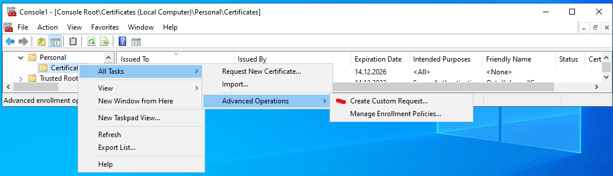

Click three times *Next* and then select *Details, Properties*. The certificate query custom request properties window appears:

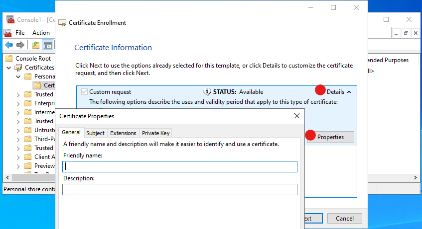

In the certificate query properties window, the exact properties desired in the new certificate can be set.

For similar queries performed more frequently, it is recommended to use `PowerShell` for automation.

##### Tab General

Here the certificate friendly name and description can be set. These fields are not actually inner parts of the certificate but can be useful for later certificate selection and understanding what is what.

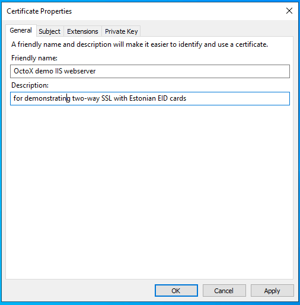

##### Tab Subject

The certificate subject is described here as usual. If different DNS aliases are needed, or the common name is not the FQDN for any reason, it is necessary to describe SAN DNS names in this tab too!

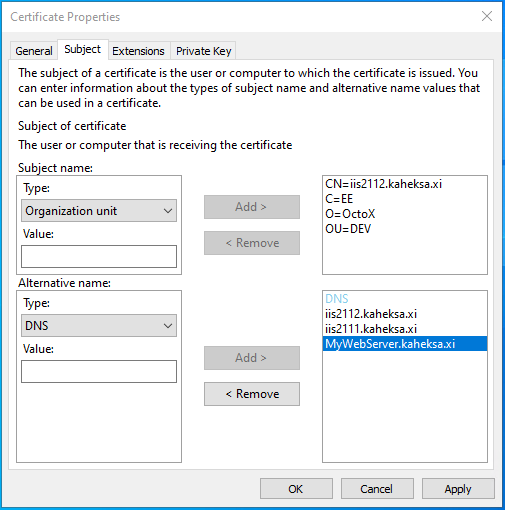

##### Tab Extensions

In the extensions tab, set the following options:

1.  Key Usage:
    1.  Digital signature;
    2.  Key encipherment.
2.  Extended Key Usage:
    1.  Server Authentication.

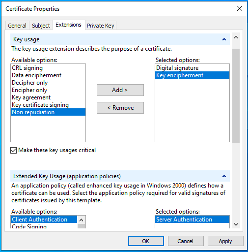

##### Tab Private Key

Here, select the CSP (cryptographic service provider). In this example, to use `ECDSA_P256`, unselect RSA and select `ECDSA_P256`.

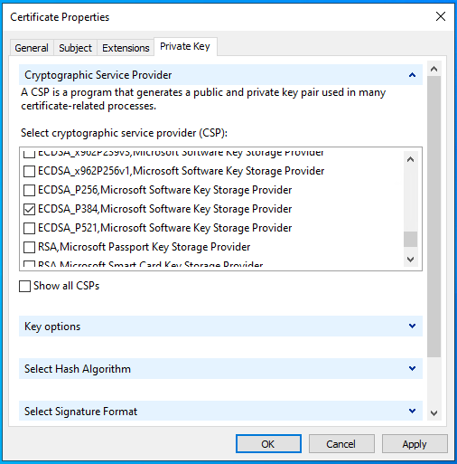

Click *OK* and *Next* to save the request file with any name you like in `Base64` format.

The contents of the request file can be checked with the command `certutil -dump REQUEST_FILE_NAME`.

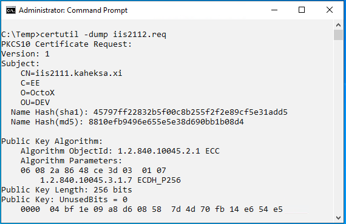

The DNS aliases defined in this query are also visible:

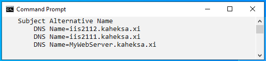

The query file must now be sent to any CA for certificate generation. If everything goes fine, the certificate will be returned.

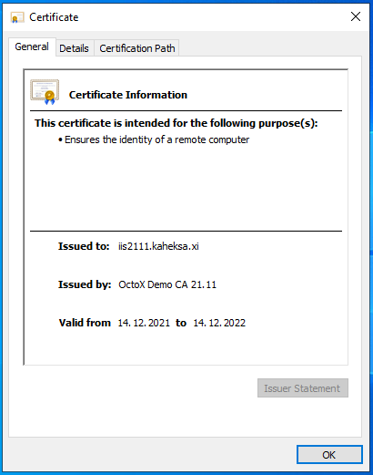

#### Installing certificate

Issuing CA certificate `OctoX Demo CA 21.11` must be trusted by the IIS server. It means it must be in the IIS server `Trusted Root Certification Authorities` container.[^2]

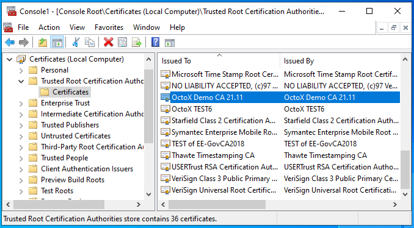

Certificate for IIS server must belong to `Local Computer/Personal` certificates container on IIS server.

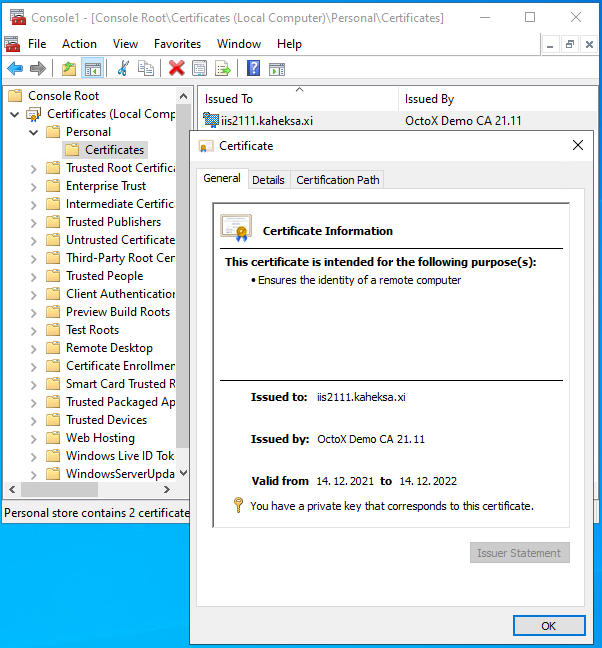

### Configuring IIS for one-way SSL

To configure one-way SSL on IIS server, a new HTTP(S) binding (usually port 443) must be added and a certificate applied to it. And it is definitely a good idea to disable legacy TLS protocols!

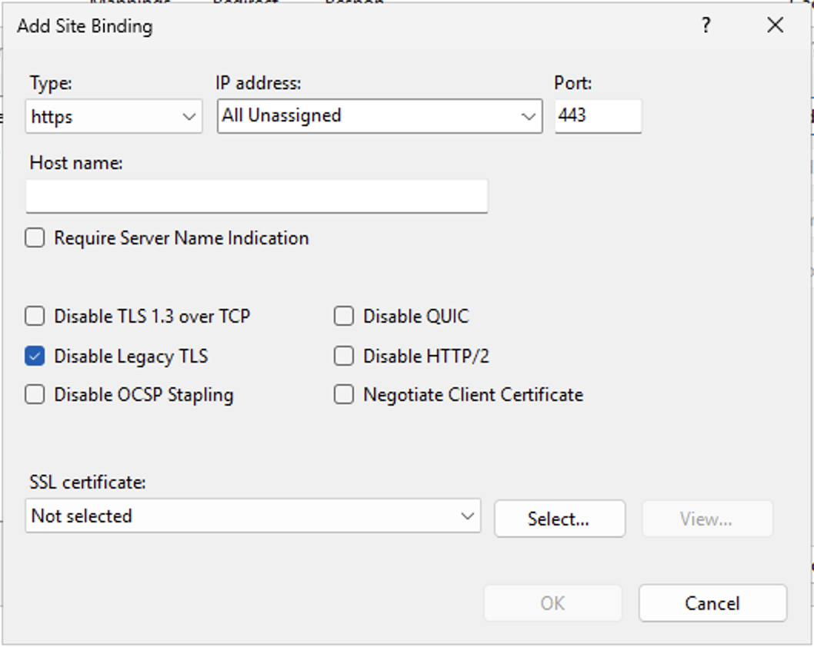

After applying settings, one-way SSL works and the website is accessible over HTTPS protocol.

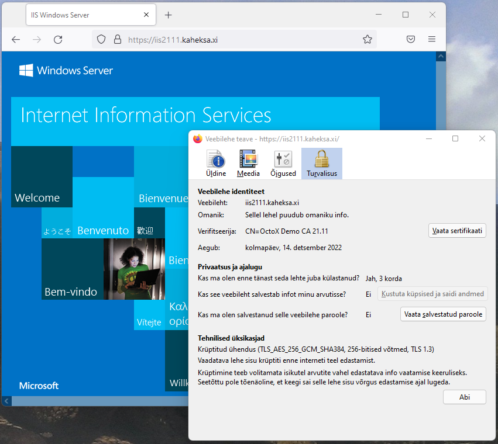

The Firefox information window shows that:

1.  Web server certificate `iis2111.kaheksa.xi` is in use;
2.  TLS protocol version 1.3 is in use.

#### Disabling HTTP access

To disable access to the website over unsecure HTTP (usually port 80), the binding can be removed from configuration and firewall access to port 80 can be disabled. As an alternative, an automatic redirection rule can be created from port 80 to port 443. This can be useful for cases when users do not type the https:// prefix to the server address and cannot reach the website.

## Requiring two-way SSL, certificate authentication

### Preset

> **Note:** As of 2022 and still applicable in 2026, IIS 10/Schannel running on Windows Server 2022 uses post-handshake authentication method with `TLS 1.3` by default. But because common browsers do not support this method, this configuration in practice is faulty. The problem with `TLS 1.3` is that the server will not send certificate request query to the client in default configuration and because of missing client certificate server resets connection. To re-enable certificate-based authentication, `TLS 1.3` must be turned off. An alternative is to enable the in-handshake authentication method, discussed later in chapter "[Enabling in-handshake authentication method](#enabling-in-handshake-authentication-method)".

> **Note:** On Windows Server 2025 this has been resolved natively — IIS adds a *Negotiate Client Certificate* checkbox directly in the HTTPS binding UI, enabling in-handshake authentication without the `netsh` workaround described below.

On Windows Server 2022, while this problem exists, `TLS 1.3` over TCP must be turned off. This can be done by selecting `Disable TLS 1.3 over TCP` in the IIS bindings window:

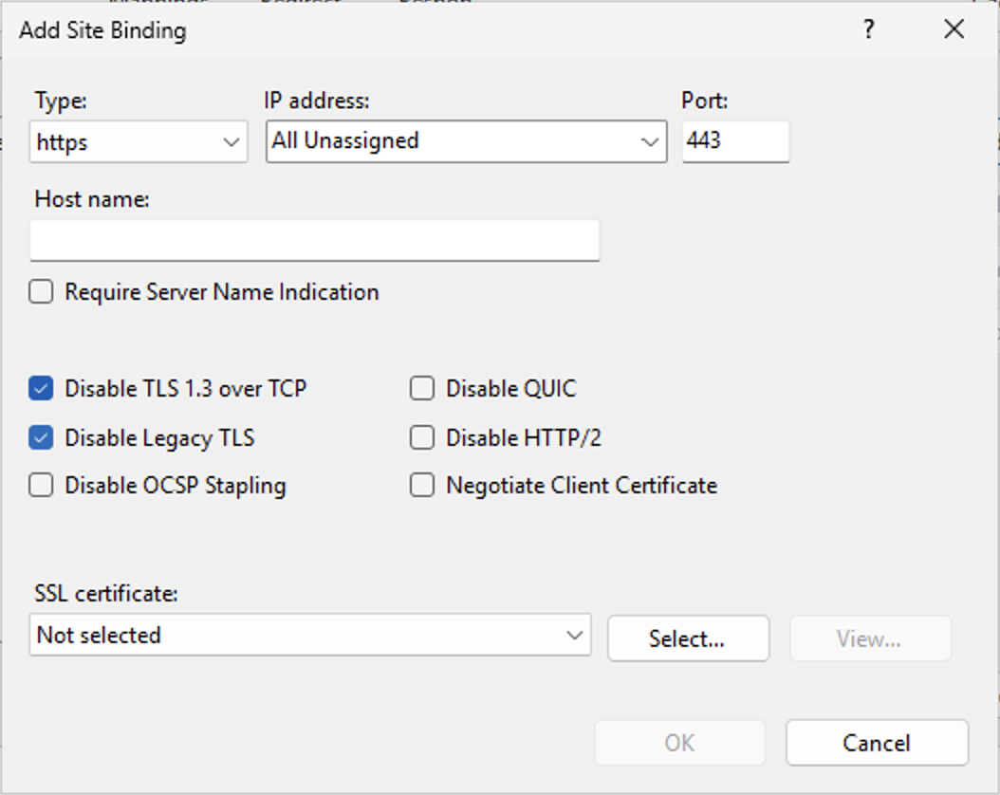

### Configuring IIS server to support Estonian eID cards

To enable two-way SSL certificate authentication must be turned on. By default, all trusted certificates with `client authentication` extension in EKU can be used. Client certificate chain must be known by server, intermediate certificates must belong to intermediate certificates container and root certificates must belong to `Trusted Root Certification Authorities` container.

The following certificates must be added to the IIS server certificate store:

1.  Trusted Root Certification Authorities:
    1.  `EE-GovCA2018` (<http://c.sk.ee/EE-GovCA2018.der.crt>)
    2.  `EEGovCA2025` (<https://crt.eidpki.ee/EEGovCA2025.crt>)
2.  Intermediate Certification Authorities[^3]:
    1.  `ESTEID2018` (<http://c.sk.ee/esteid2018.der.crt>)
    2.  `ESTEID2025` (<https://crt.eidpki.ee/ESTEID2025.crt>)

After defining certificate chains, the certificate requirement can be enabled in website SSL settings:

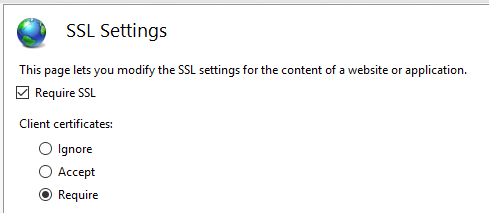

Described configuration allows access to website over port 443, client certificate is required. While connecting to server over https certificate request appears:

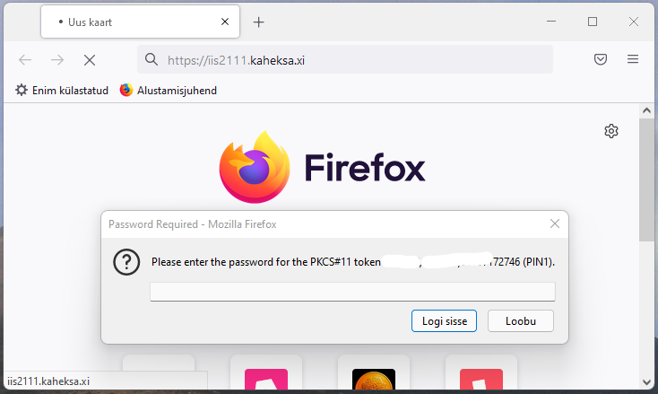

After entering PIN, certificate revocation status will be checked by IIS server and if it is good, user can access website.

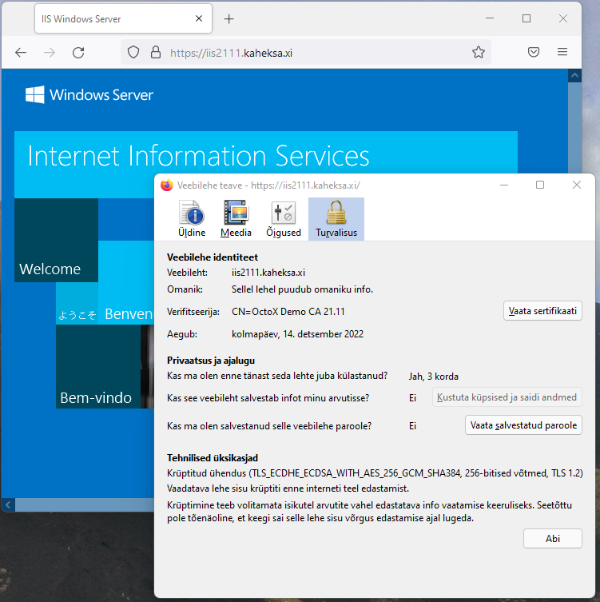

As an alternative, certificate acceptance can be used instead of requiring it. In this case, websites can be accessed also with username or password or without authentication at all.

### Enabling in-handshake authentication method

To use `TLS 1.3` protocol with Windows Server 2022 IIS 10, the in-handshake authentication method must be enabled. With this method, the certificate request query is sent to the client with *Server Hello*.

Please follow next steps to enable in-handshake authentication method:

1.  Document `Certificate Hash` and `Application ID` values with command `netsh http show sslcert`:

    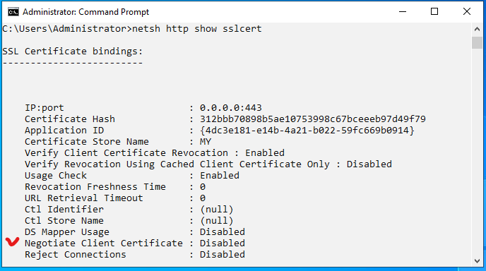

2.  Remove certificate binding from port 443 with command `netsh http del sslcert 0.0.0.0:443`:

    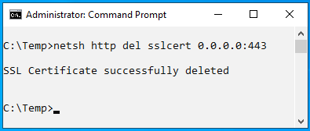

3.  Bind certificate to port 443 again and also enable in-handshake authentication with command `netsh http add sslcert ipport=0.0.0.0:443 certhash=312bbb70898b5ae10753998c67bceeeb97d49f79 appid={4dc3e181-e14b-4a21-b022-59fc669b0914} certstorename=MY clientcertnegotiation=Enable`:

    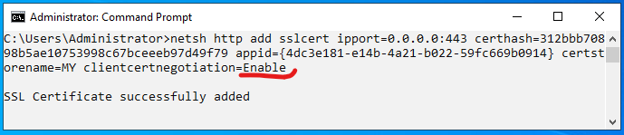

Checking certificate binding information again, `Negotiate Client Certificate` is now enabled:

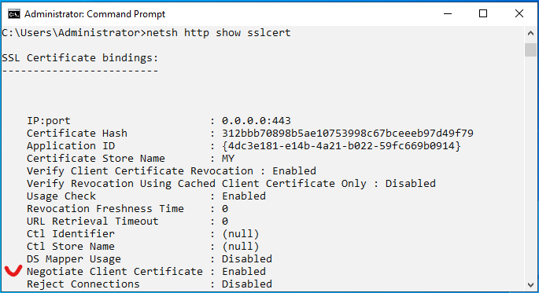

> **Note:** Because session renegotiation is disabled with `TLS 1.3`, it must be understood that authentication must happen on the first page. If a one-way SSL connection already exists with any website, renegotiation will fail if some parts of this site/page require it. So, if necessary, this *landing* problem must be solved.

### Authentication

In this configuration, only anonymous authentication is used:

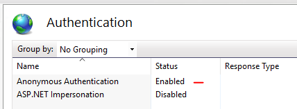

## Possible additional configurations

The purpose of this document is not to give exact guidance on how to configure or secure websites. This section introduces useful configurations for using two-way SSL with Estonian eID cards. The following sections cover options worth considering.

### Filtering certificate list on client side

By default, all personal certificates with private key and `user authentication` EKU on client side are accepted by IIS. But it is possible to teach IIS to share list of acceptable certificate authorities with clients – in this case browser shows only certificates from supported chains to user.

The goal is to support only certificates issued from chains under root CA `EE-GovCA2018` and `EEGovCA2025`.

1.  Get IIS certificate information with command `netsh http show sslcert 0.0.0.0:443`:

    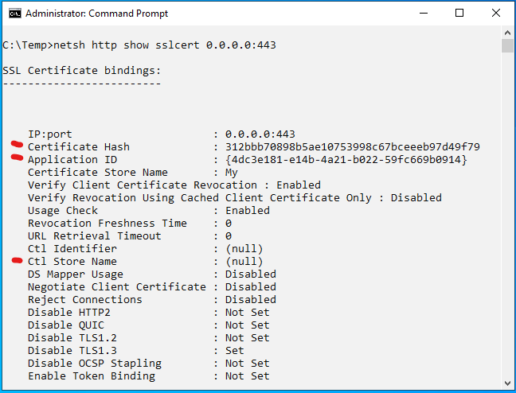

2.  Remove certificate binding with command `netsh http del sslcert 0.0.0.0:443`:

    

3.  Add certificate again and point it to user store `Client Authentication Issuers` as list for acceptable certification authorities for clients. Command is `netsh http add sslcert ipport=0.0.0.0:443 certhash=1e75c77c696aa4d49686bb1ef73ac3b07fdff38a appid={4dc3e181-e14b-4a21-b022-59fc669b0914} sslctlstorename=ClientAuthIssuer`:

    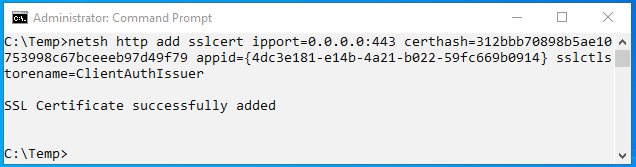

    `Certhash` and `appid` values can be taken from the output in step 1 above.

4.  Check that `ClientAuthIssuer` value exists after `CTL Store Name`:

    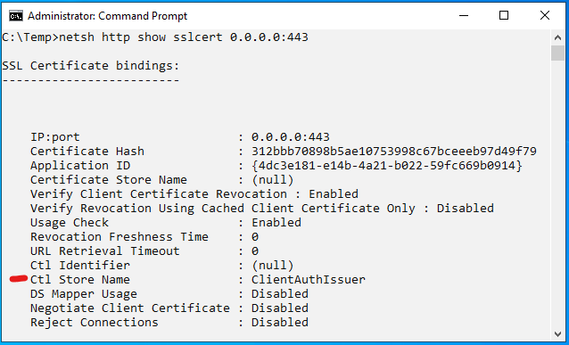

    The IIS configuration can also be checked to confirm the SSL certificate is correctly bound to port 443.

5.  Enable certificate filtering option in IIS server registry by adding value `HKEY_LOCAL_MACHINE\SYSTEM\CurrentControlSet\Control\SecurityProviders\SCHANNEL\SendTrustedIssuerList=1`:

    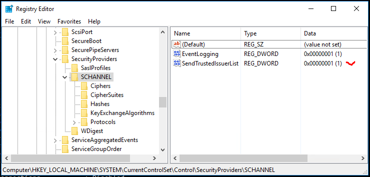

6.  Add the intermediate CA to certificates container `Client Authentication Issuers` in IIS server to support only specific CA:

    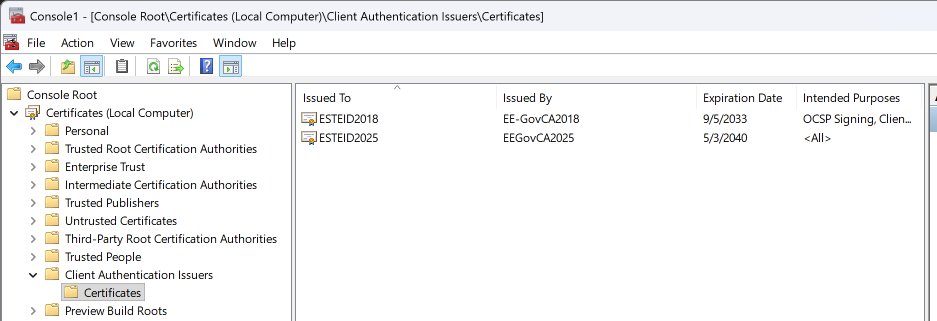

7.  If necessary, restart the IIS service or server and check if everything works as expected.

### Checking revocation status of client certificates against OCSP service

Using the OCSP service, the revocation status of client certificates can be checked practically in real time. In every client authentication attempt, the web server sends a query to the OCSP service, which responds with the client certificate revocation status.

Certificates issued by `ESTEID2018` and `ESTEID2025` CA have AIA OCSP service location included in the end user certificate (<http://aia.sk.ee/esteid2018> and <http://ocsp.eidpki.ee>), so no changes are needed here. The server can still be configured to check revocation status of certificates using the AIA OCSP service:

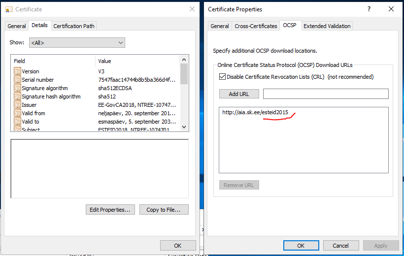

> **Note:** I repeat here for clarity: certificates issued by `ESTEID2018` / `ESTEID2025` CA have AIA OCSP path described in certificate. CRL is not described for those certificates.

> **Note:** Windows server by default changes from OCSP based revocation check to CRL based revocation checking after 50 OCSP queries. In this configuration, this doesn't really matter since CRL is not used at all. For other configurations, note that this behavior can be changed by changing the registry value of registry key `HKEY_LOCAL_MACHINE/Software/Policies/Microsoft/SystemCertificates/ChainEngine/Config/CryptnetCachedOcspSwitchToCrlCount`. For more information take a look at [OCSP magic count](https://learn.microsoft.com/en-us/previous-versions/windows/it-pro/windows-server-2008-R2-and-2008/ee619754(v=ws.10)#determining-preference-between-ocsp-and-crls) or *magic number*. This behavior can also be changed with windows policy:

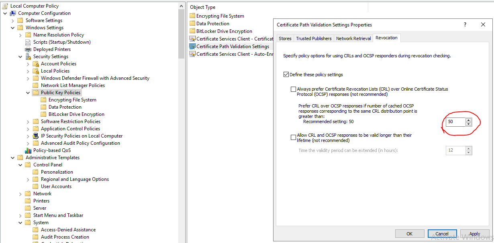

### Recommended security settings for IIS

#### SSL/TLS

IIS version 10 is using TLS protocol versions from 1.0 to 1.3 by default[^4]. Older SSL versions are disabled by default.

Old unsecure SSL/TLS protocols with version number lower than `TLS 1.2` should definitely no longer be used. `TLS 1.2` should be the lowest version to use! From Windows Server version 2022 `TLS 1.3` is also available. If you need one-way SSL, it can be a good idea to enable only `TLS 1.3`!

More information about the recommendations for the use of the TLS protocol can be found in the cryptographic algorithms life cycle reports ordered by RIA at <https://www.id.ee/en/article/cryptographic-algorithms-life-cycle-reports-2/>.

In addition to disabling older TLS versions in the IIS management console, `TLS 1.0` and `TLS 1.1` can be disabled in registry keys by defining the following values[^5]:

- `HKEY_LOCAL_MACHINE\SYSTEM\CurrentControlSet\Control\SecurityProviders\SCHANNEL\Protocols\`[^6]:
  - `TLS 1.0\Server`
    - `Enabled DWORD:0`
    - `DisabledByDefault = DWORD:1`
  - `TLS 1.1\Server`
    - `Enabled DWORD:0`
    - `DisabledByDefault = DWORD:1`

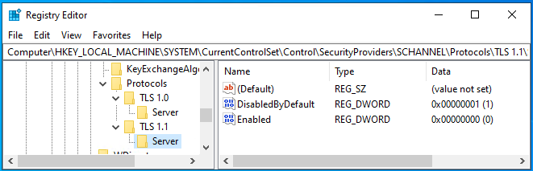

Of course, it is also possible to deploy TLS/SSL versions settings through group policy by deploying registry settings.

#### Cipher suites

There are many different cipher suites available with Windows Server. Available cipher suites can be listed with the `PowerShell` command `Get-TLSCipherSuite`[^7].

It is impossible to give an exact recommendation for configuring cipher suites because different environments have different requirements. And requirements and possibilities are changing in time. The only recommendation is to remove non-secure cipher suites from the list if any exist. Before going on with configuring cipher suites, it is recommended to get acquainted with RIA's recommendations for the use of the cipher suites in the cryptographic algorithms life cycle report at <https://www.id.ee/en/article/cryptographic-algorithms-life-cycle-reports-2/>. It can make sense to enable only specific cipher combinations.

So, to configure specific cipher suites, the best way is probably using local or group policy. To configure cipher suites `ECDHE-ECDSA-AES256-GCM-SHA384` and `ECDHE-RSA-AES256-GCM-SHA384` as the only ones in this configuration, the policy setting `Computer Configuration/Administrative Templates/Network/SSL Configuration Settings: SSL Cipher Suite Order` must be modified. Cipher suites must be separated with comma.[^8]

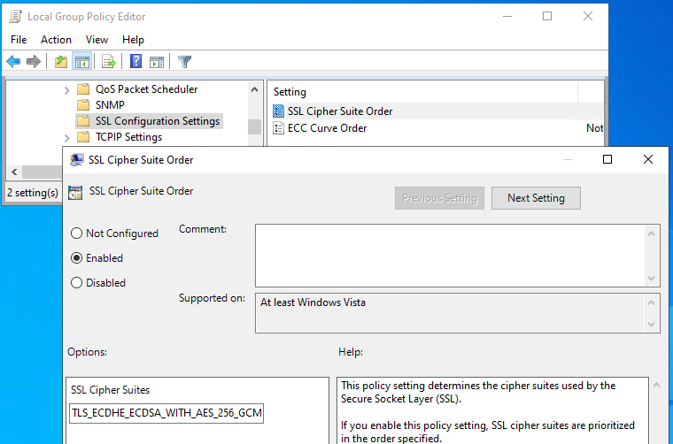

Assigned configuration can be found from registry location presented on the following picture:

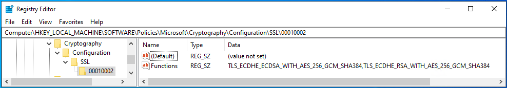

Default configuration settings can be found from registry location presented on the following picture:

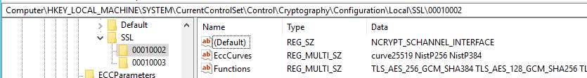

##### Other configurable Schannel settings

Default location for all Schannel settings is `HKLM\SYSTEM\CurrentControlSet\Control\SecurityProviders\SCHANNEL`. It is possible to enable or disable different Schannel components here, overwrite default configuration.

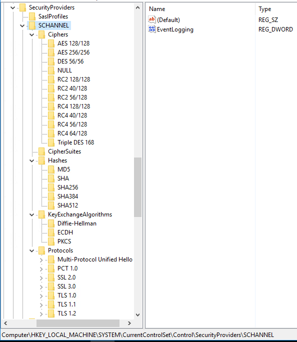

#### Additional possibilities

In addition to TLS and cipher suite configuration, there are many other things that can be done to secure the server:

- Keep operating system up to date.
- Disable presenting server information.
- Disable HTTP requests.
- Disable directory listing.
- Run under separate non-system and non-administrator accounts.
- Enable HSTS.
- …

Please take the list above as a short demo recommendations list. Of course, it makes sense to follow the recommendations, but there can be much more you can do to secure your server:

<https://www.google.com/search?q=how+to+secure+IIS+server>

[^1]: <https://www.id.ee/en/article/install-id-software/>

[^2]: If certificate is issued by intermediate CA, it must be in `Intermediate Certification Authorities` container. In this case root CA certificate for intermediate CA must be in `Trusted Root Certification Authorities` container.

[^3]: To support EID cards issued for organizations by SK ID Solutions, `EID-SK 2016` (<https://www.sk.ee/upload/files/EID-SK_2016.der.crt>) certificates must also be added to the list!

[^4]: <https://docs.microsoft.com/en-us/windows/win32/secauthn/protocols-in-tls-ssl--schannel-ssp-?redirectedfrom=MSDN>

[^5]: These entries do not exist in the registry by default.

[^6]: It is also possible to configure the client part for SSL/TLS versions, but this guide covers server configuration. It does not mean that configuring the client part is not recommended, it just depends.

[^7]: <https://docs.microsoft.com/en-us/windows/win32/secauthn/cipher-suites-in-schannel>

[^8]: With the cipher settings described here, `TLS 1.3` will not work. So, those settings can be useful if `TLS 1.3` is not to be used for any reason, for enabling certificate authentication for example.
