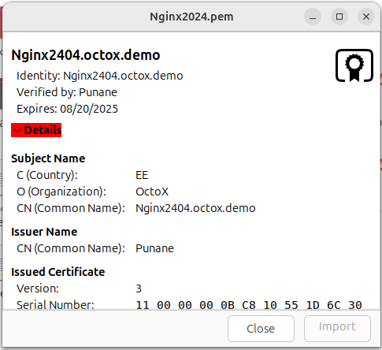
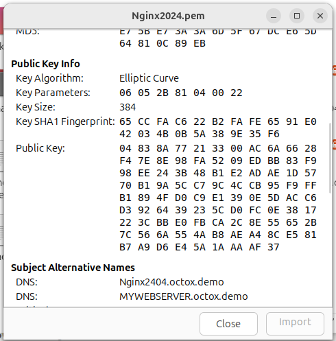
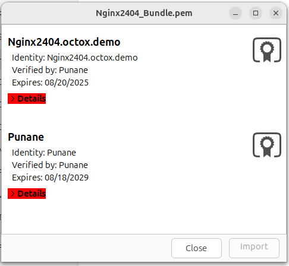
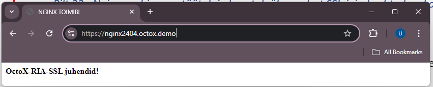
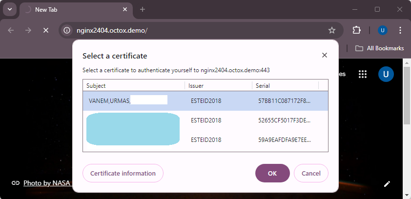

# Configuring two-way SSL using Estonian ID-cards in the Ubuntu Nginx web server

**[Eesti keeles (In Estonian)](index.et.md)**

**Version:** 26.08/1

**Published by:** [RIA](https://www.ria.ee/)

**Version information**

| Date       | Version | Changes/Notes
|:-----------|:-------:|:-----------------------------------------------------------
| 08/02/2019 | 19.02/1 | Public version.
| 28/02/2019 | 19.02/2 | Added notes about the user certificate validity check. Default webpage removal. — Changed by: Urmas Vanem
| 12/12/2019 | 19.12/1 | Added recommendations for securing Nginx. — Changed by: Urmas Vanem
| 30/12/2020 | 20.12/1 | Ubuntu updated to 20.04.1. Nginx updated to 1.19.6. Configuration management changed (sites... -> conf.d). Added OCSP-based revocation lists, recommended security settings, and filtering of wrong CA certificates. — Changed by: Urmas Vanem
| 13/01/2021 | 21.01/1 | Added the demonstrative configuration file. Added HSTS configuration. — Changed by: Urmas Vanem
| 25/01/2021 | 21.01/2 | Changed the HSTS recommendations. Changed the SSL/TLS and cipher recommendations. Added additional security recommendations. — Changed by: Urmas Vanem
| 28/04/2021 | 21.04/1 | Support for outdated `ESTEID-SK 2011` certificates removed. — Changed by: Urmas Vanem
| 25/11/2021 | 21.11/1 | Ubuntu updated to Server 21.10. Nginx updated to 1.21.4. Added guidance for ECC certificates. Updated TLS and cipher recommendations. — Changed by: Urmas Vanem
| 22/02/2023 | 23.02/1 | Ubuntu updated to Server 22.04 and Nginx to 1.23.3. Virtual host configuration updated. — Changed by: Urmas Vanem
| 18/12/2023 | 23.12/1 | Removed the `ESTEID-SK 2015` chain. — Changed by: Urmas Vanem
| 22/08/2024 | 24.08/1 | Ubuntu updated to Server 24.04 and Nginx to 1.27.1. — Changed by: Urmas Vanem
| 31/10/2025 | 25.10/1 | Added Zetes chain, removed SK OCSP section. — Changed by: Lauris Kaplinski
| 22/04/2026 | 26.04/1 | Converted to Markdown format. — Changed by: Raul Metsma
| 21/08/2026 | 26.08/1 | Updated certificate-key, TLS protocol, cipher-suite, certificate-policy, and OCSP guidance based on the 2026 cryptographic algorithms life-cycle report. — Changed by: Raul Metsma

---

- TOC
{:toc}

## Intro

This guide describes:

- How to install and configure the Nginx 1.28.1 web server on Ubuntu Server 24.04.
- How to configure HTTPS (one-way SSL) in the web server.
- How to configure ID-card authentication (two-way SSL) using [SK ID Solutions](https://www.skidsolutions.eu/resources/certificates/) (`EE-GovCA2018`) and [Zetes](https://repository.eidpki.ee/) (`EEGovCA2025`) ID-cards.
- How to check client-certificate revocation and configure server-certificate
  OCSP stapling.
- How to protect the web server.

This guide also covers other configuration options such as how to configure HTTP -\> HTTPS redirection, etc.

## Nginx installation and configuration

### Installation

By default, Ubuntu 24.04 installs Nginx version 1.24. However, since version 1.28.1 is used in this guide, additional changes are required before installation.

To install Nginx 1.28.1 on Ubuntu 24.04:

1.  Run in terminal

    ```bash
    $ sudo add-apt-repository ppa:ondrej/nginx
    PPA publishes dbgsym, you may need to include 'main/debug' component
    Repository: 'Types: deb
    URIs: https://ppa.launchpadcontent.net/ondrej/nginx/ubuntu/
    Suites: noble
    Components: main
    '

    Description:
    This branch follows latest NGINX Stable packages compiled against latest OpenSSL for HTTP/2 and TLS 1.3 support.

    BUGS&FEATURES: This PPA now has a issue tracker: https://deb.sury.org/#bug-reporting
    ```

2.  Run in terminal:

    ```bash
    $ apt update
    Hit:1 http://ee.archive.ubuntu.com/ubuntu noble InRelease
    Hit:2 http://ee.archive.ubuntu.com/ubuntu noble-updates InRelease
    Hit:3 http://ee.archive.ubuntu.com/ubuntu noble-backports InRelease
    Hit:4 http://security.ubuntu.com/ubuntu noble-security InRelease
    Hit:5 https://ppa.launchpadcontent.net/ondrej/apache2/ubuntu noble InRelease
    Hit:6 https://ppa.launchpadcontent.net/ondrej/nginx-mainline/ubuntu noble InRelease
    ```

3.  Run in terminal:

    ```bash
    $ apt install nginx-full
    Reading package lists... Done
    Building dependency tree... Done
    Reading state information... Done
    The following additional packages will be installed:
      libnginx-mod-http-auth-pam libnginx-mod-http-dav-ext libnginx-mod-http-echo
      libnginx-mod-http-geoip2 libnginx-mod-http-subs-filter
      libnginx-mod-http-upstream-fair libnginx-mod-stream
      libnginx-mod-stream-geoip2 nginx nginx-common
    ```

The Nginx version can be checked with the command

```bash
$ nginx -v
nginx version: nginx/1.28.1
```

### Configuration

#### Enabling one-way SSL

##### Creating the private key and the Certificate Signing Request (CSR)

###### Elliptic Curve Cryptography (ECC)

First, generate an ECC private key, then an ECC CSR[^1]:

```bash
$ openssl ecparam -name secp384r1 -genkey -noout -out Nginx2404.key
$ openssl req -new -key Nginx2404.key -out Nginx2404.csr -subj /C=EE/O=OctoX/CN=Nginx2404.octox.demo -reqexts SAN -config <(cat /etc/ssl/openssl.cnf <(printf "[SAN]\nsubjectAltName=DNS:Nginx2404.octox.demo,DNS:MYWEBSERVER.octox.demo"))
```

1.  `Nginx2404.key` is the private key of the certificate;
2.  `Nginx2404.csr` is the CSR for the certificate authority (CA);
3.  `CN=Nginx2404.octox.demo` is the common name for the certificate;
4.  `DNS:Nginx2404.octox.demo` and `DNS:MYWEBSERVER.octox.demo` are SAN DNS names for the certificate. These names must correspond to the actual address of the website[^2]. The names must also be resolvable in name services.

Generate a separate private key for every independent TLS server. Do not copy
one key between servers merely because a wildcard or multi-SAN certificate
could cover all their names. Keeping keys separate limits the impact of a
server or key compromise.

For production deployments, use a hardware security module (HSM) or an
equivalent non-exportable hardware-backed key store where supported. Generate
the key inside the device and keep it non-exportable. Confirm that the HSM,
OpenSSL integration, and certificate issuer support the selected ECDSA P-384
key before deployment. The file-based key in this example is not an HSM setup.

The contents of the CSR can be viewed by running

```bash
$ openssl req -in Nginx2404.csr -noout -text
Certificate Request:
    Data:
        Version: 1 (0x0)
        Subject: C = EE, O = OctoX, CN = Nginx2404.octox.demo
        Subject Public Key Info:
            Public Key Algorithm: id-ecPublicKey
                Public-Key: (384 bit)
                pub:
                    04:83:8a:77:21:33:00:ac:6a:66:28:f4:7e:8e:98:
                    fa:52:09:ed:bb:83:f9:98:ee:24:3b:48:b1:e2:ad:
                    ae:1d:57:70:b1:9a:5c:c7:9c:4c:cb:95:f9:ff:b1:
                    89:4f:d0:c9:e1:39:0e:5d:ac:c6:d3:92:64:39:23:
                    5c:d0:fc:0e:38:17:22:3c:bb:e0:fb:ca:2c:8e:55:
                    65:2b:7c:56:6a:55:4a:b8:ae:a4:8c:e5:81:b7:a9:
                    d6:e4:5a:1a:aa:af:37
                ASN1 OID: secp384r1
                NIST CURVE: P-384
        Attributes:
            Requested Extensions:
                X509v3 Subject Alternative Name:
                    DNS:Nginx2404.octox.demo, DNS:MYWEBSERVER.octox.demo
        Signature Algorithm: ecdsa-with-SHA256
        Signature Value:
```

##### Ordering and installing an SSL certificate

The CSR `Nginx2404.csr` should be sent to trustworthy CA. In the demo environment, the certificate issuer is the test CA. Signed certificate is issued in PEM format.

```
-----BEGIN CERTIFICATE-----
MIICfjCCAZygAwIBAgITEQAAAAvIEFUdbDDF...
...
Hz3/vZjy73t2ag==
-----END CERTIFICATE-----
```

In Ubuntu, the certificate looks like this:



The certificate also includes the algorithm and alternative SAN DNS names of the subject:



As you can see, certificate issuer is a CA named `Punane`. Now, you need to obtain the issuer CA's certificate in PEM format and save it to the user's home folder in Ubuntu as `Punane.pem`.

Consolidate all one-way SSL certificates into one file, with the web server certificate first. In this example that means `Nginx2404.pem` followed by its CA certificate `Punane.pem`. This can be done in a text editor (placing the Base64-encoded certificates one after another) or with the command

```bash
$ cat Nginx2404.pem Punane.pem >Nginx2404_Bundle.pem
```

When opened in Ubuntu, the file looks like this:



Place the bundled certificate file `Nginx2404_Bundle.pem` in the `/etc/ssl/certs` folder. In addition,
you need to place the certificate private key in the `/etc/ssl/private` folder.

```bash
$ cp Nginx2404_Bundle.pem /etc/ssl/certs
$ cp Nginx2404.key /etc/ssl/private
```

Now, all the certificates and the private key needed by Nginx for one-way SSL have been correctly installed.

#### Creating a virtual website

Create a separate virtual website for your configuration. First, create a home folder named `/var/www/Nginx2404` for the content of the website.

```bash
$ mkdir /var/www/Nginx2404
```

Put a simple and recognizable webpage named `index.html` into the folder you created.

Then, prepare the configuration file for the new virtual website. Create a new file named `/etc/nginx/conf.d/Nginx2404.conf` (e.g. with the command `nano /etc/nginx/conf.d/Nginx2404.conf`).

```bash
$ nano /etc/nginx/conf.d/Nginx2404.conf
```

Now, change the new configuration file as you wish. Paste the following configuration in it[^3]:

```nginx
server {
    listen 80;
    listen [::]:80;
    server_name Nginx2404.octox.demo;
    return 301 https://Nginx2404.octox.demo;
}

server {
    # SSL configuration
    listen 443 ssl;
    listen [::]:443 ssl;
    root /var/www/Nginx2404;
    index index.html;
    server_name Nginx2404.octox.demo;

    # Certificates
    ssl_certificate /etc/ssl/certs/Nginx2404_Bundle.pem;
    ssl_certificate_key /etc/ssl/private/Nginx2404.key;

    location / {
        try_files $uri $uri/ =404;
    }
}
```

You can verify the configuration syntax with `nginx -t`. If there are no errors, start nginx to activate the web service:

```bash
$ systemctl start nginx
```

If nginx is already running, you can apply the changes by restarting nginx with the terminal command

```bash
$ systemctl reload nginx
```

#### Result

Now, the new website can be accessed by one-way SSL. In addition, all HTTP requests to the site <http://Nginx2404.octox.demo> are automatically redirected to the HTTPS site <https://Nginx2404.octox.demo>.



#### Requiring two-way SSL

If you wish to allow website access by authenticating with an Estonian ID-card, you need to supplement the existing configuration slightly.

Add the following lines after `ssl_certificate_key` in the SSL section of the file `Nginx2404.conf`:

```nginx
# Certificates
ssl_certificate /etc/ssl/certs/Nginx2404_Bundle.pem;
ssl_certificate_key /etc/ssl/private/Nginx2404.key;
ssl_client_certificate /etc/ssl/certs/EID_Bundle.pem;
ssl_verify_client on;
ssl_verify_depth 2;
```

Now, create a new text file named [`EID_Bundle.pem`](#eid_bundle.pem), which includes the eID root and intermediate certificates (`EE-GovCA2018`, `ESTEID2018`, `EEGovCA2025`, `ESTEID2025`) in PEM format. With this file, you can filter out all CA's whose certificates are supported by the new website. The user will only see the certificates from those chains. The 'cat' command can be used to create this file, but it also works as copy-and-paste between text redactors. When opened in Ubuntu, the file looks like this:


Save the file as [`EID_Bundle.pem`](#eid_bundle.pem) and copy it to the folder `/etc/ssl/certs`. Restart the Nginx web server to activate the change:

```bash
$ systemctl reload nginx
```

After accessing the website `Nginx2404.octox.demo` now, a user certificate is required:



The server suggests certificates to the user, the issuers of which are described in the file [`EID_Bundle.pem`](#eid_bundle.pem). After confirming the certificate and entering the PIN, the user can access the website -- two-way SSL works.

A complete demonstrative Nginx configuration file combining all settings in this document is available in the [Appendix](#nginx_eid_demo.conf).

## Additional configuration options

The purpose of this document is not to give exact guidance on how to optimize or protect websites, but to show how to configure two-way SSL for Estonian ID-cards. However, you should take into account the following.

### Firewall rules (if necessary)

For creating a firewall rule, run the command on the terminal:

```bash
$ ufw allow 'DESIRABLE RULE'
```

For example, to allow HTTPS traffic only, run

```bash
$ ufw enable
Firewall is active and enabled on system startup
$ ufw allow 443/tcp
Rule added
Rule added (v6)
```

If the firewall is active (`ufw enable`), running the command `ufw status` in the terminal shows the active rules.

```bash
$ ufw status
Status: active

To                         Action      From
--                         ------      ----
443/tcp                    ALLOW       Anywhere
443/tcp (v6)               ALLOW       Anywhere (v6)
```

### Checking client-certificate revocation with OCSP[^4]

OCSP (Online Certificate Status Protocol) lets Nginx check the revocation
status of a client certificate during authentication.

Certificates issued under the `ESTEID2018` and `ESTEID2025` CAs contain
their AIA OCSP service address (<http://aia.sk.ee/esteid2018> and
<http://ocsp.eidpki.ee>).


To enable the user certificate validity check against the AIA OCSP service, you need to add the following lines after `ssl_verify_depth` in the SSL configuration of Nginx:

```nginx
# Certificates
ssl_certificate /etc/ssl/certs/Nginx2404_Bundle.pem;
ssl_certificate_key /etc/ssl/private/Nginx2404.key;
ssl_client_certificate /etc/ssl/certs/EID_Bundle.pem;
ssl_verify_client on;
ssl_verify_depth 2;
ssl_ocsp leaf;
ssl_ocsp_cache shared:OCSP:10m;
resolver 194.126.115.18;
```

The `leaf` value checks the end-user certificate, and the shared cache
reduces repeated responder queries. The responder address is taken from the
client certificate. Replace the `resolver` IP with a DNS server capable of
resolving public addresses[^5]. Allow outbound DNS and HTTP access to the
responders and monitor Nginx errors: an OCSP validation failure prevents
client-certificate authentication.

### Stapling the server-certificate OCSP response

Client-certificate validation above and server-certificate OCSP stapling are
separate functions. Stapling lets Nginx obtain a signed status response for
its own server certificate and send it during the TLS handshake. This avoids
each browser querying the issuing CA and improves client privacy.[^6]

First check whether the server certificate contains an OCSP responder URI:

```bash
$ openssl x509 -in /etc/ssl/certs/Nginx2404_Bundle.pem -noout -ocsp_uri
```

If the command returns a supported URI, create
`/etc/ssl/certs/Nginx2404_CA.pem` containing the issuing, intermediate, and
root CA certificates in PEM format. Then enable stapling and response
verification:

```nginx
ssl_stapling on;
ssl_stapling_verify on;
ssl_trusted_certificate /etc/ssl/certs/Nginx2404_CA.pem;
resolver 194.126.115.18;
```

Do not enable stapling when the issuing CA does not provide an OCSP service.
After reloading Nginx, verify the stapled response:

```bash
$ openssl s_client -connect Nginx2404.octox.demo:443 \
    -servername Nginx2404.octox.demo -status </dev/null
```

The output must contain a successful OCSP response and a `good` certificate
status. Monitor refresh errors and ensure the server can reach the responder.

### Recommended security settings for Nginx

#### SSL/TLS

Do not rely on the Nginx or operating-system defaults to select TLS
protocol versions. Disable TLS 1.0 and TLS 1.1. New and updated
deployments should enable only TLS 1.3 by default.

Add TLS 1.2 only as a documented exception when the service must support
clients from 2020 or earlier, or when a client certificate must be
requested after the initial TLS connection has been established. When
TLS 1.2 is enabled, configure an explicit secure cipher-suite allowlist.

TLS 1.3 configuration:

```nginx
ssl_protocols TLSv1.3;
```

For a documented compatibility exception, enable TLS 1.2 and TLS 1.3:

```nginx
ssl_protocols TLSv1.2 TLSv1.3;
```

Nginx requests client certificates at the initial handshake, so TLS 1.2
renegotiation is not required for the authentication flow in this guide. The
configuration below disables it explicitly.

When the TLS implementation and deployed clients provide production support,
prioritize the hybrid `X25519MLKEM768` group. This guide does not hard-code a
group setting because support and the standardized identifier depend on the
installed OpenSSL version. Confirm the effective group with a current TLS
scanner before relying on it.

If you want to make the change at the server level, modify the parameter
`ssl_protocols` in the file `/etc/nginx/nginx.conf`.

More information about the recommendations for the use of the TLS
protocol can be found in the cryptographic algorithms life cycle report
ordered by RIA at
<https://www.id.ee/en/article/cryptographic-algorithms-life-cycle-reports-2/>.

#### Cipher suites

Configure an explicit allowlist instead of relying on OpenSSL aliases
such as `HIGH`. For TLS 1.3, enable the following suites in this order:

```nginx
ssl_conf_command Ciphersuites TLS_AES_256_GCM_SHA384:TLS_CHACHA20_POLY1305_SHA256:TLS_AES_128_GCM_SHA256;
```

`TLS_AES_128_CCM_SHA256` may be used only as a fallback when AES-GCM and
ChaCha20-Poly1305 are unavailable. Do not enable CCM_8 suites.

When the documented TLS 1.2 compatibility exception applies, enable only the
three ECDHE-ECDSA and AEAD suites below. This matches the ECDSA-only
certificate profile used in this guide:

```nginx
ssl_ciphers 'ECDHE-ECDSA-AES128-GCM-SHA256:ECDHE-ECDSA-AES256-GCM-SHA384:ECDHE-ECDSA-CHACHA20-POLY1305';
```

The `ssl_ciphers` directive controls TLS 1.2 and older versions;
`ssl_conf_command Ciphersuites` controls TLS 1.3 through OpenSSL. The
TLS 1.2 list excludes RSA authentication and key exchange, static DH/ECDH,
CBC, CCM_8, and non-AEAD suites.

You can also configure these directives at the server level in
`/etc/nginx/nginx.conf`. Check the effective list with
`openssl ciphers -v` and verify the negotiated protocol and suite with a
current TLS scanner after every configuration change.

##### Compression and renegotiation

Keep TLS compression and TLS 1.2 renegotiation disabled explicitly:

```nginx
ssl_conf_command Options -Compression,NoRenegotiation;
```

HTTP response compression is separate from TLS compression and can disclose
secrets when a response contains both attacker-controlled input and sensitive
data. Set `gzip off;` for sensitive dynamic locations and also disable any
configured Brotli module there. If response compression must remain enabled,
the application must prevent cross-site request forgery and mitigate
response-length leakage.

More information about the recommendations for the use of the cipher
suites can be found in the cryptographic algorithms life cycle report
ordered by RIA at
<https://www.id.ee/en/article/cryptographic-algorithms-life-cycle-reports-2/>.

##### ssl_prefer_server_ciphers

Preferring server ciphers over user ciphers can be enabled with
`ssl_prefer_server_ciphers`. Set its value to `on` in the configuration
file.

#### Additional filtering of client certificates

Trusting a CA chain does not prove that the leaf certificate is an ID-card
authentication certificate. Different certificate products can share a root
or intermediate CA. Before accepting the authenticated identity, require all
of the following:

1.  Nginx successfully validates the complete certificate chain;
2.  the issuer is an explicitly allowed intermediate CA;
3.  `extendedKeyUsage` permits TLS web-client authentication;
4.  the leaf certificate's `X509v3 CertificatePolicies` extension
    (`2.5.29.32`) contains both the NCP+ authentication-policy OID and an
    allowed document-policy OID for the certificate's CA generation.[^7]

For production certificates covered by this guide, use this allowlist:

```text
# Required in every accepted authentication certificate
0.4.0.2042.1.2

# ESTEID2018 - require one of these document-policy OIDs
1.3.6.1.4.1.51361.1.1.1
1.3.6.1.4.1.51361.1.1.2
1.3.6.1.4.1.51361.1.1.3
1.3.6.1.4.1.51361.1.1.4
1.3.6.1.4.1.51361.1.1.5
1.3.6.1.4.1.51361.1.1.6
1.3.6.1.4.1.51361.1.1.7
1.3.6.1.4.1.51455.1.1.1

# ESTEID2025 - require one of these document-policy OIDs
1.3.6.1.4.1.51361.2.1.1
1.3.6.1.4.1.51361.2.1.2
1.3.6.1.4.1.51361.2.1.3
1.3.6.1.4.1.51361.2.1.4
1.3.6.1.4.1.51361.2.1.5
1.3.6.1.4.1.51361.2.1.6
1.3.6.1.4.1.51455.2.1.1
```

Correlate the document-policy OID with the validated issuer: an `ESTEID2018`
certificate must not be accepted using an `ESTEID2025` policy OID, or vice
versa. The common NCP+ OID is not product-specific and is insufficient on its
own. Do not add test OIDs, such as Zetes OIDs prefixed with `2.999`, to a
production allowlist.

Nginx does not provide a directive that can reliably apply an allowlist to
the policy OIDs inside `CertificatePolicies`. Perform that check in the
application or an authentication gateway. Do not infer the certificate
product from its subject, issuer, or EKU alone, and do not treat the
`anyPolicy` OID (`2.5.29.32.0`) as proof of an ID-card policy.

As a preliminary, defence-in-depth check, reject certificates whose issuer CA
name is not `ESTEID2018` or `ESTEID2025`. Add these conditions to the `server`
section after the TLS configuration:

```nginx
# Preliminary filter by intermediate CA name
set $trusted_client_issuer 0;

if ($ssl_client_i_dn ~ "^CN=ESTEID2018,") {
    set $trusted_client_issuer 1;
}

if ($ssl_client_i_dn ~ "^CN=ESTEID2025,") {
    set $trusted_client_issuer 1;
}

if ($trusted_client_issuer = 0) {
    return 403;
}
```

With these conditions, Nginx rejects a certificate unless its issuer is
`ESTEID2018` or `ESTEID2025`. This issuer check does not replace the
certificate-policy check.

For an HTTP upstream, overwrite a dedicated request header with the verified
leaf certificate:

```nginx
proxy_set_header X-Client-Certificate $ssl_client_escaped_cert;
```

The application must URL-decode and parse the certificate, then reject
authentication unless both the NCP+ OID and a document-policy OID matching
the issuer are present. Only trust this header when the application is
reachable exclusively through the trusted Nginx proxy. Other application
interfaces should use their native TLS client-certificate integration.

To inspect the extension while testing an exported certificate:

```bash
$ openssl x509 -in client.pem -noout -text
```

Check the `X509v3 Certificate Policies` section against the current policy
and certificate-profile sources cited above. Test at least one
accepted ID-card certificate and certificates for other products issued in
related hierarchies, including Mobile-ID where applicable.

> **Note:** If you are using another feature to filter network traffic, the secure configuration should be implemented there, too. SK has published information about the F5 configuration in the chapter 'Only accept certificates with trusted key usage' in the following article: <https://github.com/SK-EID/smart-id-documentation/wiki/Secure-Implementation-Guide>

> **Note:** SK's recommendations for secure ID-card authentication are published here in the chapter 'Defense: implement ID-card authentication securely': <https://github.com/SK-EID/smart-id-documentation/wiki/Secure-Implementation-Guide>

#### Enabling HTTP Strict Transport Security (HSTS)

To enable HSTS for the Nginx webpage, add the `add_header Strict-Transport-Security` line to the configuration file.

```nginx
# Other recommended security and optimization settings.
ssl_prefer_server_ciphers on;
add_header Strict-Transport-Security "max-age=31536000; includeSubDomains; preload" always;
ssl_session_cache    shared:SSL:10m;
ssl_session_timeout  1h;
ssl_session_tickets  on;
```

#### Additional possibilities

In addition to TLS and cipher suite configuration, you should pay attention to the security of the Nginx server from the following aspects:

- Keep the operating system up to date.
- Keep Nginx up to date.
- Disable presenting server information.
- Disable HTTP requests.
- Install and configure Naxsi.
- Monitor with Monit.
- Configure X-XSS Protection.
- Configure X-Frame-Options.
- Configure X-Content-Type-Options.
- Configure Content Security Policy (CSP).
- ...

The above is a sample list of ways to improve Nginx security. Detailed recommendations are available online: <https://www.google.com/search?q=how+to+secure+nginx+server>.

## Appendix

### EID_Bundle.pem

```
# EE-GovCA2018
-----BEGIN CERTIFICATE-----
MIIE+DCCBFmgAwIBAgIQMLOwlXoR0oFbj52nmRsnezAKBggqhkjOPQQDBDBaMQsw
CQYDVQQGEwJFRTEbMBkGA1UECgwSU0sgSUQgU29sdXRpb25zIEFTMRcwFQYDVQRh
DA5OVFJFRS0xMDc0NzAxMzEVMBMGA1UEAwwMRUUtR292Q0EyMDE4MB4XDTE4MDkw
NTA5MTEwM1oXDTMzMDkwNTA5MTEwM1owWjELMAkGA1UEBhMCRUUxGzAZBgNVBAoM
ElNLIElEIFNvbHV0aW9ucyBBUzEXMBUGA1UEYQwOTlRSRUUtMTA3NDcwMTMxFTAT
BgNVBAMMDEVFLUdvdkNBMjAxODCBmzAQBgcqhkjOPQIBBgUrgQQAIwOBhgAEAMcb
/dmAcVo/b2azEPS6CfW7fEA2KuHKC53D7ShVNvLz4QUjCdTXjds/4u99jUoYEQec
luVVzMlgEJR1nkN2eOrLAZYxPjwG5HiI1iZEyW9QKVdeEgyvhzWWTNHGjV3HdZRv
7L9o4533PtJAyqJq9OTs6mjsqwFXjH49bfZ6CGmzUJsHo4ICvDCCArgwEgYDVR0T
AQH/BAgwBgEB/wIBATAOBgNVHQ8BAf8EBAMCAQYwNAYDVR0lAQH/BCowKAYIKwYB
BQUHAwkGCCsGAQUFBwMCBggrBgEFBQcDBAYIKwYBBQUHAwEwHQYDVR0OBBYEFH4p
Vuc0knhOd+FvLjMqmHHB/TSfMB8GA1UdIwQYMBaAFH4pVuc0knhOd+FvLjMqmHHB
/TSfMIICAAYDVR0gBIIB9zCCAfMwCAYGBACPegECMAkGBwQAi+xAAQIwMgYLKwYB
BAGDkSEBAQEwIzAhBggrBgEFBQcCARYVaHR0cHM6Ly93d3cuc2suZWUvQ1BTMA0G
CysGAQQBg5EhAQECMA0GCysGAQQBg5F/AQEBMA0GCysGAQQBg5EhAQEFMA0GCysG
AQQBg5EhAQEGMA0GCysGAQQBg5EhAQEHMA0GCysGAQQBg5EhAQEDMA0GCysGAQQB
g5EhAQEEMA0GCysGAQQBg5EhAQEIMA0GCysGAQQBg5EhAQEJMA0GCysGAQQBg5Eh
AQEKMA0GCysGAQQBg5EhAQELMA0GCysGAQQBg5EhAQEMMA0GCysGAQQBg5EhAQEN
MA0GCysGAQQBg5EhAQEOMA0GCysGAQQBg5EhAQEPMA0GCysGAQQBg5EhAQEQMA0G
CysGAQQBg5EhAQERMA0GCysGAQQBg5EhAQESMA0GCysGAQQBg5EhAQETMA0GCysG
AQQBg5EhAQEUMA0GCysGAQQBg5F/AQECMA0GCysGAQQBg5F/AQEDMA0GCysGAQQB
g5F/AQEEMA0GCysGAQQBg5F/AQEFMA0GCysGAQQBg5F/AQEGMDEGCisGAQQBg5Eh
CgEwIzAhBggrBgEFBQcCARYVaHR0cHM6Ly93d3cuc2suZWUvQ1BTMBgGCCsGAQUF
BwEDBAwwCjAIBgYEAI5GAQEwCgYIKoZIzj0EAwQDgYwAMIGIAkIBk698EqetY9Tt
6HwO50CfzdIIjKmlfCI34xKdU7J+wz1tNVu2tHJwEhdsH0e92i969sRDp1RNPlVh
4XFJzI3oQFQCQgGVxmcuVnsy7NUscDZ0erwovmbFOsNxELCANxNSWx5xMqzEIhV8
46opxu10UFDIBBPzkbBenL4h+g/WU7lG78fIhA==
-----END CERTIFICATE-----
# ESTEID2018
-----BEGIN CERTIFICATE-----
MIIFVzCCBLigAwIBAgIQdUf6rBR0S4tbo2bU/mZV7TAKBggqhkjOPQQDBDBaMQsw
CQYDVQQGEwJFRTEbMBkGA1UECgwSU0sgSUQgU29sdXRpb25zIEFTMRcwFQYDVQRh
DA5OVFJFRS0xMDc0NzAxMzEVMBMGA1UEAwwMRUUtR292Q0EyMDE4MB4XDTE4MDky
MDA5MjIyOFoXDTMzMDkwNTA5MTEwM1owWDELMAkGA1UEBhMCRUUxGzAZBgNVBAoM
ElNLIElEIFNvbHV0aW9ucyBBUzEXMBUGA1UEYQwOTlRSRUUtMTA3NDcwMTMxEzAR
BgNVBAMMCkVTVEVJRDIwMTgwgZswEAYHKoZIzj0CAQYFK4EEACMDgYYABAHHOBlv
7UrRPYP1yHhOb7RA/YBDbtgynSVMqYdxnFrKHUXh6tFkghvHuA1k2DSom1hE5kqh
B5VspDembwWDJBOQWQGOI/0t3EtccLYjeM7F9xOPdzUbZaIbpNRHpQgVBpFX0xpL
TgW27MpIMhU8DHBWFpeAaNX3eUpD4gC5cvhsK0RFEqOCAx0wggMZMB8GA1UdIwQY
MBaAFH4pVuc0knhOd+FvLjMqmHHB/TSfMB0GA1UdDgQWBBTZrHDbX36+lPig5L5H
otA0rZoqEjAOBgNVHQ8BAf8EBAMCAQYwEgYDVR0TAQH/BAgwBgEB/wIBADCCAc0G
A1UdIASCAcQwggHAMAgGBgQAj3oBAjAJBgcEAIvsQAECMDIGCysGAQQBg5EhAQEB
MCMwIQYIKwYBBQUHAgEWFWh0dHBzOi8vd3d3LnNrLmVlL0NQUzANBgsrBgEEAYOR
IQEBAjANBgsrBgEEAYORfwEBATANBgsrBgEEAYORIQEBBTANBgsrBgEEAYORIQEB
BjANBgsrBgEEAYORIQEBBzANBgsrBgEEAYORIQEBAzANBgsrBgEEAYORIQEBBDAN
BgsrBgEEAYORIQEBCDANBgsrBgEEAYORIQEBCTANBgsrBgEEAYORIQEBCjANBgsr
BgEEAYORIQEBCzANBgsrBgEEAYORIQEBDDANBgsrBgEEAYORIQEBDTANBgsrBgEE
AYORIQEBDjANBgsrBgEEAYORIQEBDzANBgsrBgEEAYORIQEBEDANBgsrBgEEAYOR
IQEBETANBgsrBgEEAYORIQEBEjANBgsrBgEEAYORIQEBEzANBgsrBgEEAYORIQEB
FDANBgsrBgEEAYORfwEBAjANBgsrBgEEAYORfwEBAzANBgsrBgEEAYORfwEBBDAN
BgsrBgEEAYORfwEBBTANBgsrBgEEAYORfwEBBjAqBgNVHSUBAf8EIDAeBggrBgEF
BQcDCQYIKwYBBQUHAwIGCCsGAQUFBwMEMGoGCCsGAQUFBwEBBF4wXDApBggrBgEF
BQcwAYYdaHR0cDovL2FpYS5zay5lZS9lZS1nb3ZjYTIwMTgwLwYIKwYBBQUHMAKG
I2h0dHA6Ly9jLnNrLmVlL0VFLUdvdkNBMjAxOC5kZXIuY3J0MBgGCCsGAQUFBwED
BAwwCjAIBgYEAI5GAQEwMAYDVR0fBCkwJzAloCOgIYYfaHR0cDovL2Muc2suZWUv
RUUtR292Q0EyMDE4LmNybDAKBggqhkjOPQQDBAOBjAAwgYgCQgDeuUY4HczUbFKS
002HZ88gclgYdztHqglENyTMtXE6dMBRnCbgUmhBCAA0mJSHbyFJ8W9ikLiSyurm
kJM0hDE9KgJCASOqA405Ia5nKjTJPNsHQlMi7KZsIcTHOoBccx+54N8ZX1MgBozJ
mT59rZY/2/OeE163BAwD0UdUQAnMPP6+W3Vd
-----END CERTIFICATE-----
# EEGovCA2025
-----BEGIN CERTIFICATE-----
MIICljCCAhygAwIBAgIUKbkXJo8FWjthNs7Hgduq1RiXqwswCgYIKoZIzj0EAwMw
WDEUMBIGA1UEAwwLRUVHb3ZDQTIwMjUxFzAVBgNVBGEMDk5UUkVFLTE3MDY2MDQ5
MRowGAYDVQQKDBFaZXRlcyBFc3RvbmlhIE/DnDELMAkGA1UEBhMCRUUwHhcNMjUw
NTA2MDgxODEzWhcNNDAwNTA1MDgxODEyWjBYMRQwEgYDVQQDDAtFRUdvdkNBMjAy
NTEXMBUGA1UEYQwOTlRSRUUtMTcwNjYwNDkxGjAYBgNVBAoMEVpldGVzIEVzdG9u
aWEgT8OcMQswCQYDVQQGEwJFRTB2MBAGByqGSM49AgEGBSuBBAAiA2IABH0zMU4D
UN/Ay6gUdWzMUDAYFaau0flpuuicO2bfK7kHNGw+psRRn6DaF/4cVQd8qHxbDF2x
N4jJf1bSpQHLsc2RZHSCI8qb4E9GmB5MDoVVxiXnBHOOW3+55Qm/BfwcwaOBpjCB
ozASBgNVHRMBAf8ECDAGAQH/AgEBMB8GA1UdIwQYMBaAFKqAqJsPu0umfsUC9HLN
LPGlKdm3MD0GA1UdIAQ2MDQwMgYEVR0gADAqMCgGCCsGAQUFBwIBFhxodHRwczov
L3JlcG9zaXRvcnkuZWlkcGtpLmVlMB0GA1UdDgQWBBSqgKibD7tLpn7FAvRyzSzx
pSnZtzAOBgNVHQ8BAf8EBAMCAQYwCgYIKoZIzj0EAwMDaAAwZQIwOy8+eV+yYNXt
XcEEdOuQd60O7lXucK3W4cDewxEoEXb4iTYFswWUZq3DacfmeE+/AjEAkzHeNdru
QqKfvqTFB3eNRnMycNcnJ3rmGe37u9zgH8wnQUuMhUClOGxeRcK4NV9I
-----END CERTIFICATE-----
# ESTEID2025
-----BEGIN CERTIFICATE-----
MIIDDzCCApagAwIBAgIUUFQrcGtK7/jCP+GyAOTPvbglGlcwCgYIKoZIzj0EAwMw
WDEUMBIGA1UEAwwLRUVHb3ZDQTIwMjUxFzAVBgNVBGEMDk5UUkVFLTE3MDY2MDQ5
MRowGAYDVQQKDBFaZXRlcyBFc3RvbmlhIE/DnDELMAkGA1UEBhMCRUUwHhcNMjUw
NTA3MTMyMDA3WhcNNDAwNTAzMTMyMDA2WjBXMRMwEQYDVQQDDApFU1RFSUQyMDI1
MRcwFQYDVQRhDA5OVFJFRS0xNzA2NjA0OTEaMBgGA1UECgwRWmV0ZXMgRXN0b25p
YSBPw5wxCzAJBgNVBAYTAkVFMHYwEAYHKoZIzj0CAQYFK4EEACIDYgAEdSEmb1An
xN7G22CCEQ3ts2YZNieTUZP4Vc4iObhmL/um4EXkiA4HgyCiR5T6olKAEkPdxFBs
fmcLoPN+TmBO8ZpLGEqy1Vwf59ahDW7dQiLXTIAEiGCoXSWI9MvtHDZ2o4IBIDCC
ARwwEgYDVR0TAQH/BAgwBgEB/wIBADAfBgNVHSMEGDAWgBSqgKibD7tLpn7FAvRy
zSzxpSnZtzBABggrBgEFBQcBAQQ0MDIwMAYIKwYBBQUHMAKGJGh0dHA6Ly9jcnQu
ZWlkcGtpLmVlL0VFR292Q0EyMDI1LmNydDA9BgNVHSAENjA0MDIGBFUdIAAwKjAo
BggrBgEFBQcCARYcaHR0cHM6Ly9yZXBvc2l0b3J5LmVpZHBraS5lZTA1BgNVHR8E
LjAsMCqgKKAmhiRodHRwOi8vY3JsLmVpZHBraS5lZS9FRUdvdkNBMjAyNS5jcmww
HQYDVR0OBBYEFJLAOLC4NhJo9crtZu5HKohtpo3oMA4GA1UdDwEB/wQEAwIBBjAK
BggqhkjOPQQDAwNnADBkAjANipgLQqdM985dSFZfKvU9A7Sz2YdmmUSZBxu0lL7Q
XKzqa0ZDyXmf03NPLNAC6dICMBQiROZbLoPezO9LDl847UbENx85hloLlzweWjqP
rY++Xj8FjCD1C9hnblsVgj3XAA==
-----END CERTIFICATE-----
```

### Nginx_EID_Demo.conf

```nginx
server {
    listen 80;
    listen [::]:80;
    server_name Nginx2404.octox.demo;
    return 301 https://Nginx2404.octox.demo;
}

server {
    # SSL configuration
    listen 443 ssl;
    listen [::]:443 ssl;
    root /var/www/Nginx2404;
    index index.html;
    server_name Nginx2404.octox.demo;

    # Certificates
    ssl_certificate /etc/ssl/certs/Nginx2404_Bundle.pem;
    ssl_certificate_key /etc/ssl/private/Nginx2404.key;
    ssl_client_certificate /etc/ssl/certs/EID_Bundle.pem;
    ssl_verify_client on;
    ssl_verify_depth 2;

    # Client-certificate revocation checking
    ssl_ocsp leaf;
    ssl_ocsp_cache shared:OCSP:10m;
    resolver 194.126.115.18;

    # Server-certificate OCSP stapling - enable only if its CA supports OCSP
    # ssl_stapling on;
    # ssl_stapling_verify on;
    # ssl_trusted_certificate /etc/ssl/certs/Nginx2404_CA.pem;

    # TLS
    ssl_protocols TLSv1.3;
    ssl_conf_command Ciphersuites TLS_AES_256_GCM_SHA384:TLS_CHACHA20_POLY1305_SHA256:TLS_AES_128_GCM_SHA256;
    # Documented TLS 1.2 compatibility exception:
    # ssl_protocols TLSv1.2 TLSv1.3;
    # ssl_ciphers 'ECDHE-ECDSA-AES128-GCM-SHA256:ECDHE-ECDSA-AES256-GCM-SHA384:ECDHE-ECDSA-CHACHA20-POLY1305';
    ssl_conf_command Options -Compression,NoRenegotiation;
    ssl_prefer_server_ciphers on;

    # HSTS and session settings
    add_header Strict-Transport-Security "max-age=31536000; includeSubDomains; preload" always;
    ssl_session_cache    shared:SSL:10m;
    ssl_session_timeout  1h;
    ssl_session_tickets  on;

    # Partial filtering by issuer CA name; the application must also
    # allowlist ID-card CertificatePolicies OIDs
    set $trusted_client_issuer 0;

    if ($ssl_client_i_dn ~ "^CN=ESTEID2018,") {
        set $trusted_client_issuer 1;
    }

    if ($ssl_client_i_dn ~ "^CN=ESTEID2025,") {
        set $trusted_client_issuer 1;
    }

    if ($trusted_client_issuer = 0) {
        return 403;
    }

    location / {
        try_files $uri $uri/ =404;
    }
}
```

[^1]: In addition to the certificate attributes C, O, and CN described on the command line, it is also possible to describe the attributes L, OU, and S if desired. However, only CN can also be used.

[^2]: Modern browsers trust the certificate only when the requested hostname matches at least one of its SAN DNS names.

[^3]: The HTTP sections in the configuration file are not necessary and are shown here as an example of the HTTP -\> HTTPS redirection.

[^4]: The certificate check is also doable with certificate revocation lists (CRL), but this is not covered in this document, as the OCSP-based solution is preferred.

[^5]: Resolver -- replace the IP address here with any DNS server that can resolve public DNS addresses. You can also use the DNS server of your intranet for this.

[^6]: <https://nginx.org/en/docs/http/ngx_http_ssl_module.html>

[^7]: The allowlist is based on the
    [ESTEID2018 certificate policy v4.0](https://www.id.ee/wp-content/uploads/2025/10/cp_esteid_v4.0-08.10.2025.pdf)
    and the [ESTEID2025 certificate policy v2.0](https://repository.eidpki.ee/static/documents/eid-cp-v-2.0_04.06.2026_allkirjastatud.pdf),
    supplemented by the [Zetes certificate profiles](https://repository.eidpki.ee/static/documents/CertificateProfiles-20260520.pdf).
    Check the [Zetes repository](https://repository.eidpki.ee/repository/)
    and the service providers' current policies and profiles before changing
    the production allowlist.
